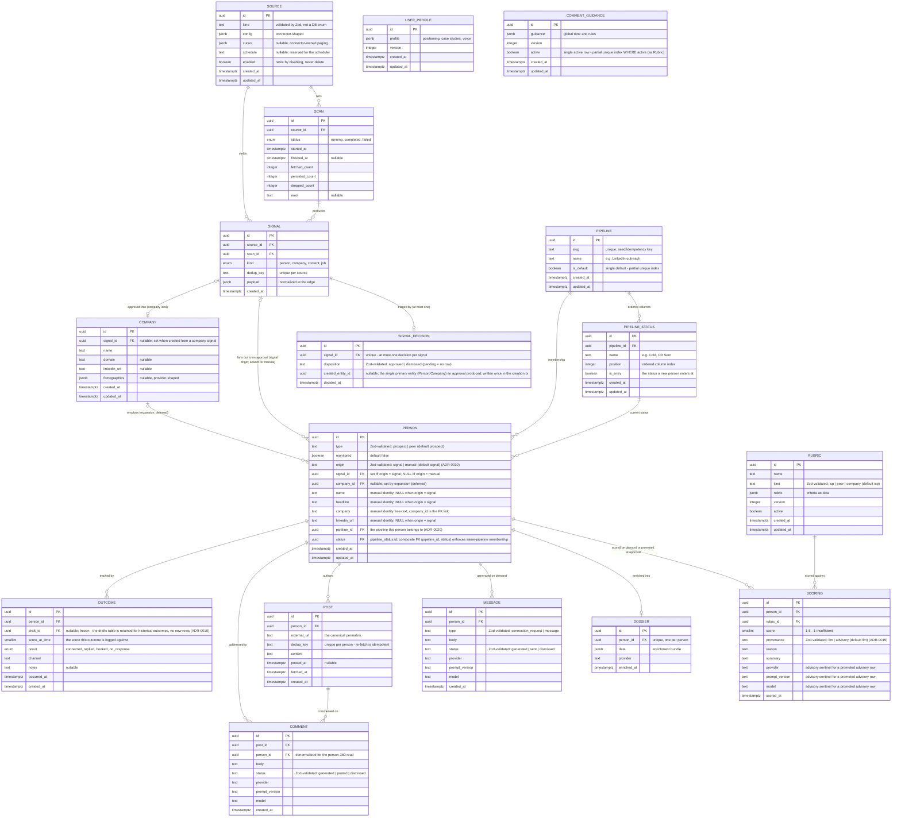
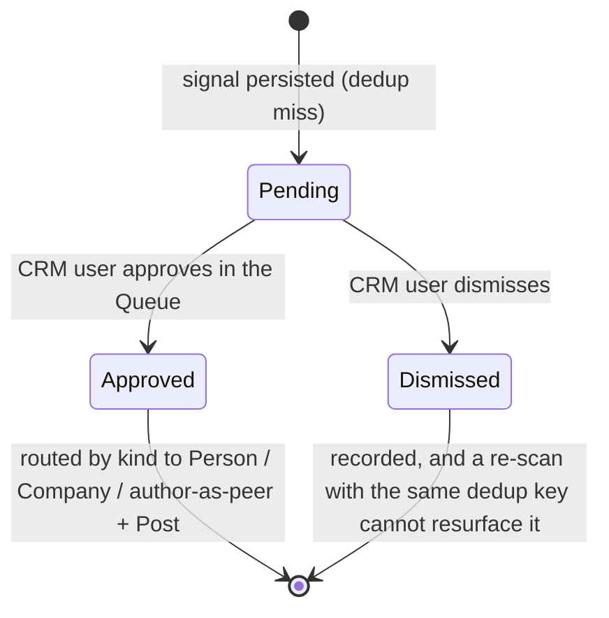
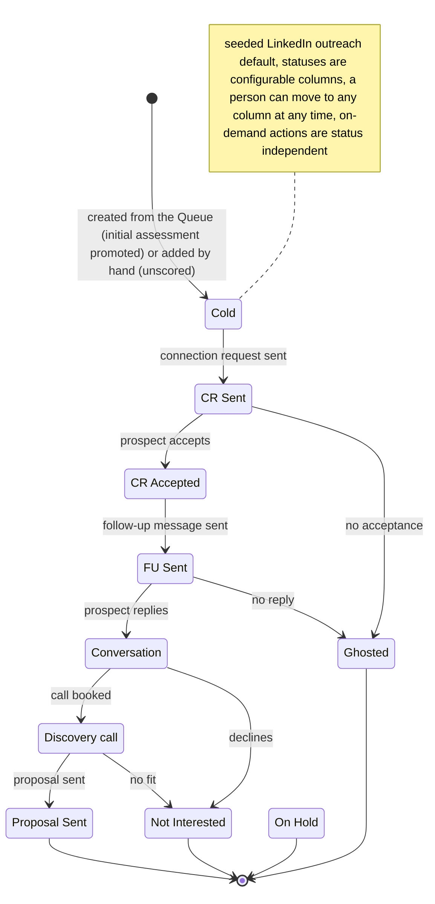
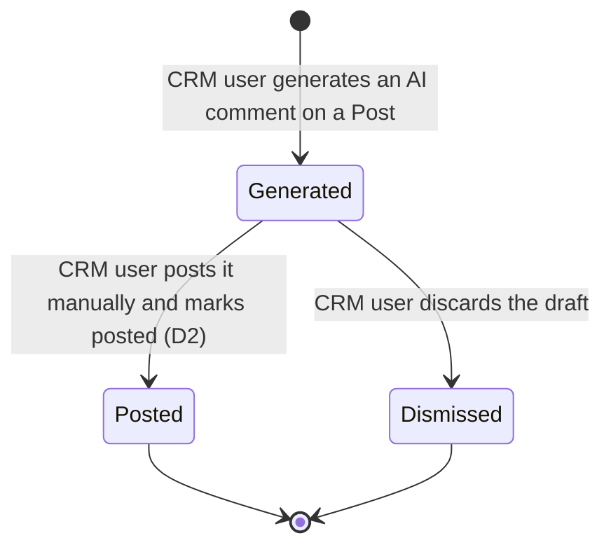

# Domain model (whole MVP pipeline)

The entities of the CRM-core pipeline, their relationships, the core entity's lifecycle, and the
domain events that map to background-job stages. Flat (single implicit area) per README rule 5. The
ubiquitous nouns are in [glossary.md](glossary.md); the component view is in
[system-design.md](system-design.md) (C4 L3).

Promoted from change `c4-level3-and-domain-model` (2026-05-26), extended by
`content-marketing-engagement` (2026-06-07) and re-cut by `engagement-rework` (2026-06-08).
Governing decisions:
[ADR-0005](../adr/0005-signal-to-prospect-fan-out.md) (signal -> N person fan-out, refines D5),
[ADR-0010](../adr/0010-prospect-origin-signal-or-manual.md) (a person originates from a signal or is
entered manually; supersedes ADR-0005's signal_id-NOT-NULL totality, fan-out preserved),
[ADR-0013](../adr/0013-universal-triage-intake.md) (universal triage - signals await human approval,
refines ADR-0005's fan-out trigger), [ADR-0014](../adr/0014-signal-decision-separate-from-signal.md)
(separate `signal_decisions` table), [ADR-0015](../adr/0015-prospect-to-person-with-type.md) (rename
Prospect -> Person + `type`/`monitored`), [ADR-0016](../adr/0016-company-first-class-entity.md)
(Company first-class), [ADR-0017](../adr/0017-type-keyed-advisory-rubrics.md) (type-keyed rubrics),
[ADR-0018](../adr/0018-engagement-artifacts-post-comment.md) (Post + Comment),
[ADR-0019](../adr/0019-generation-and-scoring-on-demand.md) (generation + scoring are on-demand Person
actions, the Draft entity and drafting stage retired, `scorings.provenance` added, qualification a
derived read), [ADR-0020](../adr/0020-configurable-pipelines-for-person-status.md) (configurable
pipelines, `Person.status` -> `pipeline_status` FK, supersedes ADR-0008),
[ADR-0021](../adr/0021-linkedin-message-entity.md) (the LinkedIn Message entity),
[product-overview.md](../product-overview.md) section 4 (pipeline, locked decisions D1-D11).

## Entity model

`Source`, `Scan`, `Signal` are built by the signal-ingestion capability (first migration);
everything else is modeled here and migrated when its capability lands. All tables share the
ingestion schema conventions: uuid PKs via `gen_random_uuid()`, `timestamptz`, JSONB at the
connector boundary, FK `NOT NULL` + `RESTRICT`. Enum policy: a pg enum only for a genuinely
closed, low-churn set; `text` validated by a Zod enum for any set expected to churn (so
`Person.type` and `Rubric.kind` are `text`, not enums). `Person.status` is no longer a Zod-enum
`text` value - it is a foreign key into the CRUD-able `pipeline_status` vocabulary
([ADR-0020](../adr/0020-configurable-pipelines-for-person-status.md)).

`Prospect` is renamed to `Person` ([ADR-0015](../adr/0015-prospect-to-person-with-type.md)); the
immutable ADRs that predate the rename (0005, 0008, 0010) read `Prospect`/`prospects` as
`Person`/`person`. The outreach pipeline below operates on a `Person` with `type = prospect`.

Per non-obvious cardinality:

- **SIGNAL ||--o| SIGNAL_DECISION (zero-or-one).** The triage decision is a separate, mutable record keyed `unique` on `signal_id`; `pending` is the absence of a row. Kept off the signal so the immutable-fact invariant holds and the scan writer (insert-only) and the triage writer never share a row - a re-scan that re-encounters the same dedup key is a no-op on the signal and cannot reset a dismissal ([ADR-0014](../adr/0014-signal-decision-separate-from-signal.md)). `created_entity_id` holds only the single primary entity an approval produced (the `Person` for a content approval, with the `Post` reached via `Post.person_id`); the signal-to-many-people fan-out rides the reverse FKs (`Person.signal_id` / `Company.signal_id`), never this column. It is written once in the creation transaction, never updated, and null only for a dismissal.
- **SIGNAL |o--o{ PERSON (the load-bearing fan-out, re-timed; a person has at most one signal).** A signal is not a person. A person source yields one person per signal; a company or content source expands one signal into many person prospects via normalize-expand. One-to-many from day one keeps the company/content path migration-free ([ADR-0005](../adr/0005-signal-to-prospect-fan-out.md)). What [ADR-0013](../adr/0013-universal-triage-intake.md) changes is the **trigger**: fan-out now fires on triage approval, not at persist, with no per-source bypass; the cardinality and the per-person Scoring are unchanged. A person references at most one signal: exactly one when `origin = signal`, none when `origin = manual` ([ADR-0010](../adr/0010-prospect-origin-signal-or-manual.md)). A per-origin CHECK keeps "signal-derived but missing its signal" unrepresentable: `(origin <> 'signal' OR signal_id IS NOT NULL) AND (origin <> 'manual' OR (signal_id IS NULL AND name IS NOT NULL))`. A manual person's identity lives in its own columns; a signal-derived person's identity stays in `signals.payload`, both read through one `PersonIdentity` seam so consumers do not branch on origin.
- **SIGNAL |o--o| COMPANY and COMPANY |o--o{ PERSON (expansion, deferred).** Approving a company signal creates exactly one `Company` (1:1, recorded by `SignalDecision.created_entity_id`); `Company.signal_id` is nullable, left null for any future manual company entry ([ADR-0016](../adr/0016-company-first-class-entity.md)). The company-to-people link is modeled now (`Person.company_id`) so it is not a later migration, but the expansion job that populates it is out of scope this slice; the signal-to-many-people fan-out a company used to trigger re-homes onto this deferred `Company -> Person` path.
- **PIPELINE ||--o{ PIPELINE_STATUS and PIPELINE/PIPELINE_STATUS ||--o{ PERSON.** A `Pipeline` is an ordered set of statuses an operator owns; a `PipelineStatus` is one ordered column. A Person's `status` is a FK into one `pipeline_status`, and `Person.pipeline_id` records its pipeline membership explicitly. The agreement between the two is DB-enforced: a composite FK `(pipeline_id, status)` references a `pipeline_status` unique key `(pipeline_id, id)`, so a Person can never point at a status of another pipeline. Both are config-as-data, seeded from code (one default "LinkedIn outreach" pipeline, entry status `Cold`) and then CRUD-able; a `pipeline_status` is RESTRICT-deleted while any Person references it. These two FK columns replace the fixed seven-value status enum ([ADR-0020](../adr/0020-configurable-pipelines-for-person-status.md), supersedes ADR-0008).
- **PERSON `type` and `monitored` are independent facets, not new tables.** One identity carries both, so a person who is both an ICP target and an engaged amplifier is one row ([ADR-0015](../adr/0015-prospect-to-person-with-type.md)). SCORING attaches to people of either type - the rubric kind differs by type (the ICP rubric for `type = prospect`, the peer rubric for `type = peer`, [ADR-0017](../adr/0017-type-keyed-advisory-rubrics.md)), so a peer is scored too, just never against the buyer rubric.
- **PERSON ||--o{ SCORING and RUBRIC ||--o{ SCORING.** The score is its own entity, not columns on Person, so a person can be re-scored without overwriting the prior score and its rubric version. Each scoring binds to its rubric version (`rubric_id` + `prompt_version`/`model`) and carries a `provenance` (`llm | advisory`). Two triggers write a Scoring: at signal approval, the advisory score is promoted into an `advisory`-provenance initial assessment (no LLM) when an active rubric of the advisory's kind exists (a stable `advisory` sentinel fills the NOT NULL provider/prompt_version/model columns); and an on-demand re-score writes a fresh `llm`-provenance buyer-rubric Scoring. The advisory triage hint shown *before* approval still writes **no** Scoring row. A manually created person gets no Scoring until its first on-demand re-score. `advisory` rows power the qualification read but are excluded from the ADR-0005 learning loop (the `provenance = 'llm'` filter), so the cheap advisory pass can never tune the bar ([ADR-0019](../adr/0019-generation-and-scoring-on-demand.md)). Company-fit stays advisory only (a company is not a `Person` and writes no Scoring).
- **Qualification is a derived read, not a stored status.** A `prospect`-type Person reads `qualified` (latest `icp`/buyer-rubric Scoring >= 3), `below_bar` (< 3; the `-1` insufficient-data sentinel is `below_bar` by rule, distinct from `unassessed`), or `unassessed` (no `icp`-rubric Scoring row at all). The read takes the latest Scoring **of the buyer/`icp` rubric kind**, by `scored_at`, tie-broken by `id` - the rubric-kind filter is part of the read, so a peer-rubric row never satisfies a buyer qualification. It is `n/a` for a `peer`-type Person (never buyer-scored, ADR-0017). Decoupled from pipeline position ([ADR-0019](../adr/0019-generation-and-scoring-on-demand.md)).
- **PERSON ||--o| DOSSIER (zero-or-one).** Enrichment is optional and user-triggered by default ([ADR-0007](../adr/0007-user-triggered-optional-enrichment.md)), now from the Person workspace, so a person may have no dossier; one when present.
- **PERSON ||--o{ MESSAGE.** Many LinkedIn messages per person (a connection-request and later DMs all live here), each `Message(type = connection_request | message)`, generated on demand and human-sent. This replaces the retired one-selected `Draft`: first-touch is now a Message, not a Draft ([ADR-0021](../adr/0021-linkedin-message-entity.md)).
- **PERSON ||--o{ POST and POST ||--o{ COMMENT.** A person accrues many posts; a post accrues many comment drafts (regenerable). `Comment.person_id` is denormalized from its post so the person-360 detail reads one person's whole comment history without walking posts. `Post.dedup_key` unique per person makes re-fetch and the activity scan idempotent (the same discipline as `Signal.dedup_key` per source); `dedup_key` is the provider's stable post id when present, else a canonicalized permalink, else the item is dropped ([ADR-0018](../adr/0018-engagement-artifacts-post-comment.md)). A comment is a separate table from a message because its business rule differs (keyed to a Post, many-per-person, vs keyed to a person).
- **PERSON ||--o{ OUTCOME.** Each outcome binds to the score it acted on (`score_at_time`). `Outcome.draft_id` is nullable and now frozen: the `drafts` table is retained only so historical outcomes still resolve (no new Draft rows are written); binding an `Outcome` to the `Message` that drove it (a nullable `outcomes.message_id`) is deferred with the rest of the learning-loop work ([ADR-0019](../adr/0019-generation-and-scoring-on-demand.md)).

The **Draft** entity is retired: there is no per-prospect, one-selected first-touch artifact anymore (ADR-0019). The `drafts` table is left in place, frozen, for historical `outcomes.draft_id` references only.

The status/result vocabularies (`Message.status`, `Comment.status`, `Outcome.result`), the
`Person.type`, the `Message.type`, and the `Rubric.kind` are text+Zod (the churn-prone sets);
`Person.status` is a `pipeline_status` FK rather than a Zod enum (ADR-0020). A **Rubric** row is
immutable once any Scoring references it: tuning the ICP creates a new version row, so a past score's
rubric is never rewritten - the invariant the learning loop depends on. The prior single-active rubric
constraint (`rubric_one_active_uq`) generalizes to one-active-per-kind (a partial unique index over
`(kind)` where active), and the qualifier's active-rubric selection becomes kind-aware ([ADR-0017](../adr/0017-type-keyed-advisory-rubrics.md)).

Not modeled yet: a `tenant` entity (`tenant_id` is the additive productization hook on the
config-as-data entities); cross-source and cross-origin identity resolution across people and across
companies (dedup is per-source by design); and the company-to-people **expansion job** (firmographic
pre-check verdict and expanded roles) - `Company` itself is now a first-class entity (ADR-0016), but
the job that populates `Person.company_id` from it stays deferred (M2).

## Lifecycle

Three lifecycles. The **Person** moves through a configurable Pipeline - its status is a pointer into
the ordered statuses of a Pipeline the operator owns, no longer a fixed line
([ADR-0020](../adr/0020-configurable-pipelines-for-person-status.md)). A **Signal**
now has a triage lifecycle (it is born immutable, but its triage verdict is mutable and lives in the
SignalDecision relation). A **Comment** has its own generate/post lifecycle. A `type = peer` person is
scored against the peer rubric ([ADR-0017](../adr/0017-type-keyed-advisory-rubrics.md)) and lives in
the monitoring/feed flow rather than the outreach funnel.

### Signal triage lifecycle

### Person pipeline lifecycle (configurable)

`Person.status` is no longer a fixed line - it is a pointer into the ordered statuses of a configurable
`Pipeline` ([ADR-0020](../adr/0020-configurable-pipelines-for-person-status.md)). The diagram below
shows the seeded default "LinkedIn outreach" pipeline (frozen in ADR-0020); the statuses are CRUD-able,
so a tenant may add, rename, reorder, or remove columns, and a person can move to any column at any
time. Qualification is **not** a status - it is the derived read over the latest buyer-rubric Scoring
(ADR-0019), decoupled from pipeline position. On-demand actions (re-score, enrich, generate
message/comment) are available in every status and never move it. Entry is at triage approval (signal
origin, with the advisory score promoted to an initial assessment) or manual add (unscored).

Enrichment, scoring, and generation are **on-demand actions that produce artifacts** (a `Dossier`, a
`Scoring`, a `Message`/`Comment`), not status transitions: they run synchronously from the Person
workspace and never move the pipeline status, which the operator sets directly (ADR-0019, ADR-0020).

### Comment lifecycle

Regenerate does not transition an existing comment - it creates a new `Comment` row that begins its own
lifecycle at Generated. Several Generated rows may coexist for one post; the user posts one (-> Posted)
and may dismiss the rest.

## Domain events

The events that drive the system; doubles as the background-job-stage map.

| Event (past tense) | Trigger | Produces (state / read-model) | Job stage |
|---|---|---|---|
| SourceConfigured | CRM user saves a source | `Source` row created/updated, `enabled` set | config UI (icp-config) |
| ScanRequested | `enqueueScan(sourceId)` or the deferred cron | one `source-scan` job enqueued | scan (signal-ingestion) |
| ScanCompleted | `runScan` finishes | `Scan` -> completed with fetched/persisted/dropped counts | scan |
| ScanFailed | a connector raises mid-run | `Scan` -> failed with error, other sources unaffected | scan |
| SignalPersisted | dedup miss on `(source_id, dedup_key)` | new immutable `Signal` row; it awaits triage - **no entity is created at persist** (ADR-0013 refines ADR-0005's fan-out trigger; replaces the old kind-routed auto-handoff) | scan |
| SignalScored | advisory filter runs the rubric matching the signal's intent (kind/type) | a lightweight advisory result on the triage read-model (NOT a durable `Scoring`) | advisory-filter (post-scan, own queue) |
| SignalApproved | CRM user clicks Create Person/Company in the Queue | `SignalDecision` approved + routing in one tx: person signal -> `Person` (status = default entry `Cold`, `pipeline_id` set); company signal -> `Company`; content signal -> author `Person(type = peer)` + `Post`. For a person/peer, an `advisory`-provenance initial `Scoring` is written when an active rubric of the advisory's kind exists (advisory score promoted, no LLM); a company writes none; no downstream job is enqueued | Queue triage action (synchronous, one tx) |
| SignalDismissed | CRM user dismisses a pending signal | `SignalDecision` dismissed; the signal cannot resurface | Queue triage action |
| PersonAddedManually | CRM user submits the add-lead form | a `Person` with `origin = manual`, `signal_id` null, identity columns set, status = default entry `Cold`; **no Scoring** (not auto-scored) (ADR-0010, ADR-0019) | person-list add action (synchronous) |
| PersonRescored | CRM user clicks Re-score on the Person | a fresh buyer-rubric `Scoring` row (`provenance = llm`, LLM call) superseding the initial assessment | none (synchronous on-demand action) |
| PersonEnriched | CRM user clicks Enrich on the Person, provider available | `Dossier` created; **no status change** | enrich (existing worker, user-triggered) |
| MessageGenerated | CRM user clicks Generate message (by type) | a new `Message` row (type, body, provider, prompt_version, model) via the `LLMProvider` port | none (synchronous on-demand action) |
| PersonStatusChanged | CRM user sets the Person's pipeline status | `Person.status` FK updated (any column of its pipeline) | none (synchronous) |
| OutcomeLogged | CRM user logs the result of a manual touch | `Outcome` row bound to `score_at_time` | none (synchronous) |
| PersonMonitored | CRM user sets the monitored flag | `Person.monitored` set; the person's posts enter the Feed | person detail / Queue action |
| PostsFetched | CRM user clicks "get latest posts" on a person | `Post` rows upserted by `(person_id, dedup_key)` | fetch-posts (user-triggered, ADR-0007 pattern) |
| ActivityScanned | activity-scan cron dispatches one fetch-posts job per monitored person (per-unit isolation) | new `Post` rows for monitored people; the Feed read-model refreshes | activity-scan dispatcher -> fetch-posts |
| CommentGenerated | CRM user generates a comment on a post | a new `Comment` row (status generated) via the `LLMProvider` port | comment generation (synchronous server action) |
| CommentPosted | CRM user posts manually and marks posted | `Comment` -> posted | Feed action |

Removed events (the drafting stage is gone, ADR-0019): `DraftGenerated`, `PersonQueued`,
`PersonActed`. The automatic post-approval `PersonScored` and `PersonQualified` events are also gone -
approval instead promotes the advisory score into an `advisory`-provenance initial `Scoring` (no LLM),
and the durable `qualify-prospect` worker is retired; scoring is now the no-LLM approval promotion plus
the on-demand `PersonRescored`. Post-intake work (re-score, enrich, generate message/comment, set
status, log outcome) is a synchronous on-demand action on the Person that writes one row and never
enqueues a downstream job - so there is no committed transition for the ADR-0009 handoff to strand
(its invariant holds vacuously on the approval path). The advisory filter, activity scan, and
fetch-posts remain their own pg-boss handlers; message and comment generation and re-score are
synchronous server actions, not queue handlers.
