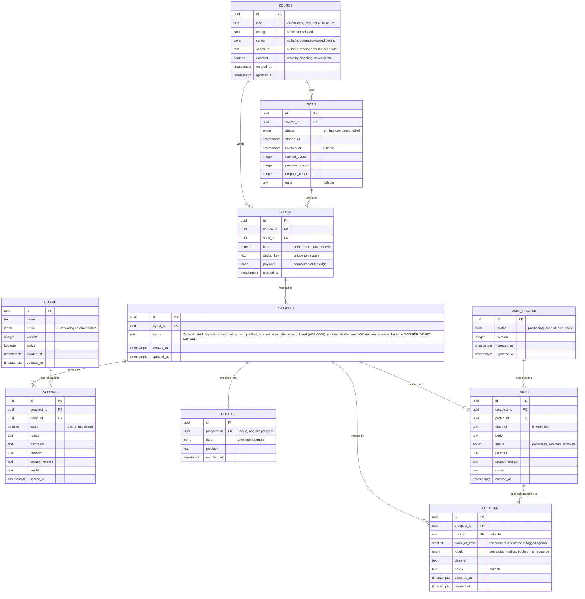

# Domain model (whole MVP pipeline)

The entities of the CRM-core pipeline, their relationships, the core entity's lifecycle, and the
domain events that map to background-job stages. Flat (single implicit area) per README rule 5. The
ubiquitous nouns are in [glossary.md](glossary.md); the component view is in
[system-design.md](system-design.md) (C4 L3).

Promoted from change `c4-level3-and-domain-model` (2026-05-26). Governing decisions:
[ADR-0005](../adr/0005-signal-to-prospect-fan-out.md) (signal -> N prospect fan-out, refines D5),
[product-overview.md](../product-overview.md) section 4 (pipeline, locked decisions D1-D10).

## Entity model

`Source`, `Scan`, `Signal` are built by the signal-ingestion capability (first migration);
everything else is modeled here and migrated when its capability lands. All tables share the
ingestion schema conventions: uuid PKs via `gen_random_uuid()`, `timestamptz`, JSONB at the
connector boundary, FK `NOT NULL` + `RESTRICT`. Enum policy: a pg enum only for a genuinely
closed, low-churn set; `text` validated by a Zod enum for any set expected to churn (so
`Prospect.status` is `text`, not an enum).

Per non-obvious cardinality:

- **SIGNAL ||--o{ PROSPECT (the load-bearing fan-out).** A signal is not a prospect. A person source yields one prospect per signal; a company or content source expands one signal into many person prospects via normalize-expand. One-to-many from day one keeps the company/content path from being a later migration ([ADR-0005](../adr/0005-signal-to-prospect-fan-out.md)).
- **PROSPECT ||--o{ SCORING and RUBRIC ||--o{ SCORING.** The score is its own entity, not columns on Prospect, so a prospect can be re-scored (when the rubric is tuned) without overwriting the prior score and the rubric version it was taken against. Each scoring binds to its rubric version (`rubric_id` + `prompt_version`/`model`). In MVP a prospect is scored once; the entity makes re-scoring additive rows rather than a future migration. The prospect's pipeline status is gated by its latest Scoring against the active rubric, so a re-score moves the gate deterministically.
- **PROSPECT ||--o| DOSSIER (zero-or-one).** Enrichment is optional and user-triggered by default (with an opt-in auto-enrich setting), not an automatic score gate ([ADR-0007](../adr/0007-user-triggered-optional-enrichment.md)), so a prospect may have no dossier; one when present. A qualified prospect is drafted from the signal by default; enrichment is a user/auto-triggered side-transition that then re-drafts from the dossier.
- **PROSPECT ||--o{ DRAFT.** Drafts are regenerable, so a prospect can accumulate several; one is `selected` for the human to send.
- **PROSPECT ||--o{ OUTCOME and DRAFT |o--o{ OUTCOME.** A relationship produces several touches; each outcome binds to the score it acted on (`score_at_time`), making the bar tunable later without a migration. `draft_id` is nullable because an outcome can be logged for a touch that did not use a generated draft.
- **USER_PROFILE ||--o{ DRAFT.** A read dependency: drafts are written from the profile, config-as-data shared across all drafts.

The status/result vocabularies (`Prospect.status`, `Draft.status`, `Outcome.result`), the nullable `Outcome.draft_id`, and the versioning fields are deliberate modeling choices: closed pg enums are extensible by an additive `ALTER TYPE ADD VALUE` (applied in isolation, never ADD-then-USE in one migration), and `Prospect.status` is text+Zod because a lifecycle state machine is the most churn-prone set. A **Rubric** row is immutable once any Scoring references it: tuning the ICP creates a new version row, so a past score's rubric is never rewritten - the invariant the learning loop depends on.

Not modeled yet: a `tenant` entity (`tenant_id` is the additive productization hook on the config-as-data entities); cross-source identity resolution across prospects (dedup is per-source by design); and the company-to-people expansion record (firmographic pre-check verdict and expanded roles), owned by the normalize-expand capability (M2).

## Lifecycle

The **Prospect** is the entity that moves through the pipeline. The Signal has no lifecycle - it is
born persisted and immutable; pipeline progress lives on the prospect's `status`, driven by durable
job stages, not polled flags.

`status` is the prospect's **disposition** in the human-facing pipeline (one mutually-exclusive
category, [ADR-0008](../adr/0008-prospect-status-is-disposition.md)). Whether a prospect is
*enriched* (a `Dossier` exists) or *drafted* (a selected `Draft` exists) is **derived from the
relations, not a status** - those facts are orthogonal to disposition, can co-occur, and can recur
(ADR-0007's draft -> enrich -> re-draft), which a linear status cannot hold but related rows can.

```mermaid
stateDiagram-v2
    [*] --> New : signal fans out to a person
    New --> BelowBar : score < 3 or score = -1 (insufficient data)
    New --> Qualified : score >= 3
    Qualified --> Queued : a first-touch draft exists; enters the review queue
    Queued --> Acted : CRM user acts via the chosen channel
    Queued --> Dismissed : CRM user dismisses
    Acted --> Closed : outcome logged against the score
    BelowBar --> [*] : retained silently for the learning loop
    Dismissed --> [*]
    Closed --> [*]
```

Drafting and enrichment are **side-activities that produce artifacts**, not status transitions:
drafting a qualified prospect creates a `Draft` and moves it to `queued`; enrichment (user- or
auto-triggered, ADR-0007) creates a `Dossier` and a re-`Draft` without changing the disposition.
Consistent with the L2 intelligence-pipeline flow in [system-design.md](system-design.md): qualify is
the cost gate, below-bar prospects are kept but not surfaced, and the human acts outside the system
and logs the outcome back in.

## Domain events

The events that drive the system; doubles as the background-job-stage map.

| Event (past tense) | Trigger | Produces (state / read-model) | Job stage |
|---|---|---|---|
| SourceConfigured | CRM user saves a source | `Source` row created/updated, `enabled` set | config UI (icp-config) |
| ScanRequested | `enqueueScan(sourceId)` or the deferred cron | one `source-scan` job enqueued | scan (signal-ingestion) |
| ScanCompleted | `runScan` finishes | `Scan` -> completed with fetched/persisted/dropped counts | scan |
| ScanFailed | a connector raises mid-run | `Scan` -> failed with error, other sources unaffected | scan |
| SignalPersisted | dedup miss on `(source_id, dedup_key)` | new immutable `Signal` row | scan |
| ProspectScored | qualify job runs the rubric over a signal-derived person | a `Scoring` row (score, reason, rubric version); `Prospect` -> `qualified` or `below_bar` directly per the gate - no intermediate `scored` status (ADR-0008) | qualify (qualification) |
| ProspectQualified | latest Scoring against the active rubric is >= 3 | `Prospect` -> qualified, enqueue draft (default); enqueue enrich only if the user triggered it or auto-enrich is on (ADR-0007) | qualify (qualification) |
| ProspectEnriched | enrich job, user- or auto-triggered, provider available | `Dossier` created (enriched is derived from this relation, ADR-0008), re-draft enqueued; **no status change** | enrich (enrichment) |
| DraftGenerated | draft job, from the signal (default) or re-drafted from a dossier after enrichment | `Draft` row created (drafted is derived from this relation, ADR-0008); prospect moves to `queued` when a draft first exists | draft (drafting) |
| ProspectQueued | draft persisted | `Prospect` -> queued, appears in the review-queue read-model | review-queue |
| ProspectActed | CRM user acts via the channel | `Prospect` -> acted | review-queue |
| OutcomeLogged | CRM user logs the result | `Outcome` row against `score_at_time`, `Prospect` -> closed | review-queue |

Each stage enqueues the next stage's job inside the same Drizzle transaction as its state write
([ADR-0009](../adr/0009-atomic-enqueue-handoff.md)). pg-boss shares the app's Postgres database, so
its Drizzle adapter (`fromDrizzle`) lets the follow-on job INSERT ride the state-write transaction:
the state transition and its handoff job commit together or roll back together - a committed
transition can never be stranded without its next job. Decoupling is preserved: the composition root
injects a transaction-aware `enqueueNext(tx, ids)` callback into each stage, so a stage still imports
no sibling. This holds while pg-boss is co-located in the app database (the default); a separate
pg-boss database would forfeit the atomicity (a cross-database transaction cannot commit atomically)
and is unsupported for the atomic handoff.
