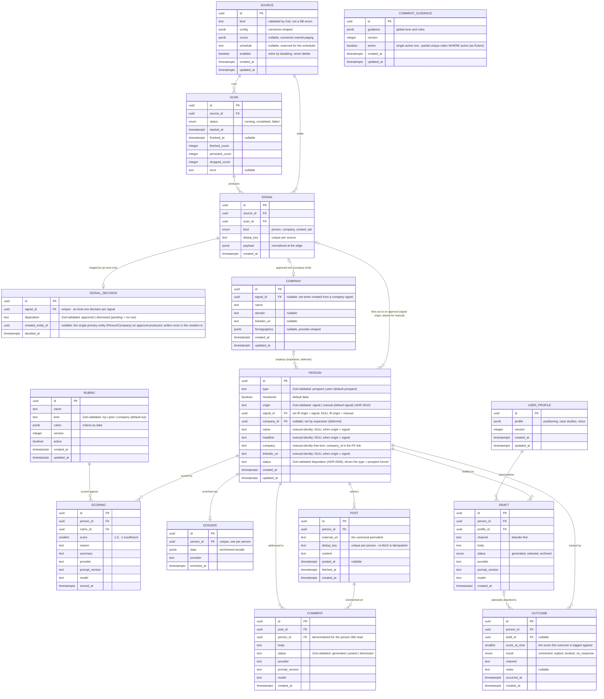
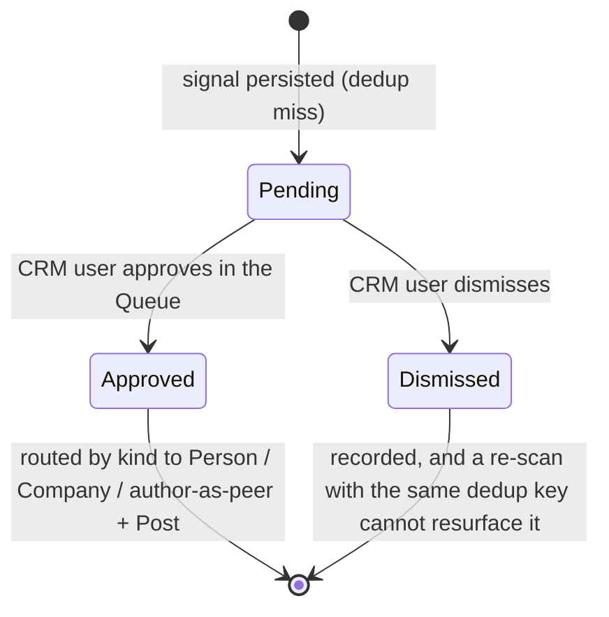
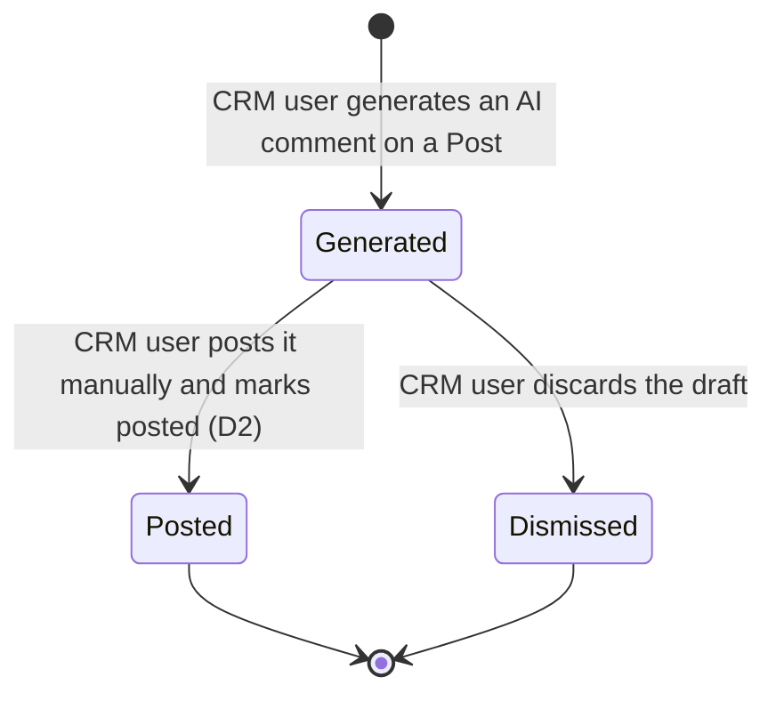

# Domain model (whole MVP pipeline)

The entities of the CRM-core pipeline, their relationships, the core entity's lifecycle, and the
domain events that map to background-job stages. Flat (single implicit area) per README rule 5. The
ubiquitous nouns are in [glossary.md](glossary.md); the component view is in
[system-design.md](system-design.md) (C4 L3).

Promoted from change `c4-level3-and-domain-model` (2026-05-26), extended by
`content-marketing-engagement` (2026-06-07). Governing decisions:
[ADR-0005](../adr/0005-signal-to-prospect-fan-out.md) (signal -> N person fan-out, refines D5),
[ADR-0010](../adr/0010-prospect-origin-signal-or-manual.md) (a person originates from a signal or is
entered manually; supersedes ADR-0005's signal_id-NOT-NULL totality, fan-out preserved),
[ADR-0013](../adr/0013-universal-triage-intake.md) (universal triage - signals await human approval,
refines ADR-0005's fan-out trigger), [ADR-0014](../adr/0014-signal-decision-separate-from-signal.md)
(separate `signal_decisions` table), [ADR-0015](../adr/0015-prospect-to-person-with-type.md) (rename
Prospect -> Person + `type`/`monitored`), [ADR-0016](../adr/0016-company-first-class-entity.md)
(Company first-class), [ADR-0017](../adr/0017-type-keyed-advisory-rubrics.md) (type-keyed rubrics),
[ADR-0018](../adr/0018-engagement-artifacts-post-comment.md) (Post + Comment),
[product-overview.md](../product-overview.md) section 4 (pipeline, locked decisions D1-D11).

## Entity model

`Source`, `Scan`, `Signal` are built by the signal-ingestion capability (first migration);
everything else is modeled here and migrated when its capability lands. All tables share the
ingestion schema conventions: uuid PKs via `gen_random_uuid()`, `timestamptz`, JSONB at the
connector boundary, FK `NOT NULL` + `RESTRICT`. Enum policy: a pg enum only for a genuinely
closed, low-churn set; `text` validated by a Zod enum for any set expected to churn (so
`Person.status`, `Person.type`, and `Rubric.kind` are `text`, not enums).

`Prospect` is renamed to `Person` ([ADR-0015](../adr/0015-prospect-to-person-with-type.md)); the
immutable ADRs that predate the rename (0005, 0008, 0010) read `Prospect`/`prospects` as
`Person`/`person`. The outreach pipeline below operates on a `Person` with `type = prospect`.

Per non-obvious cardinality:

- **SIGNAL ||--o| SIGNAL_DECISION (zero-or-one).** The triage decision is a separate, mutable record keyed `unique` on `signal_id`; `pending` is the absence of a row. Kept off the signal so the immutable-fact invariant holds and the scan writer (insert-only) and the triage writer never share a row - a re-scan that re-encounters the same dedup key is a no-op on the signal and cannot reset a dismissal ([ADR-0014](../adr/0014-signal-decision-separate-from-signal.md)). `created_entity_id` holds only the single primary entity an approval produced (the `Person` for a content approval, with the `Post` reached via `Post.person_id`); the signal-to-many-people fan-out rides the reverse FKs (`Person.signal_id` / `Company.signal_id`), never this column. It is written once in the creation transaction, never updated, and null only for a dismissal.
- **SIGNAL |o--o{ PERSON (the load-bearing fan-out, re-timed; a person has at most one signal).** A signal is not a person. A person source yields one person per signal; a company or content source expands one signal into many person prospects via normalize-expand. One-to-many from day one keeps the company/content path migration-free ([ADR-0005](../adr/0005-signal-to-prospect-fan-out.md)). What [ADR-0013](../adr/0013-universal-triage-intake.md) changes is the **trigger**: fan-out now fires on triage approval, not at persist, with no per-source bypass; the cardinality and the per-person Scoring are unchanged. A person references at most one signal: exactly one when `origin = signal`, none when `origin = manual` ([ADR-0010](../adr/0010-prospect-origin-signal-or-manual.md)). A per-origin CHECK keeps "signal-derived but missing its signal" unrepresentable: `(origin <> 'signal' OR signal_id IS NOT NULL) AND (origin <> 'manual' OR (signal_id IS NULL AND name IS NOT NULL))`. A manual person's identity lives in its own columns; a signal-derived person's identity stays in `signals.payload`, both read through one `PersonIdentity` seam so consumers do not branch on origin.
- **SIGNAL |o--o| COMPANY and COMPANY |o--o{ PERSON (expansion, deferred).** Approving a company signal creates exactly one `Company` (1:1, recorded by `SignalDecision.created_entity_id`); `Company.signal_id` is nullable, left null for any future manual company entry ([ADR-0016](../adr/0016-company-first-class-entity.md)). The company-to-people link is modeled now (`Person.company_id`) so it is not a later migration, but the expansion job that populates it is out of scope this slice; the signal-to-many-people fan-out a company used to trigger re-homes onto this deferred `Company -> Person` path.
- **PERSON `type` and `monitored` are independent facets, not new tables.** One identity carries both, so a person who is both an ICP target and an engaged amplifier is one row ([ADR-0015](../adr/0015-prospect-to-person-with-type.md)). SCORING attaches to people of either type - the rubric kind differs by type (the ICP rubric for `type = prospect`, the peer rubric for `type = peer`, [ADR-0017](../adr/0017-type-keyed-advisory-rubrics.md)), so a peer is scored too, just never against the buyer rubric.
- **PERSON ||--o{ SCORING and RUBRIC ||--o{ SCORING.** The score is its own entity, not columns on Person, so a person can be re-scored (when the rubric is tuned) without overwriting the prior score and its rubric version. Each scoring binds to its rubric version (`rubric_id` + `prompt_version`/`model`). The advisory triage hint shown before approval writes **no** Scoring row (no rubric-version binding, no learning-loop entry); only the post-approval `qualify`/peer-scoring job persists a Scoring, so the advisory read can never pollute the ADR-0005 learning loop. Company-fit stays advisory only this slice (a company is not a `Person`).
- **PERSON ||--o| DOSSIER (zero-or-one).** Enrichment is optional and user-triggered by default ([ADR-0007](../adr/0007-user-triggered-optional-enrichment.md)), so a person may have no dossier; one when present.
- **PERSON ||--o{ DRAFT.** Drafts are regenerable; one is `selected` for the human to send (the one-selected-per-person rule).
- **PERSON ||--o{ POST and POST ||--o{ COMMENT.** A person accrues many posts; a post accrues many comment drafts (regenerable). `Comment.person_id` is denormalized from its post so the person-360 detail reads one person's whole comment history without walking posts. `Post.dedup_key` unique per person makes re-fetch and the activity scan idempotent (the same discipline as `Signal.dedup_key` per source); `dedup_key` is the provider's stable post id when present, else a canonicalized permalink, else the item is dropped ([ADR-0018](../adr/0018-engagement-artifacts-post-comment.md)). A comment is a separate table from `drafts` because its business rule differs (per-post, many-per-person vs per-person, one-selected).
- **PERSON ||--o{ OUTCOME and DRAFT |o--o{ OUTCOME.** Each outcome binds to the score it acted on (`score_at_time`); `draft_id` is nullable because an outcome can be logged for a touch that did not use a generated draft.
- **USER_PROFILE ||--o{ DRAFT.** A read dependency: drafts are written from the profile, config-as-data shared across all drafts.

The status/result vocabularies (`Person.status`, `Draft.status`, `Comment.status`, `Outcome.result`),
the `Person.type`, and the `Rubric.kind` are text+Zod (the churn-prone sets). A **Rubric** row is
immutable once any Scoring references it: tuning the ICP creates a new version row, so a past score's
rubric is never rewritten - the invariant the learning loop depends on. The prior single-active rubric
constraint (`rubric_one_active_uq`) generalizes to one-active-per-kind (a partial unique index over
`(kind)` where active), and the qualifier's active-rubric selection becomes kind-aware ([ADR-0017](../adr/0017-type-keyed-advisory-rubrics.md)).

Not modeled yet: a `tenant` entity (`tenant_id` is the additive productization hook on the
config-as-data entities); cross-source and cross-origin identity resolution across people and across
companies (dedup is per-source by design); and the company-to-people **expansion job** (firmographic
pre-check verdict and expanded roles) - `Company` itself is now a first-class entity (ADR-0016), but
the job that populates `Person.company_id` from it stays deferred (M2).

## Lifecycle

Three lifecycles. The **Person** with `type = prospect` is the entity that moves through the outreach
pipeline; its post-approval lifecycle is unchanged from before the engagement motion. A **Signal**
now has a triage lifecycle (it is born immutable, but its triage verdict is mutable and lives in the
SignalDecision relation). A **Comment** has its own generate/post lifecycle. A `type = peer` person is
scored against the peer rubric ([ADR-0017](../adr/0017-type-keyed-advisory-rubrics.md)) and lives in
the monitoring/feed flow rather than the draft/send funnel.

### Signal triage lifecycle

### Person (type = prospect) lifecycle

`status` is the person's **disposition** in the human-facing pipeline (one mutually-exclusive
category, [ADR-0008](../adr/0008-prospect-status-is-disposition.md)). Whether a person is *enriched*
(a `Dossier` exists) or *drafted* (a selected `Draft` exists) is **derived from the relations, not a
status**. Entry is now at triage approval (signal origin) or manual add - no longer at signal persist
([ADR-0013](../adr/0013-universal-triage-intake.md)).

```mermaid
stateDiagram-v2
    [*] --> New : a person signal is approved in triage (origin = signal)
    [*] --> New : CRM user adds a lead by hand (origin = manual, no signal)
    New --> BelowBar : score < 3 or score = -1 (insufficient data)
    New --> Qualified : score >= 3
    Qualified --> Queued : a first-touch draft exists; enters the review queue
    Queued --> Acted : CRM user acts via the chosen channel
    Queued --> Dismissed : CRM user dismisses
    Acted --> Closed : outcome logged against the score
    BelowBar --> [*] : retained silently for the learning loop
    Dismissed --> [*]
    Closed --> [*]
```

Drafting and enrichment are **side-activities that produce artifacts**, not status transitions:
drafting a qualified person creates a `Draft` and moves it to `queued`; enrichment (user- or
auto-triggered, ADR-0007) creates a `Dossier` and a re-`Draft` without changing the disposition.

### Comment lifecycle

Regenerate does not transition an existing comment - it creates a new `Comment` row that begins its own
lifecycle at Generated. Several Generated rows may coexist for one post; the user posts one (-> Posted)
and may dismiss the rest.

## Domain events

The events that drive the system; doubles as the background-job-stage map.

| Event (past tense) | Trigger | Produces (state / read-model) | Job stage |
|---|---|---|---|
| SourceConfigured | CRM user saves a source | `Source` row created/updated, `enabled` set | config UI (icp-config) |
| ScanRequested | `enqueueScan(sourceId)` or the deferred cron | one `source-scan` job enqueued | scan (signal-ingestion) |
| ScanCompleted | `runScan` finishes | `Scan` -> completed with fetched/persisted/dropped counts | scan |
| ScanFailed | a connector raises mid-run | `Scan` -> failed with error, other sources unaffected | scan |
| SignalPersisted | dedup miss on `(source_id, dedup_key)` | new immutable `Signal` row; it awaits triage - **no entity is created at persist** (ADR-0013 refines ADR-0005's fan-out trigger; replaces the old kind-routed auto-handoff) | scan |
| SignalScored | advisory filter runs the rubric matching the signal's intent (kind/type) | a lightweight advisory result on the triage read-model (NOT a durable `Scoring`) | advisory-filter (post-scan, own queue) |
| SignalApproved | CRM user approves a pending signal | `SignalDecision` approved + routing in one tx: person signal -> `Person`; company signal -> `Company`; content signal -> author `Person(type = peer)` + `Post`; for `type = prospect`, qualify enqueued via the ADR-0009 atomic handoff | Queue triage action |
| SignalDismissed | CRM user dismisses a pending signal | `SignalDecision` dismissed; the signal cannot resurface | Queue triage action |
| PersonAddedManually | CRM user submits the add-lead form | a `Person` with `origin = manual`, `signal_id` null, identity columns set, status `new`; qualify enqueued by `personId` (user-triggered, fire-and-forget per ADR-0009's carve-out) (ADR-0010) | prospect-list add action -> qualify |
| PersonScored | qualify job runs the rubric over the person's identity (read through the `PersonIdentity` seam regardless of origin) | a `Scoring` row; `Person` -> `qualified` or `below_bar` directly per the gate (ADR-0008). (Was `ProspectScored`.) | qualify (qualification) |
| PersonQualified | latest Scoring against the active rubric is >= 3 | `Person` -> qualified, enqueue draft (default); enqueue enrich only if user-triggered or auto-enrich on (ADR-0007) | qualify (qualification) |
| PersonEnriched | enrich job, user- or auto-triggered, provider available | `Dossier` created, re-draft enqueued; **no status change** | enrich (enrichment) |
| DraftGenerated | draft job, from the signal (default) or re-drafted from a dossier | `Draft` row created; person moves to `queued` when a draft first exists | draft (drafting) |
| PersonQueued | draft persisted | `Person` -> queued, appears in the review-queue read-model (the send lane of the Queue) | review-queue |
| PersonActed | CRM user acts via the channel | `Person` -> acted | review-queue |
| OutcomeLogged | CRM user logs the result | `Outcome` row against `score_at_time`, `Person` -> closed | review-queue |
| PersonMonitored | CRM user sets the monitored flag | `Person.monitored` set; the person's posts enter the Feed | person detail / Queue action |
| PostsFetched | CRM user clicks "get latest posts" on a person | `Post` rows upserted by `(person_id, dedup_key)` | fetch-posts (user-triggered, ADR-0007 pattern) |
| ActivityScanned | activity-scan cron dispatches one fetch-posts job per monitored person (per-unit isolation) | new `Post` rows for monitored people; the Feed read-model refreshes | activity-scan dispatcher -> fetch-posts |
| CommentGenerated | CRM user generates a comment on a post | a new `Comment` row (status generated) via the `LLMProvider` port | comment generation (synchronous server action) |
| CommentPosted | CRM user posts manually and marks posted | `Comment` -> posted | Feed action |

The outreach events `PersonScored`/`PersonQualified`/`PersonEnriched`/`DraftGenerated`/etc. (renamed
from the `Prospect*` events) are unchanged in behavior and now fire **after triage approval** for
`type = prospect` people. Each pipeline stage enqueues the next stage's job inside the same Drizzle
transaction as its state write ([ADR-0009](../adr/0009-atomic-enqueue-handoff.md)); triage approval
joins that atomic-handoff seam (it writes the `SignalDecision` + the routed entity and enqueues
`qualify` in one transaction). pg-boss shares the app's Postgres database, so its Drizzle adapter
(`fromDrizzle`) lets the follow-on job INSERT ride the state-write transaction - a committed transition
can never be stranded without its next job. The advisory filter, activity scan, and fetch-posts run as
their own pg-boss handlers; comment generation is a synchronous server action, not a queue handler.
