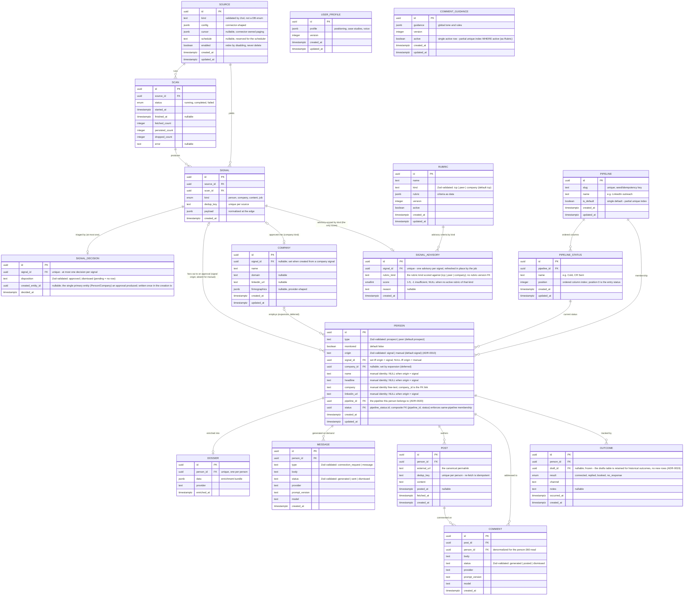
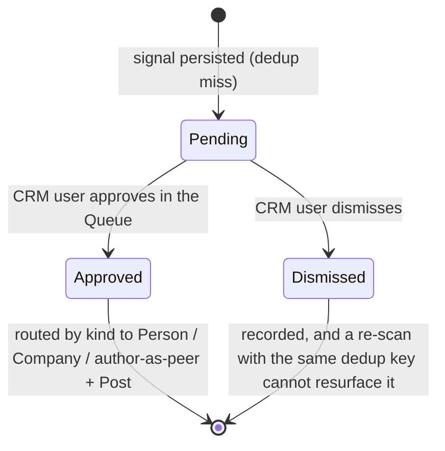
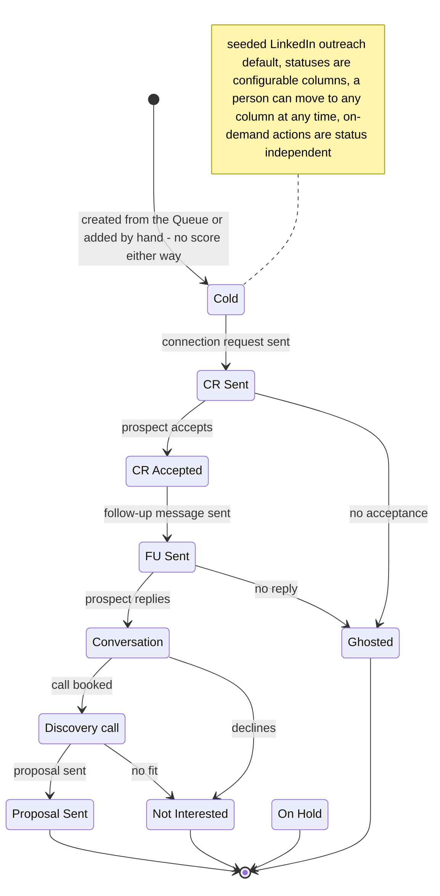
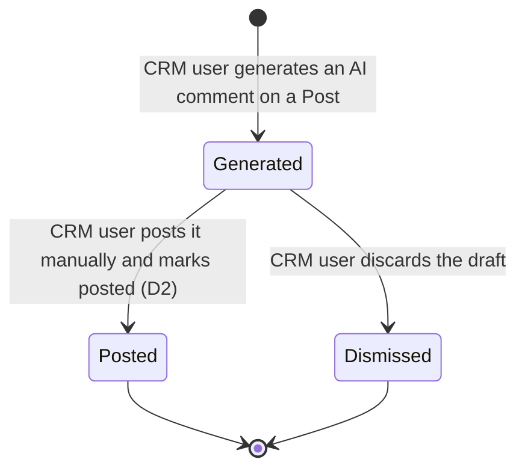

# Domain model (whole MVP pipeline)

The entities of the CRM-core pipeline, their relationships, the core entity's lifecycle, and the
domain events that map to background-job stages. Flat (single implicit area) per README rule 5. The
ubiquitous nouns are in [glossary.md](glossary.md); the component view is in
[system-design.md](system-design.md) (C4 L3).

Promoted from change `c4-level3-and-domain-model` (2026-05-26), extended by
`content-marketing-engagement` (2026-06-07), re-cut by `engagement-rework` (2026-06-08), and narrowed
by `adr-signal-only-scoring` (2026-06-13: the SCORING entity and qualification removed - the signal
advisory is the only score, [ADR-0022](../adr/0022-signal-advisory-is-the-only-score.md)).
Governing decisions:
[ADR-0005](../adr/0005-signal-to-prospect-fan-out.md) (signal -> N person fan-out, refines D5),
[ADR-0010](../adr/0010-prospect-origin-signal-or-manual.md) (a person originates from a signal or is
entered manually; supersedes ADR-0005's signal_id-NOT-NULL totality, fan-out preserved),
[ADR-0013](../adr/0013-universal-triage-intake.md) (universal triage - signals await human approval,
refines ADR-0005's fan-out trigger), [ADR-0014](../adr/0014-signal-decision-separate-from-signal.md)
(separate `signal_decisions` table), [ADR-0015](../adr/0015-prospect-to-person-with-type.md) (rename
Prospect -> Person + `type`/`monitored`), [ADR-0016](../adr/0016-company-first-class-entity.md)
(Company first-class), [ADR-0017](../adr/0017-type-keyed-advisory-rubrics.md) (type-keyed rubrics),
[ADR-0018](../adr/0018-engagement-artifacts-post-comment.md) (Post + Comment),
[ADR-0019](../adr/0019-generation-and-scoring-on-demand.md) (generation is an on-demand Person action,
the Draft entity and drafting stage retired; its person-scoring model is superseded by ADR-0022),
[ADR-0020](../adr/0020-configurable-pipelines-for-person-status.md) (configurable
pipelines, `Person.status` -> `pipeline_status` FK, supersedes ADR-0008),
[ADR-0021](../adr/0021-linkedin-message-entity.md) (the LinkedIn Message entity),
[ADR-0022](../adr/0022-signal-advisory-is-the-only-score.md) (person scoring removed - the `scorings`
table and `outcomes.score_at_time` dropped, the advisory on the signal is the only score, the human's
triage verdict is the qualification),
[product-overview.md](../product-overview.md) section 4 (pipeline, locked decisions D1-D14).

## Entity model

`Source`, `Scan`, `Signal` are built by the signal-ingestion capability (first migration);
everything else is modeled here and migrated when its capability lands. All tables share the
ingestion schema conventions: uuid PKs via `gen_random_uuid()`, `timestamptz`, JSONB at the
connector boundary, FK `NOT NULL` + `RESTRICT`. Enum policy: a pg enum only for a genuinely
closed, low-churn set; `text` validated by a Zod enum for any set expected to churn (so
`Person.type` and `Rubric.kind` are `text`, not enums). `Person.status` is no longer a Zod-enum
`text` value - it is a foreign key into the CRUD-able `pipeline_status` vocabulary
([ADR-0020](../adr/0020-configurable-pipelines-for-person-status.md)).

`Prospect` is renamed to `Person` ([ADR-0015](../adr/0015-prospect-to-person-with-type.md)); the
immutable ADRs that predate the rename (0005, 0008, 0010) read `Prospect`/`prospects` as
`Person`/`person`. The outreach pipeline below operates on a `Person` with `type = prospect`.

Per non-obvious cardinality:

- **SIGNAL ||--o| SIGNAL_DECISION (zero-or-one).** The triage decision is a separate, mutable record keyed `unique` on `signal_id`; `pending` is the absence of a row. Kept off the signal so the immutable-fact invariant holds and the scan writer (insert-only) and the triage writer never share a row - a re-scan that re-encounters the same dedup key is a no-op on the signal and cannot reset a dismissal ([ADR-0014](../adr/0014-signal-decision-separate-from-signal.md)). `created_entity_id` holds only the single primary entity an approval produced (the `Person` for a content approval, with the `Post` reached via `Post.person_id`); the signal-to-many-people fan-out rides the reverse FKs (`Person.signal_id` / `Company.signal_id`), never this column. It is written once in the creation transaction, never updated, and null only for a dismissal.
- **SIGNAL |o--o{ PERSON (the load-bearing fan-out, re-timed; a person has at most one signal).** A signal is not a person. A person source yields one person per signal; a company or content source expands one signal into many person prospects via normalize-expand. One-to-many from day one keeps the company/content path migration-free ([ADR-0005](../adr/0005-signal-to-prospect-fan-out.md)). What [ADR-0013](../adr/0013-universal-triage-intake.md) changes is the **trigger**: fan-out now fires on triage approval, not at persist, with no per-source bypass; the cardinality is unchanged, and approval writes no score (ADR-0022). A person references at most one signal: exactly one when `origin = signal`, none when `origin = manual` ([ADR-0010](../adr/0010-prospect-origin-signal-or-manual.md)). A per-origin CHECK keeps "signal-derived but missing its signal" unrepresentable: `(origin <> 'signal' OR signal_id IS NOT NULL) AND (origin <> 'manual' OR (signal_id IS NULL AND name IS NOT NULL))`. A manual person's identity lives in its own columns; a signal-derived person's identity stays in `signals.payload`, both read through one `PersonIdentity` seam so consumers do not branch on origin.
- **SIGNAL |o--o| COMPANY and COMPANY |o--o{ PERSON (expansion, deferred).** Approving a company signal creates exactly one `Company` (1:1, recorded by `SignalDecision.created_entity_id`); `Company.signal_id` is nullable, left null for any future manual company entry ([ADR-0016](../adr/0016-company-first-class-entity.md)). The company-to-people link is modeled now (`Person.company_id`) so it is not a later migration, but the expansion job that populates it is out of scope this slice; the signal-to-many-people fan-out a company used to trigger re-homes onto this deferred `Company -> Person` path.
- **PIPELINE ||--o{ PIPELINE_STATUS and PIPELINE/PIPELINE_STATUS ||--o{ PERSON.** A `Pipeline` is an ordered set of statuses an operator owns; a `PipelineStatus` is one ordered column. A Person's `status` is a FK into one `pipeline_status`, and `Person.pipeline_id` records its pipeline membership explicitly. The agreement between the two is DB-enforced: a composite FK `(pipeline_id, status)` references a `pipeline_status` unique key `(pipeline_id, id)`, so a Person can never point at a status of another pipeline. Both are config-as-data, seeded from code (one default "LinkedIn outreach" pipeline, entry status `Cold`) and then CRUD-able; a `pipeline_status` is RESTRICT-deleted while any Person references it. These two FK columns replace the fixed seven-value status enum ([ADR-0020](../adr/0020-configurable-pipelines-for-person-status.md), supersedes ADR-0008).
- **PERSON `type` and `monitored` are independent facets, not new tables.** One identity carries both, so a person who is both an ICP target and an engaged amplifier is one row ([ADR-0015](../adr/0015-prospect-to-person-with-type.md)). The person is not scored; the score lives on its originating signal, scored by the rubric kind matching the signal's intent (the `icp` rubric for a person signal, the `peer` rubric for content, [ADR-0017](../adr/0017-type-keyed-advisory-rubrics.md), [ADR-0022](../adr/0022-signal-advisory-is-the-only-score.md)).
- **SIGNAL ||--o| SIGNAL_ADVISORY and RUBRIC ||--o{ SIGNAL_ADVISORY (the only score).** The advisory score is a per-signal row (`unique` on `signal_id`), written by the advisory filter against the active rubric of the signal's kind and refreshed in place by the job. It records the `rubric_kind` it scored under, not a rubric-version FK, so it is a mutable hint - explicitly NOT a learning-grade record. There is no person-keyed score: approval copies nothing onto the created entity, and "why is this person here" is answered by joining the originating signal's advisory through `Person.signal_id` (a kind-polysemic cue - buyer-fit only for `icp`-kind signals, absent for manual origin). Company-fit is likewise the company signal's advisory score ([ADR-0022](../adr/0022-signal-advisory-is-the-only-score.md), removing the per-person `SCORING` entity ADR-0005/0019 defined; the advisory triage hint ADR-0017 introduced is now the whole story).
- **The human's triage verdict is the qualification.** There is no derived qualified / below_bar / unassessed read and no stored qualification status: approving a signal admits the person, dismissing rejects it. After approval a person is described by pipeline position only, decoupled from any score ([ADR-0022](../adr/0022-signal-advisory-is-the-only-score.md)).
- **PERSON ||--o| DOSSIER (zero-or-one).** Enrichment is optional and user-triggered by default ([ADR-0007](../adr/0007-user-triggered-optional-enrichment.md)), now from the Person workspace, with no score gate - the human's approval is the gate, so any admitted person is enrichable on demand ([ADR-0022](../adr/0022-signal-advisory-is-the-only-score.md)). A person may have no dossier; one when present.
- **PERSON ||--o{ MESSAGE.** Many LinkedIn messages per person (a connection-request and later DMs all live here), each `Message(type = connection_request | message)`, generated on demand and human-sent. This replaces the retired one-selected `Draft`: first-touch is now a Message, not a Draft ([ADR-0021](../adr/0021-linkedin-message-entity.md)).
- **PERSON ||--o{ POST and POST ||--o{ COMMENT.** A person accrues many posts; a post accrues many comment drafts (regenerable). `Comment.person_id` is denormalized from its post so the person-360 detail reads one person's whole comment history without walking posts. `Post.dedup_key` unique per person makes re-fetch and the activity scan idempotent (the same discipline as `Signal.dedup_key` per source); `dedup_key` is the provider's stable post id when present, else a canonicalized permalink, else the item is dropped ([ADR-0018](../adr/0018-engagement-artifacts-post-comment.md)). A comment is a separate table from a message because its business rule differs (keyed to a Post, many-per-person, vs keyed to a person).
- **PERSON ||--o{ OUTCOME.** Each outcome binds to the person and the artifact acted on; it snapshots no score (`score_at_time` is dropped, [ADR-0022](../adr/0022-signal-advisory-is-the-only-score.md)). `Outcome.draft_id` is nullable and frozen: the `drafts` table is retained only so historical outcomes still resolve (no new Draft rows are written); binding an `Outcome` to the `Message` that drove it (a nullable `outcomes.message_id`) is deferred with the rest of the learning-loop work ([ADR-0019](../adr/0019-generation-and-scoring-on-demand.md)). There is no outcome writer today (the route that wrote outcomes was retired in the engagement rework); the event is re-implemented with the deferred D7 loop.

The **Draft** entity is retired: there is no per-prospect, one-selected first-touch artifact anymore (ADR-0019). The `drafts` table is left in place, frozen, for historical `outcomes.draft_id` references only.

The status/result vocabularies (`Message.status`, `Comment.status`, `Outcome.result`), the
`Person.type`, the `Message.type`, and the `Rubric.kind` are text+Zod (the churn-prone sets);
`Person.status` is a `pipeline_status` FK rather than a Zod enum (ADR-0020). A **Rubric** kept versions
immutable so a past score's rubric was never rewritten; with the per-person `SCORING` entity removed
([ADR-0022](../adr/0022-signal-advisory-is-the-only-score.md)) nothing references a rubric version
(`signal_advisory` records only `rubric_kind`), so that immutability invariant is dormant - versioning
survives as config history until a future learning-grade record re-establishes a version pin. The prior
single-active rubric constraint (`rubric_one_active_uq`) generalizes to one-active-per-kind (a partial
unique index over `(kind)` where active), and the advisory filter's active-rubric selection is kind-aware
([ADR-0017](../adr/0017-type-keyed-advisory-rubrics.md)).

Not modeled yet: a `tenant` entity (`tenant_id` is the additive productization hook on the
config-as-data entities); cross-source and cross-origin identity resolution across people and across
companies (dedup is per-source by design); and the company-to-people **expansion job** (firmographic
pre-check verdict and expanded roles) - `Company` itself is now a first-class entity (ADR-0016), but
the job that populates `Person.company_id` from it stays deferred (M2).

## Lifecycle

Three lifecycles. The **Person** moves through a configurable Pipeline - its status is a pointer into
the ordered statuses of a Pipeline the operator owns, no longer a fixed line
([ADR-0020](../adr/0020-configurable-pipelines-for-person-status.md)). A **Signal**
now has a triage lifecycle (it is born immutable, but its triage verdict is mutable and lives in the
SignalDecision relation). A **Comment** has its own generate/post lifecycle. A `type = peer` person is
admitted from a content signal advisory-scored against the peer rubric ([ADR-0017](../adr/0017-type-keyed-advisory-rubrics.md))
and lives in the monitoring/feed flow rather than the outreach funnel.

### Signal triage lifecycle

### Person pipeline lifecycle (configurable)

`Person.status` is no longer a fixed line - it is a pointer into the ordered statuses of a configurable
`Pipeline` ([ADR-0020](../adr/0020-configurable-pipelines-for-person-status.md)). The diagram below
shows the seeded default "LinkedIn outreach" pipeline (frozen in ADR-0020); the statuses are CRUD-able,
so a tenant may add, rename, reorder, or remove columns, and a person can move to any column at any
time. A person carries **no score** - the signal advisory is the only score, and the human's triage
verdict is the qualification ([ADR-0022](../adr/0022-signal-advisory-is-the-only-score.md)). On-demand
actions (enrich, generate message/comment) are available in every status and never move it. Entry is at
the pipeline's entry column whether the person was approved from the Queue or added by hand - no score
either way.

Enrichment and generation are **on-demand actions that produce artifacts** (a `Dossier`, a
`Message`/`Comment`), not status transitions: they run synchronously from the Person workspace and
never move the pipeline status, which the operator sets directly (ADR-0019, ADR-0020). There is no
scoring action on a person - the only score is the signal advisory (ADR-0022).

### Comment lifecycle

Regenerate does not transition an existing comment - it creates a new `Comment` row that begins its own
lifecycle at Generated. Several Generated rows may coexist for one post; the user posts one (-> Posted)
and may dismiss the rest.

## Domain events

The events that drive the system; doubles as the background-job-stage map.

| Event (past tense) | Trigger | Produces (state / read-model) | Job stage |
|---|---|---|---|
| SourceConfigured | CRM user saves a source | `Source` row created/updated, `enabled` set | config UI (icp-config) |
| ScanRequested | `enqueueScan(sourceId)` or the deferred cron | one `source-scan` job enqueued | scan (signal-ingestion) |
| ScanCompleted | `runScan` finishes | `Scan` -> completed with fetched/persisted/dropped counts | scan |
| ScanFailed | a connector raises mid-run | `Scan` -> failed with error, other sources unaffected | scan |
| SignalPersisted | dedup miss on `(source_id, dedup_key)` | new immutable `Signal` row; it awaits triage - **no entity is created at persist** (ADR-0013 refines ADR-0005's fan-out trigger; replaces the old kind-routed auto-handoff) | scan |
| SignalAdvisoryScored | advisory filter runs the rubric matching the signal's intent (kind/type) | a `signal_advisory` row (the only score in the system), refreshed in place; NOT a durable per-person score | advisory-filter (post-scan, own queue) |
| SignalApproved | CRM user clicks Create Person/Company in the Queue | `SignalDecision` approved + routing in one tx: person signal -> `Person` (status = default entry `Cold`, `pipeline_id` set); company signal -> `Company`; content signal -> author `Person(type = peer)` + `Post`. **No score is written** - the advisory stays on the signal; no LLM call, no downstream job enqueued (ADR-0022) | Queue triage action (synchronous, one tx) |
| SignalDismissed | CRM user dismisses a pending signal | `SignalDecision` dismissed; the signal cannot resurface | Queue triage action |
| PersonAddedManually | CRM user submits the add-lead form | a `Person` with `origin = manual`, `signal_id` null, identity columns set, status = default entry `Cold`; nothing scored or enqueued (ADR-0010, ADR-0022) | person-list add action (synchronous) |
| PersonEnriched | CRM user clicks Enrich on the Person, provider available | `Dossier` created (no score gate - any admitted person, ADR-0022); **no status change** | enrich (existing worker, user-triggered) |
| MessageGenerated | CRM user clicks Generate message (by type) | a new `Message` row (type, body, provider, prompt_version, model) via the `LLMProvider` port | none (synchronous on-demand action) |
| PersonStatusChanged | CRM user sets the Person's pipeline status | `Person.status` FK updated (any column of its pipeline) | none (synchronous) |
| OutcomeLogged | CRM user logs the result of a manual touch | `Outcome` row bound to the person and the artifact acted on (no score snapshot, ADR-0022). No writer exists today - the route that wrote outcomes was retired in the engagement rework; re-implemented with the deferred D7 loop | none (synchronous, deferred) |
| PersonMonitored | CRM user sets the monitored flag | `Person.monitored` set; the person's posts enter the Feed | person detail / Queue action |
| PostsFetched | CRM user clicks "get latest posts" on a person | `Post` rows upserted by `(person_id, dedup_key)` | fetch-posts (user-triggered, ADR-0007 pattern) |
| ActivityScanned | activity-scan cron dispatches one fetch-posts job per monitored person (per-unit isolation) | new `Post` rows for monitored people; the Feed read-model refreshes | activity-scan dispatcher -> fetch-posts |
| CommentGenerated | CRM user generates a comment on a post | a new `Comment` row (status generated) via the `LLMProvider` port | comment generation (synchronous server action) |
| CommentPosted | CRM user posts manually and marks posted | `Comment` -> posted | Feed action |

Removed events: from the drafting stage (ADR-0019) `DraftGenerated`, `PersonQueued`, `PersonActed`, and
the automatic post-approval `PersonScored` / `PersonQualified`; and from person scoring (ADR-0022)
`PersonRescored` plus the advisory-promotion side effect of `SignalApproved` - approval now produces the
entity and the decision row only, writing no score. Post-intake work (enrich, generate message/comment,
set status, log outcome) is a synchronous on-demand action on the Person that writes one row and never
enqueues a downstream job - so there is no committed transition for the ADR-0009 handoff to strand
(its invariant holds vacuously on the approval path). The advisory filter, activity scan, and
fetch-posts remain their own pg-boss handlers; message and comment generation are synchronous server
actions, not queue handlers.
