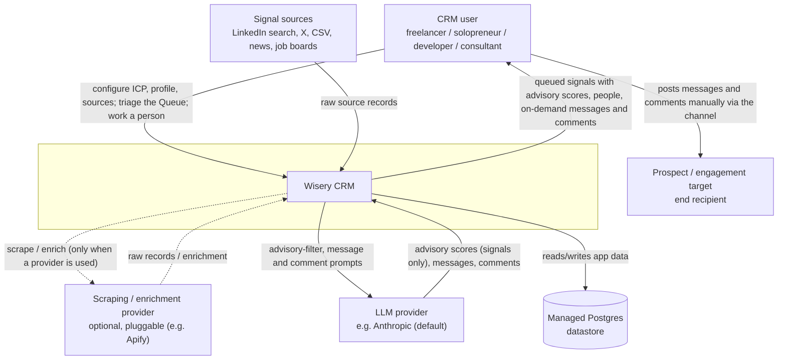
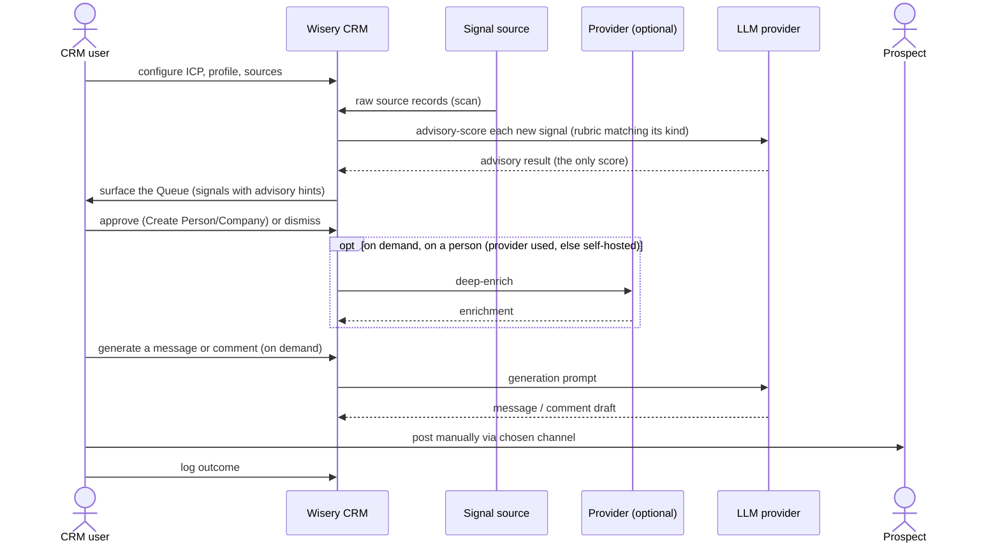

# System context (C4 L1)

The current C4 level 1 view: Wisery CRM as one box, its human actor, and every external
system it depends on. The action edge is deliberately drawn from the CRM user (not the
system) to the Prospect - the system never contacts a prospect directly.

Related: [product-overview.md](../product-overview.md) (the spine, locked decisions D1-D10),
[system-design.md](system-design.md) (C4 L2 containers + flows), [cross-cutting.md](cross-cutting.md),
[ADR-0001](../adr/0001-background-job-runtime.md). Promoted from change `system-context-c4-l1`
(2026-05-22); LLM/provider labels and the draft-position note reconciled by `c4-level2-architecture`
(2026-05-24); the engagement motion folded in by `content-marketing-engagement` (2026-06-07) - it adds
no new external system, and the post author is reached only by a manual human action like the Prospect.
The `engagement-rework` change (2026-06-08) leaves the external boundary unchanged; internally the
split Triage + Review & approve surfaces collapse into one **Queue**, and post-intake work (generate a
message or comment, enrich) becomes on-demand calls to the LLM and enrichment providers rather than an
automatic pipeline (ADR-0019). The `adr-signal-only-scoring` change (2026-06-13) narrows the LLM's
scoring role to the per-signal advisory filter only - person scoring is removed, the advisory on the
signal is the only score (ADR-0022). The diagram below also lands the engagement-rework's deferred L1
label updates (the prior labels still read "review + approve" / "qualify and draft"), so the edges now
reflect the unified Queue, on-demand generation, and signal-only scoring together.

What crosses each boundary:
- **CRM user <-> system**: inbound config (ICP, profile, sources) and triage approvals; outbound advisory-scored queued signals, people, dossiers, and on-demand messages/comments. This is the anchor-view surface.
- **Signal sources -> system**: inbound raw source records (a person, company, piece of content, or job posting), pulled per the connector seam (D4).
- **Scraping / enrichment provider <-> system** (optional, pluggable): when one is used, outbound scrape/enrich requests and inbound raw records / enrichment (normalized at our edge, D4), behind the D4 interfaces. Apify is one example; the system can instead self-host scraping (Puppeteer/Playwright) and reach sources directly, with no external provider. The same provider class can serve both signal capture and enrichment.
- **LLM provider <-> system**: outbound advisory-filter prompts (scoring each signal at triage - the only scoring) plus on-demand message/comment prompts; inbound advisory scores, messages, comments. Provider-agnostic behind an `LLMProvider` port, Anthropic the default adapter (D9). Carries prospect PII.
- **Managed Postgres <-> system**: the system's own managed datastore. Shown as a dependency because it is hosted, but it holds our own schema (not a third-party system of record). How async jobs run on it is an L2/technology concern, fixed by ADR-0001.
- **CRM user -> Prospect**: a manual human action through the chosen channel. The system has no edge to the Prospect (ToS-safe, D2).
- **CRM user -> Engagement target** (a peer or buyer whose post is commented on): also a manual human action - the system drafts the comment but never posts it (D2), the same human-only recipient edge as the Prospect. The engagement motion (content-marketing-engagement) introduces **no new external system**: a person's posts and deep profile arrive through the existing scraping/enrichment provider (a new `fetchPosts` method on the `EnrichmentProvider` port), comments through the existing `LLMProvider` port.

## Boundary runtime flow

The daily loop at the boundary (the system stays one box; container-level sequences are L2).

The advisory-score step is resolved at L2: the advisory filter scores each signal against the rubric
matching its kind and records the result on the signal (`signal_advisory`) - the only score in the
system, a triage hint, never a per-person score (ADR-0022). Approval creates the entity and writes no
score; generation is a separate on-demand LLM call grounded in the person's info and dossier. The
container-level flows are in [system-design.md](system-design.md).

## Scope notes

- The L2 container view (web app, in-process worker, datastore) and the runtime sequences are
  drawn in [system-design.md](system-design.md), honoring ADR-0001 (background jobs in-process).
- Entity shapes (ERD, lifecycle) are not modeled here; they belong to per-area domain-model
  changes.
