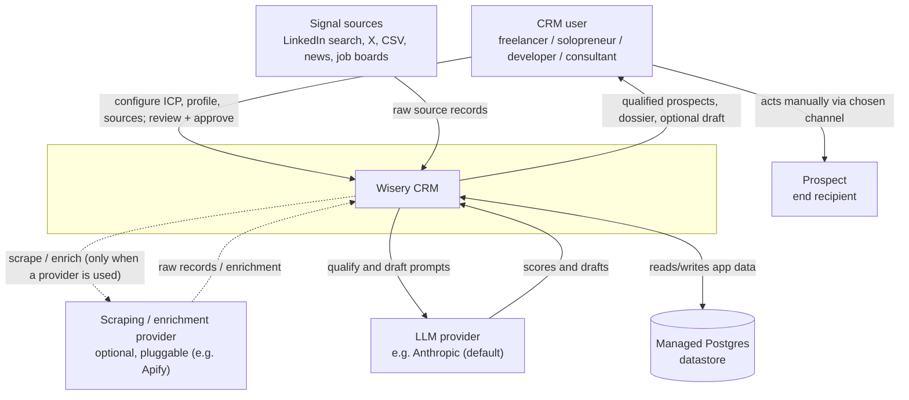
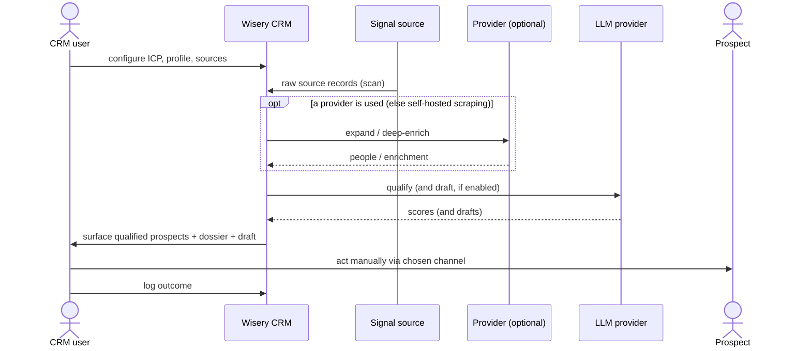

# System context (C4 L1)

The current C4 level 1 view: Wisery CRM as one box, its human actor, and every external
system it depends on. The action edge is deliberately drawn from the CRM user (not the
system) to the Prospect - the system never contacts a prospect directly.

Related: [product-overview.md](../product-overview.md) (the spine, locked decisions D1-D10),
[system-design.md](system-design.md) (C4 L2 containers + flows), [cross-cutting.md](cross-cutting.md),
[ADR-0001](../adr/0001-background-job-runtime.md). Promoted from change `system-context-c4-l1`
(2026-05-22); LLM/provider labels and the draft-position note reconciled by `c4-level2-architecture`
(2026-05-24).

What crosses each boundary:
- **CRM user <-> system**: inbound config (ICP, profile, sources) and approvals; outbound qualified prospects, dossiers, and optional drafts. This is the anchor-view surface.
- **Signal sources -> system**: inbound raw source records (a person, company, piece of content, or job posting), pulled per the connector seam (D4).
- **Scraping / enrichment provider <-> system** (optional, pluggable): when one is used, outbound scrape/enrich requests and inbound raw records / enrichment (normalized at our edge, D4), behind the D4 interfaces. Apify is one example; the system can instead self-host scraping (Puppeteer/Playwright) and reach sources directly, with no external provider. The same provider class can serve both signal capture and enrichment.
- **LLM provider <-> system**: outbound qualify/draft prompts, inbound scores and drafts. Provider-agnostic behind an `LLMProvider` port, Anthropic the default adapter (D9). Carries prospect PII.
- **Managed Postgres <-> system**: the system's own managed datastore. Shown as a dependency because it is hosted, but it holds our own schema (not a third-party system of record). How async jobs run on it is an L2/technology concern, fixed by ADR-0001.
- **CRM user -> Prospect**: a manual human action through the chosen channel. The system has no edge to the Prospect (ToS-safe, D2).

## Boundary runtime flow

The daily loop at the boundary (the system stays one box; container-level sequences are L2).

The "qualify (and draft, if enabled)" step is now resolved at L2: qualify uses the cheap signal as
the cost gate and records an ICP score per person (a Scoring against the prospect, not the signal),
and the first-touch draft is a separate LLM call after deep enrichment, grounded in the dossier (D5,
refined by ADR-0005). The container-level flows are in [system-design.md](system-design.md).

## Scope notes

- The L2 container view (web app, in-process worker, datastore) and the runtime sequences are
  drawn in [system-design.md](system-design.md), honoring ADR-0001 (background jobs in-process).
- Entity shapes (ERD, lifecycle) are not modeled here; they belong to per-area domain-model
  changes.
