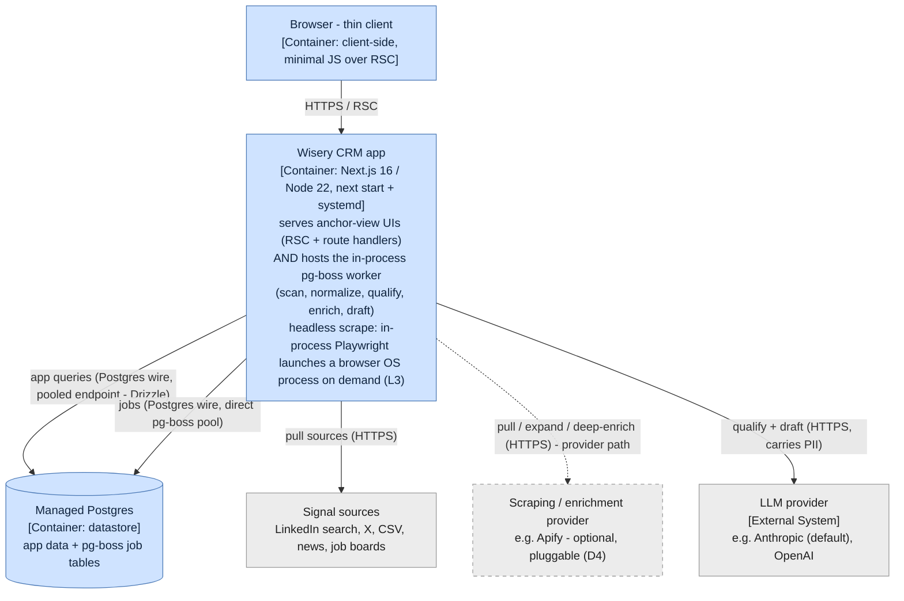
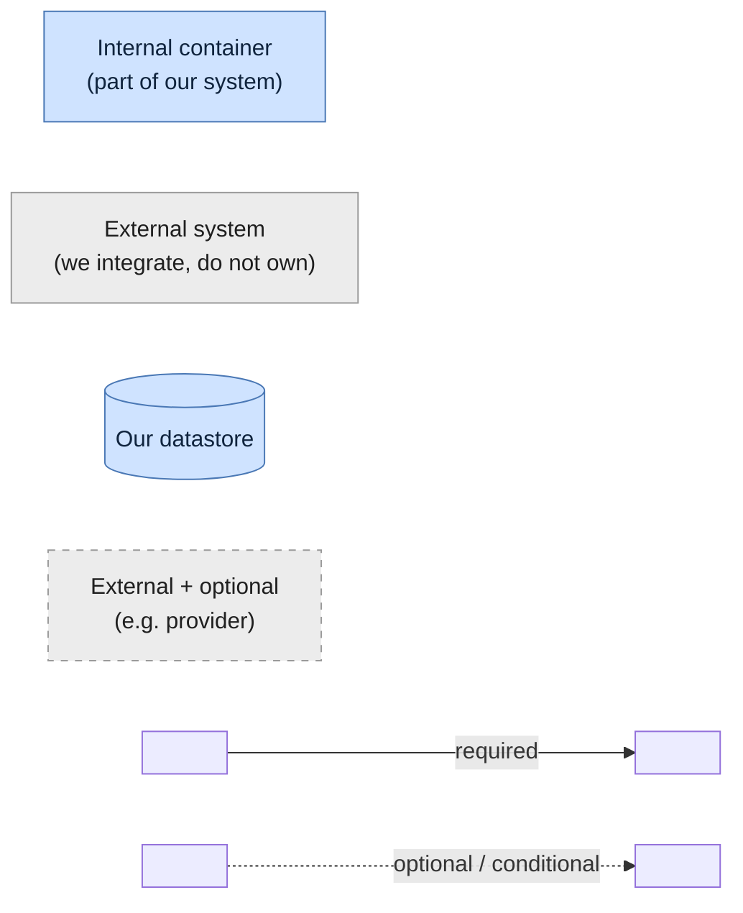
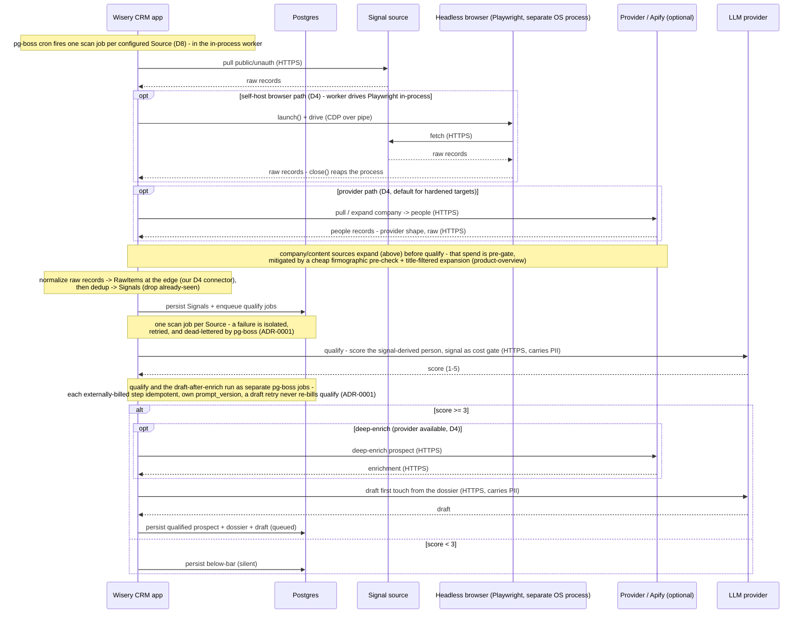
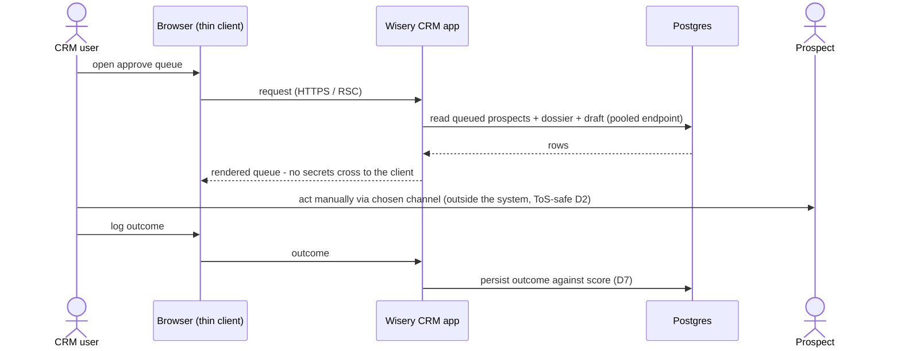
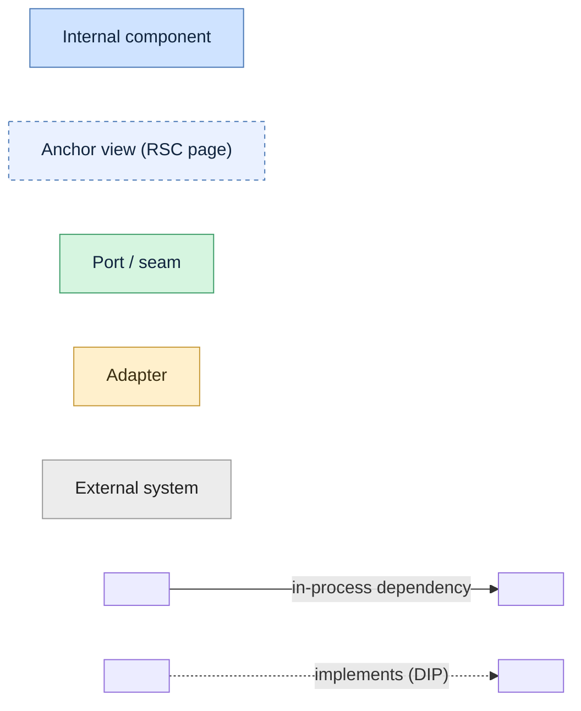
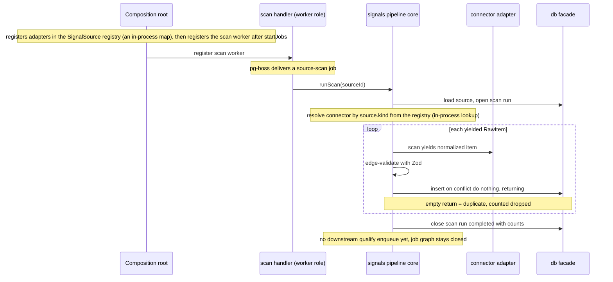

# System design (C4 L2 + L3) - containers, runtime flows, and components

The container view of Wisery CRM (C4 L2) plus the component decomposition inside the app container
(C4 L3): the separately runnable units, the protocols between them, the highest-judgment runtime
flows, and the components that make up the one app process. The L1 system context is in
[system-context.md](system-context.md); the data model in [domain-model.md](domain-model.md);
cross-cutting concerns in [cross-cutting.md](cross-cutting.md); the decisions behind this view are
[ADR-0001](../adr/0001-background-job-runtime.md), [ADR-0002](../adr/0002-headless-browser-scraping.md),
[ADR-0003](../adr/0003-llm-provider-port.md), [ADR-0004](../adr/0004-pg-boss-facade.md),
[ADR-0005](../adr/0005-signal-to-prospect-fan-out.md), and
[ADR-0006](../adr/0006-pre-code-l3-component-view.md).

Promoted from change `c4-level2-architecture` (2026-05-24); the C4 L3 component section added by
`c4-level3-and-domain-model` (2026-05-26). Flat at the top of the architecture folder while there is
a single implicit area (README rule 5).

## Containers

The separately runnable and deployable units inside (and at the edge of) the Wisery CRM boundary, and
the protocols between them. The test for a container here is "something that has to be running for the
system to work" - a process or a datastore - not a code grouping inside one of them (that is L3).

Per ADR-0001, the web app and the pg-boss worker are two ROLES of a single Node process, so they are
ONE container, annotated with both responsibilities - not two boxes. Their split into web/worker
roles, the optional `worker_threads` pool, and the on-demand headless browser Playwright launches for
browser-needing scrapes are L3 internals, deliberately not drawn. Internal containers (what we build
and run) are blue; external systems we depend on but do not control are grey; the one optional
external unit and its edge (the provider) are dashed. A legend follows the diagram.

**Legend.**

Key: a **solid** arrow is an always-present relationship; a **dashed** arrow is an optional/conditional
path (present only on the D4 self-host or provider path), not an async marker. Arrows are
unidirectional and point from caller to dependency - the response is implied, which is why this view
has no double-headed arrows. **Rectangle** = process/container, **cylinder** = datastore. **Blue** =
internal (part of the system we are building, including our own datastore even when managed-hosted),
**grey** = external system we integrate with but do not own. The two axes are independent: the
provider, for instance, is external-and-optional.

The three outbound source paths - a direct API/HTTP pull (in-process), a spawned headless-browser
child (for self-host targets that need a real browser), and the provider - are per-source
ALTERNATIVES selected by the D4 cost/ban-risk knob, not concurrent. The app's outbound edges to
sources and the provider are not direct vendor bindings: they cross the D4 `SignalSource` /
`EnrichmentProvider` ports. Apify and the self-host browser path are interchangeable adapters behind
those ports, which is why a new source is a new adapter, not a pipeline change (D4, D8).
LLM-agnosticism is a locked product decision (D9): the LLM provider sits behind an `LLMProvider`
port - a peer of the D4 `SignalSource` / `EnrichmentProvider` ports, all of them seams across the
system boundary - where every data-returning call is a provider-neutral JSON Schema validated with
Zod, the wire schema kept within that provider's supported structured-output subset and richer
constraints enforced in a post-parse Zod refine, so Anthropic is the default adapter rather than a
binding (D9, ADR-0003). (The in-process queue, by contrast, is reached via a thin pg-boss facade that
is deliberately not a portability seam - see the Managed Postgres entry.) An authenticated source
never uses the direct pull (the ToS/ban-risk path the product avoids, D2); it goes via the spawned
browser child or the provider, with the provider the default for hardened targets (ADR-0002).

Container by container, and why each qualifies as a container (not a component):
- **Wisery CRM app**: one Node process (`next start` + systemd). It is a single container because both roles run in the same process and share one event loop (ADR-0001); the web/worker split, the optional `worker_threads` pool, and the on-demand headless-browser process the worker launches for browser-needing scrapes are L3 components. **Peel-safety invariant**: the no-rewrite peel into a standalone `worker.ts` holds only while the web and worker roles share state solely through Postgres - no module-level mutable singletons, no in-process caches or event buses, no transaction or connection spanning a request handler and a job (ADR-0001). The peel is the moment this becomes two containers (the worker onto its own process, and later its own host). The headless browser is launched in-process via Playwright only for self-host targets that need a real browser; `launch()` spawns and supervises it as a separate OS process over a pipe/CDP (heavy: memory, own lifecycle, wide crash blast radius), so its weight stays off the worker's event loop and `close()` reaps it per scrape. Concurrent browsers are capped by a semaphore sized to host memory (the same budget discipline as the pg-boss pool), with try/finally `close()` + a hard timeout + an orphan reaper to bound the OOM-on-leak risk on the shared host; a `newContext()` warm-browser reuse, then a `launchServer()` pool or a dedicated host, are later scaling levers, not the default (ADR-0002).
- **Browser - thin client**: the client-side container; thin because most rendering is server-side (RSC). Drawn so the client/server cut is explicit - no secret-bearing path crosses to it.
- **Managed Postgres**: the datastore container; one instance holds both app data and the pg-boss job tables (ADR-0001), so it is a single failure domain for serving and background work - a Postgres outage halts both, accepted while single-user. It is drawn inside the system boundary (internal) because it is the system's own datastore - we own its schema - not a third-party system we integrate with; managed hosting (Neon/Supabase/RDS, ADR-0001) is an operational fact, not a boundary change, unlike the genuinely external LLM, provider, and sources. The two access modes (pooled endpoint for app queries, a direct connection for pg-boss) are a property of how the app connects: pg-boss claims work by long-polling with `SKIP LOCKED` and runs its own long-lived `pg.Pool`, so it is given a direct connection rather than fronted by a transaction-mode pooler, which would be redundant in front of its pool (its advisory locks are transaction-scoped and pooler-safe, so they are not the reason) - ADR-0001. pg-boss's persistent connections are sized via its pool `max` and budgeted against the database's connection cap alongside the pooled app connections. The app reaches pg-boss through a thin pg-boss facade (a wrapper for testability and to localize the pg-boss API), deliberately not a portability seam: pg-boss's transactional enqueue - a job created atomically with its originating data write - is a Postgres-backed-queue property the facade does not abstract away, so the queue stays intentionally Postgres-coupled and a real backend change would be a future superseding decision, not a free adapter swap (ADR-0004).

## Key runtime flows

Two highest-judgment flows, both consistent with the [L1 boundary flow](system-context.md#boundary-runtime-flow) and the [primary journey](../product-overview.md#primary-journey). These
are dynamic views over the containers above; because the web and worker are one container, the app
appears once and a note marks when it is acting in its in-process worker capacity (ADR-0001).

### Intelligence pipeline - scheduled scan to queued draft

### Human review and act

## Components (C4 L3)

The component decomposition inside the single app container. Maintaining a level-3 view in living
canon, ahead of the code, is a deliberate, scoped exception to the usual "stop at L2" stance -
recorded in [ADR-0006](../adr/0006-pre-code-l3-component-view.md). It is a skeleton of the stable
seams, revised as features land; feature-internal detail stays in each capability's design, and the
build-enforced dependency-cruiser port/adapter rule (not this diagram) is the contract.

Everything blue is a component of the one app container; grey is external. Components are grouped by
their stable seam. A solid arrow is an in-process dependency (a call within the one Node process); a
dashed arrow is an adapter implementing a port (the dependency-inversion direction); an edge crossing
to an external system carries its wire protocol. All components read configuration via `config` and
emit logs via `log`; those ubiquitous edges are stated once here rather than drawn. The three
anchor-view nodes are RSC UI surfaces, not callable components; the named bands are grouping lenses by
role or seam, not containers.

> Interactive wireframes of these three anchor-view nodes (clickable, mock-data) live in
> [`src/app/prototype/`](../../src/app/prototype/README.md) - supplementary implementation sketches
> for settling UX, not canon. The component contract here governs; the registry there maps each
> screen to the capabilities it surfaces.

```mermaid
flowchart TB
    subgraph app["Wisery CRM app - one Node process (ADR-0001)"]
        direction TB

        subgraph web["Web / RSC surface - web role"]
            icp["ICP and source config<br/>anchor view #1"]
            plist["Prospect list<br/>anchor view #3"]
            queue["Review and approve queue<br/>anchor view #2"]
            handlers["Route handlers / Server actions<br/>RSC reads + outcome logging + enqueue scan"]
        end

        root["Composition root<br/>instrumentation.ts -> bootstrapNodeRuntime<br/>starts jobs, registers workers + adapters"]

        subgraph workers["Background pipeline - worker role (pg-boss handlers)"]
            hscan["scan handler"]
            hexpand["normalize-expand handler<br/>M2"]
            hqual["qualify handler"]
            henrich["enrich handler"]
            hdraft["draft handler"]
        end

        subgraph cores["Domain cores - role-agnostic, depend on db only"]
            cscan["signals pipeline<br/>dedup + persist + scan counts"]
            cqual["qualification core<br/>fan-out + score gate"]
            cenrich["enrichment core<br/>builds dossier"]
            cdraft["drafting core<br/>draft from dossier + profile"]
            cexpand["expansion core<br/>company -> people, M2"]
        end

        subgraph portgrp["Ports and registry - D4 / D9 seams"]
            psrc["SignalSource port + registry"]
            penr["EnrichmentProvider port"]
            pllm["LLMProvider port"]
        end

        subgraph adgrp["Adapters - reached only via registry / composition root"]
            afix["fixture connector<br/>test/dev only"]
            alink["linkedin-search"]
            ax["x-posts"]
            aapify["Apify enrichment"]
            abrow["self-host browser driver<br/>Playwright"]
            aanth["Anthropic adapter<br/>Structured Outputs"]
        end

        subgraph prompts["Prompts - src/prompts/&lt;name&gt;_v&lt;n&gt;"]
            pq["qualify prompt"]
            pd["draft prompt"]
        end

        subgraph platform["Platform facades - shared"]
            cfg["config<br/>src/lib/config"]
            db["db / Drizzle + repos<br/>src/lib/db"]
            jobs["jobs facade<br/>src/lib/jobs"]
            logc["log<br/>src/lib/log"]
        end
    end

    PG[("Managed Postgres")]
    SRC["Signal sources"]
    APIFY["Scraping / enrichment provider"]
    LLMX["LLM provider"]
    BROWSER["Headless browser<br/>separate OS process"]

    icp --> handlers
    plist --> handlers
    queue --> handlers
    handlers --> db
    handlers --> jobs

    root --> jobs
    root -->|"registers workers"| workers
    root --> psrc

    hscan --> cscan
    hexpand --> cexpand
    hqual --> cqual
    henrich --> cenrich
    hdraft --> cdraft

    cscan --> db
    cqual --> db
    cenrich --> db
    cdraft --> db
    cexpand --> db
    cexpand --> penr
    cscan --> psrc
    cqual --> pllm
    cqual --> pq
    cdraft --> pllm
    cdraft --> pd
    cenrich --> penr

    afix -.->|implements| psrc
    alink -.->|implements| psrc
    ax -.->|implements| psrc
    aapify -.->|implements| penr
    abrow -.->|implements| penr
    aanth -.->|implements| pllm

    db -->|"SQL, Postgres wire"| PG
    jobs -->|"SQL, Postgres wire"| PG
    alink -->|HTTPS| SRC
    ax -->|HTTPS| SRC
    aapify -->|HTTPS| APIFY
    abrow -->|"CDP over pipe"| BROWSER
    BROWSER -->|HTTPS| SRC
    aanth -->|HTTPS| LLMX

    classDef internal fill:#cfe3ff,stroke:#4a78b5,color:#10243e;
    classDef external fill:#ececec,stroke:#9a9a9a,color:#1f1f1f;
    classDef port fill:#d6f5e0,stroke:#3f9d6a,color:#10243e;
    classDef adapter fill:#fff0cc,stroke:#c79a3a,color:#3a2e10;
    classDef anchorview fill:#eaf1ff,stroke:#4a78b5,color:#10243e,stroke-dasharray:4 4;
    class handlers,root,hscan,hexpand,hqual,henrich,hdraft,cscan,cqual,cenrich,cdraft,cexpand,cfg,db,jobs,logc,pq,pd internal;
    class icp,plist,queue anchorview;
    class psrc,penr,pllm port;
    class afix,alink,ax,aapify,abrow,aanth adapter;
    class PG,SRC,APIFY,LLMX,BROWSER external;
```

**Legend.**

### Component catalog

| Component | Responsibility | Seam / port | Role | Owning capability |
|---|---|---|---|---|
| ICP and source config | Edit rubric, profile, and sources as data (anchor #1) | - | web | icp-config |
| Prospect list | Browse and manage prospects and signals (anchor #3) | - | web | prospect-list |
| Review and approve queue | Surface queued prospect + dossier + draft, log outcome (anchor #2) | - | web | review-queue |
| Route handlers / Server actions | RSC reads, the enqueue-scan trigger, outcome logging | reads `db`, calls `jobs` | web | each anchor view |
| Composition root | Start jobs, register workers and adapters - the only `kind -> instance` wiring point | `jobs`, `psrc` registry | boot | platform-runtime |
| scan handler -> signals pipeline | Claim source, run connector, dedup, persist, tally | `SignalSource` via registry | worker | signal-ingestion |
| qualify handler -> qualification core | Fan-out signal to person prospects, score against rubric, gate at >= 3 | `LLMProvider` | worker | qualification |
| enrich handler -> enrichment core | Deep-enrich a qualified prospect into a dossier | `EnrichmentProvider` | worker | enrichment |
| draft handler -> drafting core | Generate first-touch draft from dossier + profile | `LLMProvider` | worker | drafting |
| normalize-expand handler -> expansion core | Company / content -> people before qualify | `EnrichmentProvider` | worker | normalize-expand (M2) |
| SignalSource port + registry | The D4 connector contract + the `kind -> connector` map | port (D4) | both | signal-ingestion |
| EnrichmentProvider port | The D4 deep-enrich contract | port (D4) | worker | enrichment |
| LLMProvider port | Provider-neutral structured-output contract (D9, ADR-0003) | port (D9) | worker | llm-provider |
| Connectors (fixture [test/dev only], linkedin-search, x-posts) | Fetch + normalize one source kind | implement `SignalSource` | worker | source-adapters; fixture from signal-ingestion |
| Enrichment adapters (Apify, self-host browser) | Deep-enrich / scrape per the cost knob | implement `EnrichmentProvider` | worker | enrichment |
| Anthropic adapter | Default LLM via Structured Outputs + 1h cache | implements `LLMProvider` | worker | llm-provider |
| Prompts | Versioned qualify / draft prompts for `prompt_version` traceability | consumed by cores | worker | qualification, drafting |
| config / db / jobs / log | The reused platform facades - no parallel mechanisms | - | both | platform-runtime, background-jobs |

For unbuilt capabilities only the seam, port, and owning capability are load-bearing here; their
internal shape is owned by each capability's design and is illustrative until that capability lands.

### Web vs worker role mapping (ADR-0001 peel-safety)

The web and worker components run in one process today but are split into the two roles above so the
no-rewrite peel into a standalone `worker.ts` stays available. The peel-safety invariant: web and
worker components share state only through Postgres (rows + pg-boss jobs) - no module-level mutable
singletons, no in-process cache or event bus, no transaction spanning a request handler and a job.
The domain cores are deliberately role-agnostic and depend on `db` only, so the same core is callable
from a handler or a worker without dragging in queue or HTTP concerns. Where a stage must both write
rows and enqueue the next job - the qualify fan-out persisting N prospects and queuing their next
stage - the job handler, not the core, owns one Drizzle transaction passed to both the repo and
`jobs.enqueue` (pg-boss `send` shares the same Postgres), so the writes and their follow-on jobs
commit atomically while the core stays db-only. This is within a single job handler, so it does not
violate the no-transaction-spanning-a-request-and-a-job invariant. The self-host browser is a separate
OS process the browser adapter spawns on demand (ADR-0002), drawn as the external `Headless browser`
box.

### Ports and adapters direction

The dependency-inversion seam (enforced by dependency-cruiser): cores and ports MUST NOT import
adapters; adapters depend on (implement) ports, and an adapter is bound to a `kind`/provider only in
the registry wired from the composition root. This is why a new source or provider is a new adapter
file plus one registry line - never a change to a core, a port, or the pipeline. The rule exists for
`SignalSource` today; `enrichment` and `llm-provider` extend it to their ports when they land. The
build-enforced rule covers the adapter seam; the db-only and web/worker-share-only-via-Postgres
invariants are reviewed convention, not yet build-enforced (a cores-must-not-import-jobs rule is a
candidate to add when qualification lands).

### L3 runtime flow - scan slice internals

The internal view of the scan slice, revealing the handler/core/registry/port decomposition the
container view hides; consistent with the Prospect lifecycle (a SignalPersisted event with no further
enqueue yet, owned by qualification when it lands).

