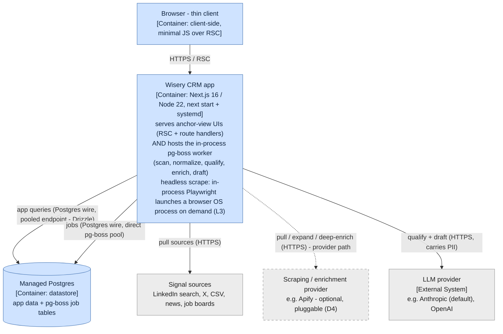
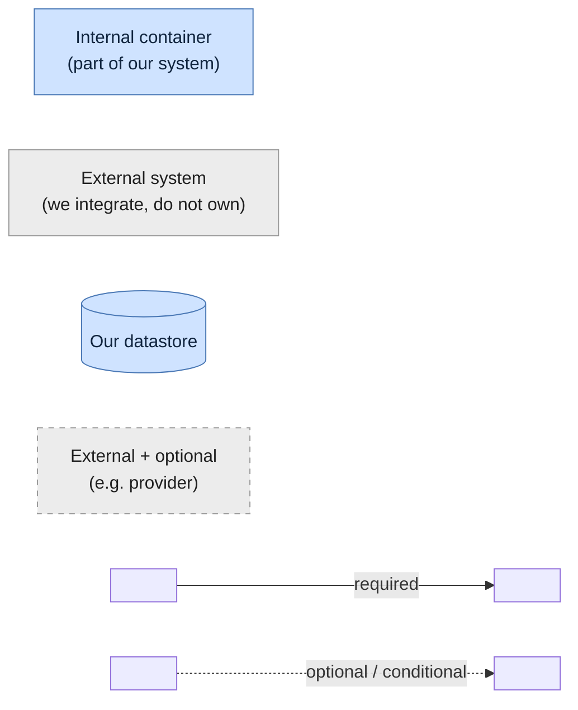
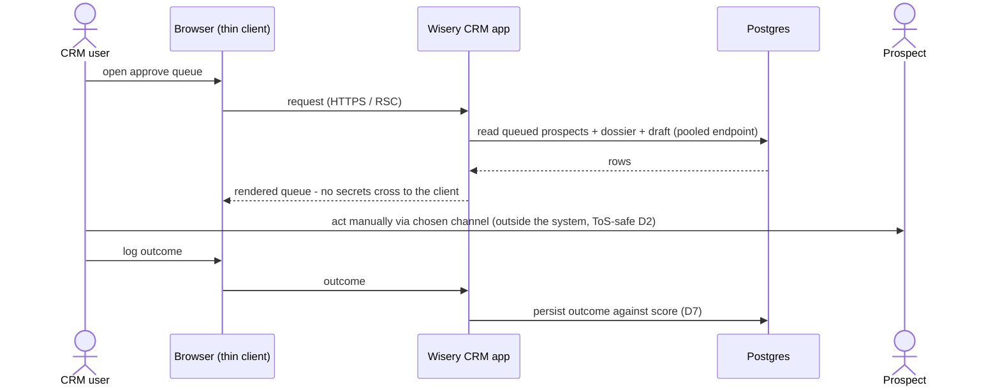

# System design (C4 L2) - containers and runtime flows

The container view of Wisery CRM: the separately runnable and deployable units inside (and at the
edge of) the boundary, the protocols between them, and the two highest-judgment runtime flows. The
L1 system context is in [system-context.md](system-context.md); cross-cutting concerns in
[cross-cutting.md](cross-cutting.md); the decisions behind this view are
[ADR-0001](../adr/0001-background-job-runtime.md), [ADR-0002](../adr/0002-headless-browser-scraping.md),
[ADR-0003](../adr/0003-llm-provider-port.md), and [ADR-0004](../adr/0004-pg-boss-facade.md).

Promoted from change `c4-level2-architecture` (2026-05-24); flat at the top of the architecture folder
while there is a single implicit area (README rule 5).

## Containers

The separately runnable and deployable units inside (and at the edge of) the Wisery CRM boundary, and
the protocols between them. The test for a container here is "something that has to be running for the
system to work" - a process or a datastore - not a code grouping inside one of them (that is L3).

Per ADR-0001, the web app and the pg-boss worker are two ROLES of a single Node process, so they are
ONE container, annotated with both responsibilities - not two boxes. Their split into web/worker
roles, the optional `worker_threads` pool, and the on-demand headless browser Playwright launches for
browser-needing scrapes are L3 internals, deliberately not drawn. Internal containers (what we build
and run) are blue; external systems we depend on but do not control are grey; the one optional
external unit and its edge (the provider) are dashed. A legend follows the diagram.

**Legend.**

Key: a **solid** arrow is an always-present relationship; a **dashed** arrow is an optional/conditional
path (present only on the D4 self-host or provider path), not an async marker. Arrows are
unidirectional and point from caller to dependency - the response is implied, which is why this view
has no double-headed arrows. **Rectangle** = process/container, **cylinder** = datastore. **Blue** =
internal (part of the system we are building, including our own datastore even when managed-hosted),
**grey** = external system we integrate with but do not own. The two axes are independent: the
provider, for instance, is external-and-optional.

The three outbound source paths - a direct API/HTTP pull (in-process), a spawned headless-browser
child (for self-host targets that need a real browser), and the provider - are per-source
ALTERNATIVES selected by the D4 cost/ban-risk knob, not concurrent. The app's outbound edges to
sources and the provider are not direct vendor bindings: they cross the D4 `SignalSource` /
`EnrichmentProvider` ports. Apify and the self-host browser path are interchangeable adapters behind
those ports, which is why a new source is a new adapter, not a pipeline change (D4, D8).
LLM-agnosticism is a locked product decision (D9): the LLM provider sits behind an `LLMProvider`
port - a peer of the D4 `SignalSource` / `EnrichmentProvider` ports, all of them seams across the
system boundary - where every data-returning call is a provider-neutral JSON Schema validated with
Zod, the wire schema kept within that provider's supported structured-output subset and richer
constraints enforced in a post-parse Zod refine, so Anthropic is the default adapter rather than a
binding (D9, ADR-0003). (The in-process queue, by contrast, is reached via a thin pg-boss facade that
is deliberately not a portability seam - see the Managed Postgres entry.) An authenticated source
never uses the direct pull (the ToS/ban-risk path the product avoids, D2); it goes via the spawned
browser child or the provider, with the provider the default for hardened targets (ADR-0002).

Container by container, and why each qualifies as a container (not a component):
- **Wisery CRM app**: one Node process (`next start` + systemd). It is a single container because both roles run in the same process and share one event loop (ADR-0001); the web/worker split, the optional `worker_threads` pool, and the on-demand headless-browser process the worker launches for browser-needing scrapes are L3 components. **Peel-safety invariant**: the no-rewrite peel into a standalone `worker.ts` holds only while the web and worker roles share state solely through Postgres - no module-level mutable singletons, no in-process caches or event buses, no transaction or connection spanning a request handler and a job (ADR-0001). The peel is the moment this becomes two containers (the worker onto its own process, and later its own host). The headless browser is launched in-process via Playwright only for self-host targets that need a real browser; `launch()` spawns and supervises it as a separate OS process over a pipe/CDP (heavy: memory, own lifecycle, wide crash blast radius), so its weight stays off the worker's event loop and `close()` reaps it per scrape. Concurrent browsers are capped by a semaphore sized to host memory (the same budget discipline as the pg-boss pool), with try/finally `close()` + a hard timeout + an orphan reaper to bound the OOM-on-leak risk on the shared host; a `newContext()` warm-browser reuse, then a `launchServer()` pool or a dedicated host, are later scaling levers, not the default (ADR-0002).
- **Browser - thin client**: the client-side container; thin because most rendering is server-side (RSC). Drawn so the client/server cut is explicit - no secret-bearing path crosses to it.
- **Managed Postgres**: the datastore container; one instance holds both app data and the pg-boss job tables (ADR-0001), so it is a single failure domain for serving and background work - a Postgres outage halts both, accepted while single-user. It is drawn inside the system boundary (internal) because it is the system's own datastore - we own its schema - not a third-party system we integrate with; managed hosting (Neon/Supabase/RDS, ADR-0001) is an operational fact, not a boundary change, unlike the genuinely external LLM, provider, and sources. The two access modes (pooled endpoint for app queries, a direct connection for pg-boss) are a property of how the app connects: pg-boss claims work by long-polling with `SKIP LOCKED` and runs its own long-lived `pg.Pool`, so it is given a direct connection rather than fronted by a transaction-mode pooler, which would be redundant in front of its pool (its advisory locks are transaction-scoped and pooler-safe, so they are not the reason) - ADR-0001. pg-boss's persistent connections are sized via its pool `max` and budgeted against the database's connection cap alongside the pooled app connections. The app reaches pg-boss through a thin pg-boss facade (a wrapper for testability and to localize the pg-boss API), deliberately not a portability seam: pg-boss's transactional enqueue - a job created atomically with its originating data write - is a Postgres-backed-queue property the facade does not abstract away, so the queue stays intentionally Postgres-coupled and a real backend change would be a future superseding decision, not a free adapter swap (ADR-0004).

## Key runtime flows

Two highest-judgment flows, both consistent with the L1 boundary flow and the primary journey. These
are dynamic views over the containers above; because the web and worker are one container, the app
appears once and a note marks when it is acting in its in-process worker capacity (ADR-0001).

### Intelligence pipeline - scheduled scan to queued draft

### Human review and act

