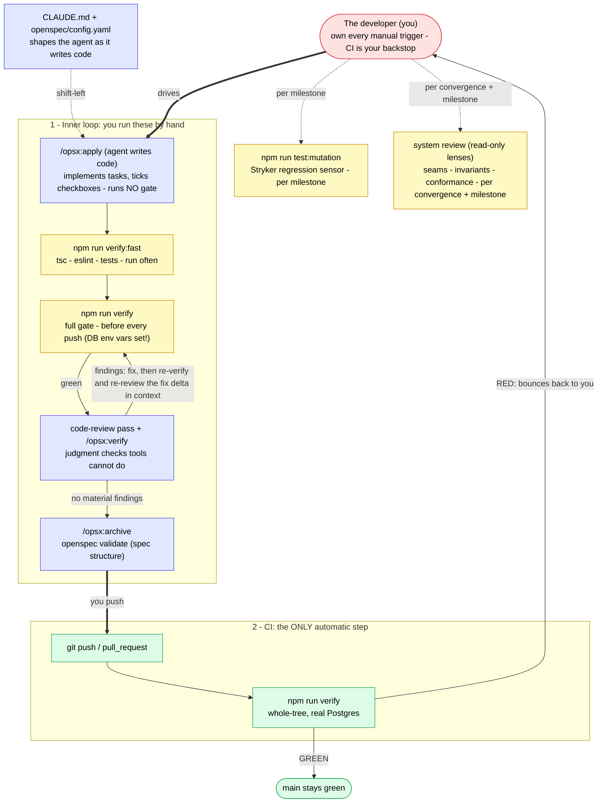
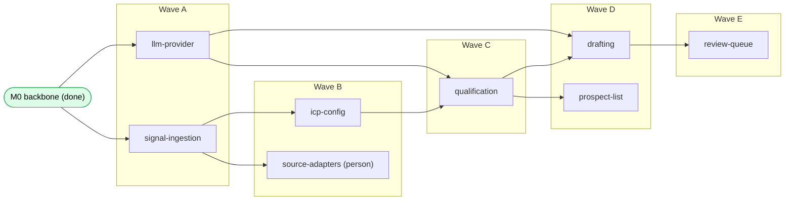
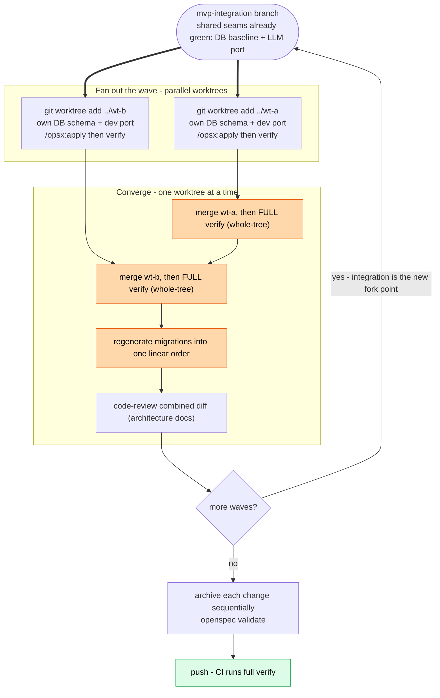

# Engineering - quality harness

How code quality is enforced in this repo. Stood up by the `quality-harness` change;
the sequencing context is in [roadmap.md](roadmap.md) (verification posture).

## The verify gate

`npm run verify` is the definition of done for every change. It runs, fail-fast:

1. `tsc --noEmit` - types (whole program)
2. `eslint .` - lint, including type-aware rules and `sonarjs/cognitive-complexity` (nesting-aware; replaces core cyclomatic `complexity`)
3. `prettier --check .` - formatting
4. `depcruise src` - architectural boundaries
5. `jscpd src` - duplication
6. `vitest run --coverage` - tests + per-file coverage floor
7. `next build` - the app builds

`npm run verify:fast` (tsc + eslint + tests) is the quick inner-loop subset; the full
gate runs before push and in CI.

These gates run **whole-tree**, not over the diff, so they catch system-context
regressions: a new import that breaks a boundary with existing modules, cross-file
duplication, a type break in a consumer, a broken existing test.

`verify` requires a reachable test Postgres (the DB and pg-boss tests connect for real -
see below). CI provides one; locally, point `TEST_DATABASE_URL` / `APP_DATABASE_URL` /
`PGBOSS_DATABASE_URL` at your instance (`localhost:5433` in dev).

## Testing strategy

- **Unit tests** for pure logic (config parsing, future domain rules) - no I/O, always run.
- **Integration tests** for anything touching Postgres or pg-boss - they connect to a real
  database (no mocks; mocking these defeats their purpose). They gate on `TEST_DATABASE_URL`
  and skip cleanly when it is unset, so a contributor without a DB can still run the suite -
  but **CI sets the URL so they always run there** (a skipped integration test is not a passing one).
- pg-boss tests use an isolated schema (`pgboss_test`) so they never touch the dev `pgboss` schema.

### Coverage floor

Per-file thresholds (`vitest.config.ts`), so a new untested module cannot hide behind high
overall coverage. The floor is set just under the measured baseline and ratcheted up as the
suite grows - a floor, not a target. Setting it above reality is performative; it gets disabled
the first time it blocks.

Excluded from the floor (with reason, not to game the number):

- `src/app/**` - Next pages, layouts, route handlers: component/integration territory, not unit tests.
- `src/instrumentation.ts`, `src/lib/runtime/**` - process bootstrap glue, exercised by the live boot smoke and integration.
- `src/lib/log/**` - logger construction (pino config), no branching logic worth a unit test.
- `src/lib/jobs/**` - the thin pg-boss facade is delegation only; it earns real coverage when the first capability enqueues through it with isolated-schema integration tests. Excluded until then rather than asserting a performative or dev-schema-touching test. **Revisit when `signal-ingestion` lands.**

Coverage answers "was this line executed", not "would a test fail if the behaviour
changed". That second question - the one a regression sensor should answer - is what
mutation testing covers (below).

### Mutation testing - the regression sensor (Stryker)

`npm run test:mutation` (config: `stryker.config.mjs`) mutates the source and checks the
suite catches each change. It exists because a green coverage floor can still hide
assertion-light tests - and when tests are largely agent-written, that gap is the norm,
not the exception (see [the maintainability-sensors note](https://martinfowler.com/articles/sensors-for-coding-agents.html)).
The baseline run proved it: the config module passed the coverage floor at **58% mutation
score** until the surviving mutants were turned into assertions (now 71%).

Scope and cadence are deliberate:

- **Pure-logic surface only** - mutates the same no-I/O modules the coverage floor guards
  (today `src/lib/config/**`). Widen `mutate` in lockstep as scoring/ICP rules land; never
  point it at `src/app`, runtime glue, or the pg-boss facade.
- **Out-of-band, not in `verify`** - mutation testing is O(mutants x suite); it would wreck
  the inner loop. It is an on-demand / per-milestone sensor, run alongside the whole-system
  review, not in the per-change gate or CI fast path.
- **Floor-not-target** - `thresholds.break` is set just under the measured baseline and
  ratcheted up, exactly like the coverage floor. Not every survivor is worth an assertion:
  equivalent mutants (e.g. Zod enum-member internals, a single-element path `.join`) are
  left below the floor on purpose - chasing them is the noise the sensor note warns against.
- **Agent-actionable output** - `npm run mutation:survivors` (`scripts/mutation-survivors.mjs`)
  parses Stryker's JSON into a `file:line / mutation / original-code` list of exactly the
  uncaught mutants, so the gap to close is explicit rather than buried in a dashboard.

## Architectural boundaries (dependency-cruiser)

`.dependency-cruiser.cjs` encodes seams as build-failing rules:

- `no-circular` - no import cycles.
- `lib-not-to-app` - `src/lib` (lower layer) must not depend on `src/app`.
- `runtime-bootstrap-isolation` - `src/lib/runtime` is reached only via `src/instrumentation.ts`'s dynamic import (ADR-0001), so nothing Node-specific is statically reachable from the Edge compile.
- `*-not-to-adapters` (llm / enrich / signals) - only the composition point imports a concrete adapter; the port and every consumer depend on the interface (dependency inversion, the one mechanically-enforceable SOLID principle).
- `jobs-facade-only-from-wrappers` - only `*-queue.ts` wrappers and the composition root (`src/lib/runtime`) import the jobs facade (`src/lib/jobs/index.ts`); orchestration cores and read-models depend on `db` only, the next-stage enqueue is injected at bootstrap (ADR-0001, ADR-0009). Generalises the earlier `pipeline-not-to-jobs`.
- `pure-kernel-no-runtime-io` - the L0 pure kernel (ports, `*-view`, `*-map`, and the listed pure domain rules) must not have a runtime dependency on the DB connection (`db/index`), the jobs facade, or the logger; type-only imports and `db/schema` (DDL-as-data) are allowed. This makes the portable kernel a build-failing contract.

The **server-only / client** boundary is enforced by `next build` (the `server-only` package
throws when pulled into a client bundle), so it is not duplicated here. Together these rules make
the internal layering described in [module-conventions.md](module-conventions.md) a build-failing
contract, not a convention: the pure kernel cannot grow an I/O dependency, and a domain core
cannot reach the queue or a concrete adapter, without `depcruise` going red.

## Duplication (jscpd)

`.jscpd.json`: `minTokens: 50`, `threshold: 0` over `src`. A block of 50+ duplicated tokens fails
the gate; smaller incidental similarity does not (that headroom is deliberate). The gate's job is
to make genuine copy-paste **visible** - it does not mandate extraction. When it fires, apply the
rule of three: a third occurrence warrants a shared abstraction; a second is left in place.

The one standing ignore is `**/prototype/**`: the clickable UI wireframes under `src/app/prototype/`
(see its [README](../src/app/prototype/README.md)) repeat card/row markup by nature and are
exploratory, not production code. They stay typechecked, linted, and built, but are excluded from
duplication (and, via the `src/app/**` rule above, from the coverage floor).

## What tools cannot judge - the review pass

Mechanical gates enforce the *textual* half of DRY and *dependency direction*. The *knowledge*
half of DRY and the rest of SOLID are judgment, caught by a `code-review` pass run **with the
architecture docs in context** (not the diff alone, which is inherently local). Checklist:

- **Knowledge-DRY:** is any business rule or constant (e.g. the ICP score bar) defined in more than one place? One authoritative representation.
- **Reuse / consistency:** does this re-implement something that exists, or introduce a parallel mechanism instead of the established one (config / db / jobs / LLM)?
- **Rule of three:** is a shared abstraction being introduced at only the second occurrence? Prefer to wait for the third.
- **SOLID (judgment parts):** does each module have one reason to change (SRP)? Naming, and the right seam.

## How the checks are triggered

Only **CI is automatic**; everything else is convention the coding agent follows from the
definition of done. `/opsx:apply` implements tasks and ticks checkboxes - it runs no gate.
There are no local git hooks: nothing blocks a local commit or push, so CI (`ci.yml`,
on every push and PR) is the hard backstop that re-runs `verify` whole-tree.

Legend: red = you, the human developer (you trigger everything that is not green);
green = automatic (CI, the backstop); yellow = the mechanical gate you run by hand;
blue = agent-driven convention, enforced by the definition of done, not by a hook.
The only automatic enforcement is CI - if it goes red, the loop bounces straight back
to you.

## Enforcement cadence

- **Per change:** `verify` green + a `code-review` pass with architecture context + `/opsx:verify` (conformance to the change's design and the accepted ADRs) before archive. **The review loops, it is not one-shot:** when a review pass produces fixes, those fixes are new, unreviewed logic written into exactly the spots the reviewer flagged, and `verify` cannot judge their semantics (it catches mechanical issues, not "the test asserts the wrong thing" or "this breaks an ADR"). So after applying fixes, **re-run `verify` AND re-run the `code-review` over the fix delta with full context** - the changed lines are the entry point, but read the surrounding code, callers, and the invariants the change touches (a fix can be locally correct yet wrong in context). Converge on a **materiality bar** - archive once a pass yields no correctness / conformance / security finding - not on zero cosmetic nits, and never by narrowing what the reviewer may look at.
- **At archive:** archive with the CLI - `openspec archive <name> --yes` - which merges the change's delta specs into `openspec/specs/` and **validates them by default**. This is where canonical-spec structure is enforced; `verify`/CI stay purely code (do not run `openspec validate` in CI - spec validation belongs at the spec lifecycle boundary, not the code build). The `/opsx:archive` skill is patched to use this CLI (Fission-AI/OpenSpec #863, #913).
- **At convergence and per milestone:** a **system review** over what spans changes - the
  composition root, the entity state machines, cross-capability invariants, code-vs-canon
  drift - to catch seam bugs no single change reveals (the per-change reviews are structurally
  local; this is the global pass). It runs three orthogonal read-only lenses (static
  composition / lifecycle reachability / invariant + canon consistency), and its success metric
  is *fewer findings next time* because each mechanizable finding is retired into a
  build-enforced fitness function. The primary trigger is **wave convergence** (a seam bug is
  born when independently-built capabilities first share a tree); a lighter global drift pass
  runs **per milestone**, alongside the Stryker pass. Full format, lineup, and method:
  [system-review.md](system-review.md). This is the code-tier counterpart to the
  architecture-artifact gate ([verification-gate.md](verification-gate.md)).

## Generation-time guidance (shift-left)

Quality is biased up front, not only gated after: `CLAUDE.md` carries the engineering principles
(reuse-before-build, rule of three, definition of done) loaded into every coding session, and
`openspec/config.yaml` carries a reuse-before-build design rule so every `design.md` is generated
reuse-aware. This is soft guidance - it shapes output; the gates remain the enforcement.

## Building features in parallel (git worktrees)

The MVP capabilities form a dependency DAG (`roadmap.md`), not a flat list. Only features
with no edge between them (siblings in the same wave) can be built concurrently; the longest
dependency chain is the critical path and cannot be parallelised away. The waves below are
the antichains of that DAG - "must precede" arrows point downstream.

Each wave runs the same fan-out / converge cycle. Worktrees give true parallel working
trees off one `.git`; the discipline is in the convergence, because `verify` is whole-tree
(green in a worktree does not mean green after merge).

Legend: amber = the convergence risk points unique to parallel work (whole-tree `verify`
after every merge; migration re-linearisation - Drizzle migrations are immutable and
numbered, so two worktrees generating them collide); green = the one automatic step (CI).

Rules that keep parallel work safe here:

- **Shared seams first.** Land the DB baseline and the `LLMProvider` port on `mvp-integration`
  before forking - they are what every later feature imports.
- **One schema owner per wave.** Only one worktree generates migrations, or features own
  disjoint tables and migrations are re-linearised at integration. Never two at once.
- **Per-worktree DB isolation.** Each worktree gets its own schema/db (extend the
  `pgboss_test` pattern) and its own dev port - parallel `verify` runs share one Postgres.
- **Converge and archive sequentially.** Merge + whole-tree `verify` one worktree at a time;
  archive changes one at a time (each merges deltas into `openspec/specs/`).
