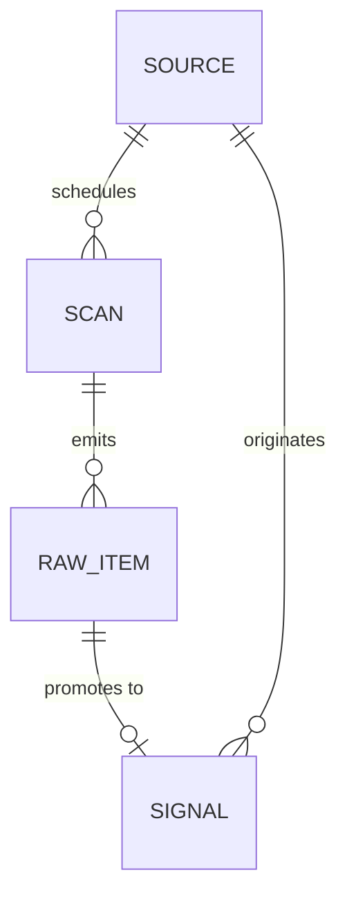
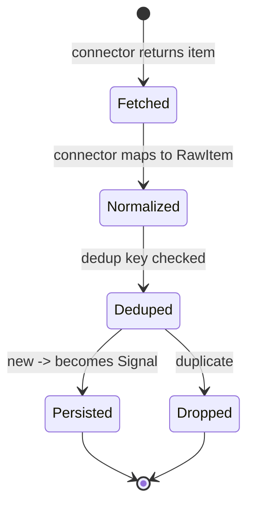

## Glossary

- **Source**: a configured external origin of raw items (config-as-data, per tenant).
- **Connector**: the code module that knows how to fetch + normalize one source type.
- **RawItem**: a normalized but un-deduped item emitted by a connector.
- **Signal**: a deduped, persisted item that enters the pipeline.

## Entity model

One Source fans out to many Signals over time (one upstream record to many downstream
records). A RawItem promotes to at most one Signal - dedup may drop it.

## Lifecycle

## Domain events

| Event (past tense) | Trigger | Produces (state / read-model) | Job stage |
|--------------------|---------|-------------------------------|-----------|
| SourceRegistered   | consultant saves a source | Source row (config) | n/a |
| ScanStarted        | scheduled job claims a source | Scan row | scan |
| RawItemEmitted     | connector normalizes a fetched item | RawItem | scan |
| SignalPersisted    | dedup passes | Signal row | dedup |
| RawItemDropped     | dedup fails | none (counter++) | dedup |
