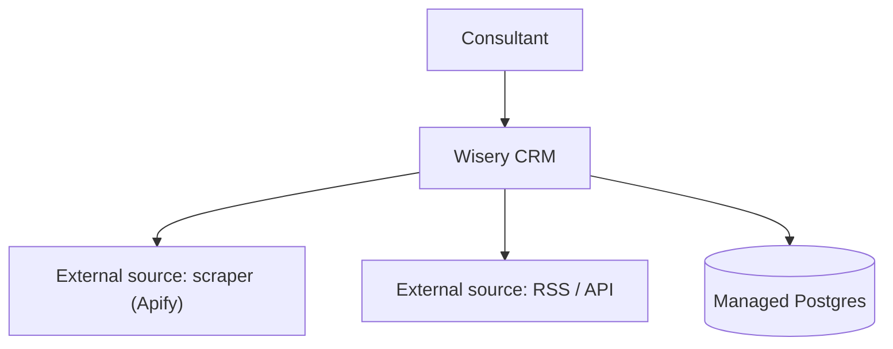
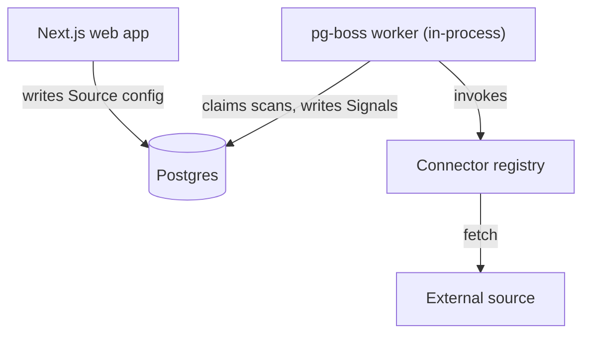
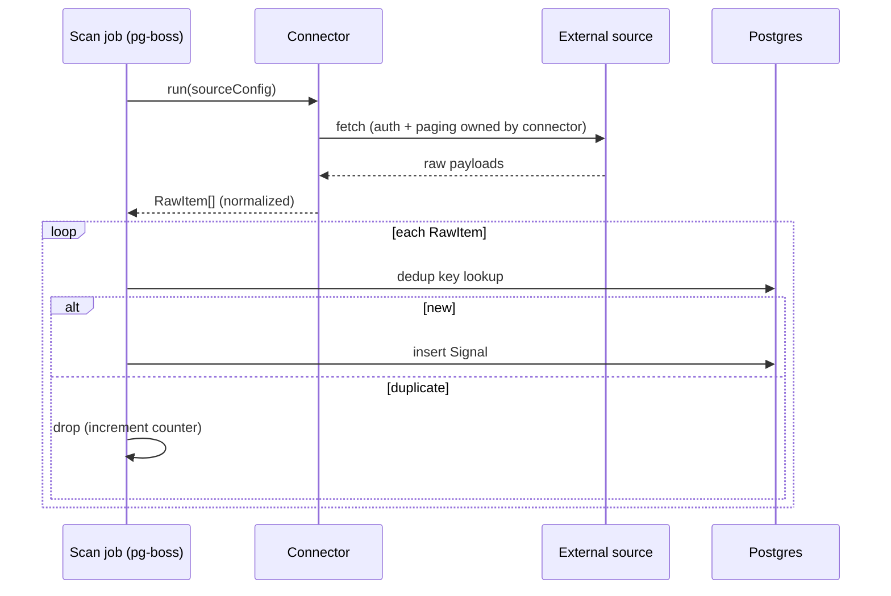

## System context (C4 L1)

Each external source crosses the boundary as raw fetched payloads; the system owns
normalization. Postgres holds Source config, Scans, and Signals.

## Containers (C4 L2)

Honors ADR-0001: the worker is in-process pg-boss on Postgres. Connectors are plain
modules the worker calls; they are not separate services.

## Key runtime flows

Consistent with the domain-model lifecycle (Fetched -> Normalized -> Deduped ->
Persisted/Dropped) and the stories primary journey.

## Decisions and trade-offs

- **Connector contract = normalized RawItem in, source owns auth/paging**: chose a thin
  normalize-at-the-edge contract over passing raw vendor payloads downstream, because it
  keeps dedup/qualify source-agnostic. Trade-off accepted: each new source type needs a
  connector module (some code), not pure config.
- **One scan job per source**: chose per-source jobs over one mega-scan, because pg-boss
  job isolation gives the failure isolation QA for free. Trade-off: more job rows.

## Cross-cutting concerns

- Observability: per-scan structured logs (pino, ADR-0002); RawItemDropped counter per source.
- Configuration: Source config is config-as-data in Postgres (ADR-0003 for app config/secrets).
- Secrets: per-source credentials referenced by config, resolved at scan time (see config ADR).
- Failure handling: a scan job failure is isolated to that source; pg-boss retries with dead-letter.
- Trust boundaries: external sources are untrusted; connectors validate/normalize before persistence.
- Data sensitivity: RawItems may carry PII; only deduped Signals persist, scoped per tenant.
- Scaling / capacity: per-source jobs let the worker peel into a standalone process later (ADR-0001) without contract change.
