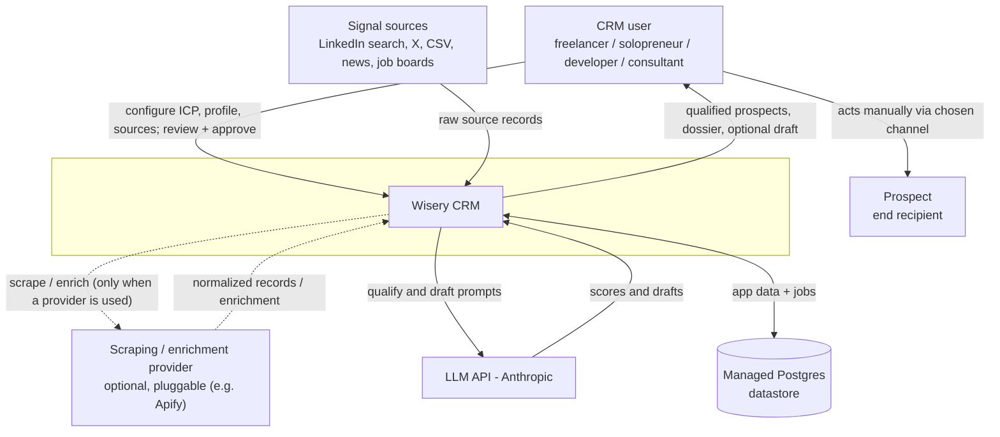
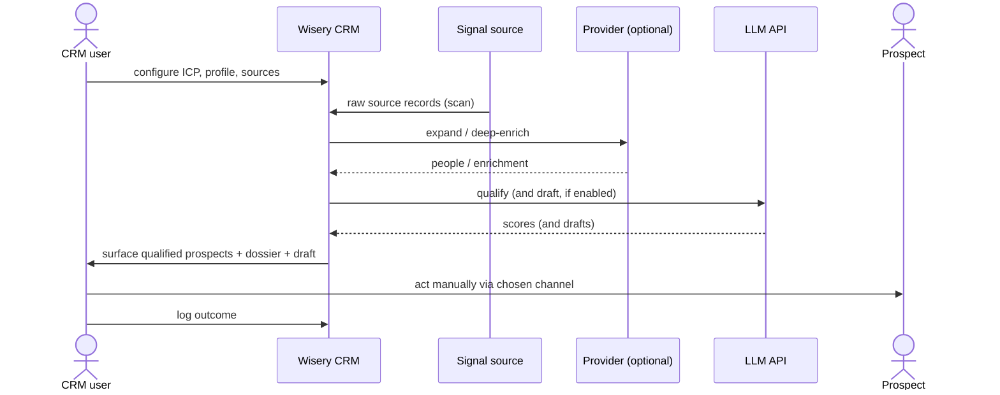

## System context (C4 L1)

Wisery CRM as one box, its human actor, and every external system it depends on. The
action edge is deliberately drawn from the CRM user (not the system) to the Prospect -
the system never contacts a prospect directly.

What crosses each boundary:
- **CRM user <-> system**: inbound config (ICP, profile, sources) and approvals; outbound qualified prospects, dossiers, and optional drafts. This is the anchor-view surface.
- **Signal sources -> system**: inbound raw source records (a person, company, or piece of content), pulled per the connector seam (D4).
- **Scraping / enrichment provider <-> system** (optional, pluggable): when one is used, outbound scrape/enrich requests and inbound normalized records / enrichment, behind the D4 interfaces. Apify is one example; the system can instead self-host scraping (Puppeteer/Playwright) and reach sources directly, with no external provider. The same provider class can serve both signal capture and enrichment.
- **LLM API (Anthropic) <-> system**: outbound qualify/draft prompts, inbound scores and drafts. Carries prospect PII.
- **Managed Postgres <-> system**: the system's own managed datastore. Shown as a dependency because it is hosted, but it holds our own schema (not a third-party system of record). How async jobs run on it is an L2/technology concern, fixed by ADR-0001.
- **CRM user -> Prospect**: a manual human action through the chosen channel. The system has no edge to the Prospect (ToS-safe, D2).

## Containers (C4 L2)

Out of scope for this change. The internal runnable units (web app, in-process pg-boss
worker, the datastore, any sidecar) and the protocols between them are a later L2 change.
The runtime decision they must honor is already fixed by ADR-0001 (pg-boss in-process).

## Key runtime flows

One L1 boundary-level flow (the system stays one box; container-level sequences are L2).

The "qualify (and draft, if enabled)" step is intentionally drawn without committing to
whether scoring and drafting are one LLM call or two - see Decisions below.

## Decisions and trade-offs

- **The provider is a pluggable, optional role - not a fixed vendor**: scraping and enrichment
  sit behind the D4 interfaces (`SignalSource` + `EnrichmentProvider`), so the provider is
  swappable (Apify, another service, or self-hosted) and the system can run with none. Apify is
  only an example. When an external provider is used, the same provider class can serve both
  signal capture and enrichment. Trade-off: the interface indirection costs a little upfront,
  accepted because it avoids coupling the system to any vendor and keeps the cost/ban-risk knob
  per source (D4).
- **Human-only action edge**: the system never contacts the Prospect; only the CRM user does,
  manually, through whichever channel the touch targets. Trade-off: no send-side automation
  leverage, accepted for ToS-safety (D2). Channel set is extensible (UC4).
- **Datastore shown as a boundary dependency**: managed Postgres is drawn at L1 because it is a
  hosted service the system depends on, even though it holds our own schema. That it also backs
  async jobs is an L2/technology concern (ADR-0001), deliberately not shown at this level.
- **OPEN (not decided here)**: whether qualification and first-touch drafting are a single LLM
  call (D5, as the ported scorer does) or a separate configurable step (UC3). This is an
  internal-flow concern (C4 L2 / the qualification area), so it is parked for the L2/area
  change, which may supersede D5 via an ADR. L1 only records that drafting is optional.

## Cross-cutting concerns

- **Observability**: structured logging and a background-job dashboard with dead-letter
  visibility (the logging library and queue are L2 technology choices; ADR-0001).
- **Configuration**: per-user ICP/profile/sources are config-as-data (D6); runtime config and
  provider endpoints via environment.
- **Secrets**: API keys for the Data provider and LLM API, plus the Postgres connection string,
  live server-side only and never reach the client bundle (server-only). Connection and pooling
  specifics are an L2 concern (ADR-0001).
- **Failure handling**: external calls (the scraping/enrichment provider, the LLM API) run as
  durable background jobs with retries and a dead-letter path (ADR-0001 fixes the mechanism); a
  single source scan that fails is isolated and does not affect other sources (UC2).
- **Trust boundaries**: every external call is server-side; inbound third-party data (sources,
  enrichment) is untrusted and normalized at the edge (D4). Auth/sessions are deferred while
  single-user (D1); the CRM user is the only trusted principal today.
- **Data sensitivity**: third-party prospect PII enters from signal sources and any
  scraping/enrichment provider, is stored in Postgres, and is sent to the LLM API for
  scoring/drafting - the main data-processor exposure (product-overview open question). The only
  outbound path to the Prospect is the manual human action.
- **Scaling / capacity**: background work runs in-process now, with a no-rewrite path to a
  standalone worker if request latency degrades (ADR-0001). The binding constraints are the
  paid, rate-limited externals (the scraping/enrichment provider when used, the LLM API) - cost per call and throttling, which
  the design gates and tolerates rather than scales past.
