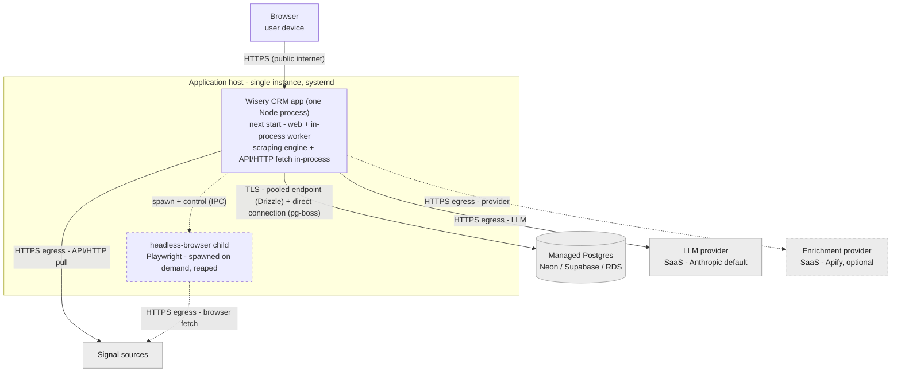

> **Status: draft seed, not promoted by this change.** The proposal scopes deployment as Skip - a
> separate future slice. This file captures the topology that follows from ADR-0001/0002 (and the
> scraper reclassification) as a seed for that future deployment change; it is **not** promoted to
> docs/architecture/ here, and the concrete host/PaaS and secret-manager choices remain deferred to M0.

## Topology

The runtime environment: one self-hosted application host running the Node process (which spawns a
headless-browser child on demand), reaching a managed Postgres and external SaaS over the network.<!-- v:derives ADR-0001 -->

Key: solid = always present, dashed = optional/conditional (the self-host scraper and the provider);
grey = external/managed (we integrate but do not operate it); the host box is what we deploy and run.
The specific host - a VM or a Node-capable PaaS - is an M0 choice and is not fixed here; the only
constraint is a persistent process that supports `next start` plus systemd-style supervision and a
stop signal.<!-- v:derives ADR-0001 --><!-- v:assumption - concrete host/PaaS deferred to M0 -->

## Where each container runs

| Container | Runs as | Where |
|-----------|---------|-------|
| Browser - thin client | client-side (RSC over HTTPS) | user device<!-- v:derives system-design --> |
| Wisery CRM app (web + in-process worker) | one Node process, `next start` + systemd | application host<!-- v:derives ADR-0001 --> |
| Headless-browser child (optional, L3) | child process the worker spawns on demand and reaps per use | same host as the worker; a pool or its own host is a later scaling option<!-- v:derives ADR-0002 --> |
| Managed Postgres | managed SaaS datastore (app data + pg-boss tables) | external (Neon / Supabase / RDS)<!-- v:derives ADR-0001 --> |
| LLM provider | external SaaS behind the `LLMProvider` port | vendor (Anthropic default)<!-- v:derives ADR-0003 --> |
| Enrichment provider (optional) | external SaaS behind the `EnrichmentProvider` port | vendor (Apify)<!-- v:derives D4 --> |
| Signal sources | external systems | various<!-- v:derives system-design --> |

Both roles of the app (web and the pg-boss worker) run in the **one** process today; the documented
peel splits the worker onto its own process (and host) with no rewrite, at which point it becomes a
second app unit on this map.<!-- v:derives ADR-0001 -->

## Secrets and config

- **Secrets** - the LLM and enrichment-provider API keys and the two Postgres connection strings -
  live only in the app process environment, server-side, via `server-only`; none reach the browser.
  On the self-host browser path, scraping session cookies live in the spawned browser child (same host as the worker).<!-- v:derives ADR-0002, server-only (CLAUDE.md) -->
- **Config**: per-user ICP/profile/sources are config-as-data in Postgres (D6); runtime config,
  provider endpoints, and the two connection strings are read from the environment at startup.<!-- v:derives D6 -->
- There is no standalone configuration ADR; the configuration posture is fixed in system-design.md
  cross-cutting concerns and D6.<!-- v:assumption - no separate config ADR; posture in system-design + D6 -->
- Secrets are injected as host environment variables (a systemd unit `EnvironmentFile`, or the PaaS
  secret store); a dedicated secrets manager is an M0 / productization detail, not decided here.<!-- v:assumption - secret-injection mechanism deferred to M0 -->

## Scaling and multi-tenant hook

- **Current shape**: one application host, one Node process (web + in-process worker), one managed
  Postgres. The binding constraints are the paid, rate-limited externals (the LLM provider, the
  enrichment provider), not host capacity.<!-- v:derives ADR-0001 -->
- **Scaling hook** (the infrastructure realization of the system-design lever): peel the in-process
  worker to a standalone `worker.ts` process - same code, no rewrite - when request p95 degrades under
  job load; `worker_threads` only for a step proven CPU-bound. Past one web instance, prefer the single
  peeled worker over N embedded pg-boss engines, because each `next start` instance runs its own engine
  and pool and multiplies the direct-connection footprint against the managed-Postgres connection cap.<!-- v:derives ADR-0001 -->
- **Multi-tenant hook**: single-user now (D1). Productization keeps the app one deployable and moves
  tenancy into the managed Postgres as schema- or row-level isolation (the earlier file-per-tenant idea
  no longer applies under ADR-0001); auth and tenant isolation are the deferred additive plumbing (D1).<!-- v:derives D1, ADR-0001 -->
