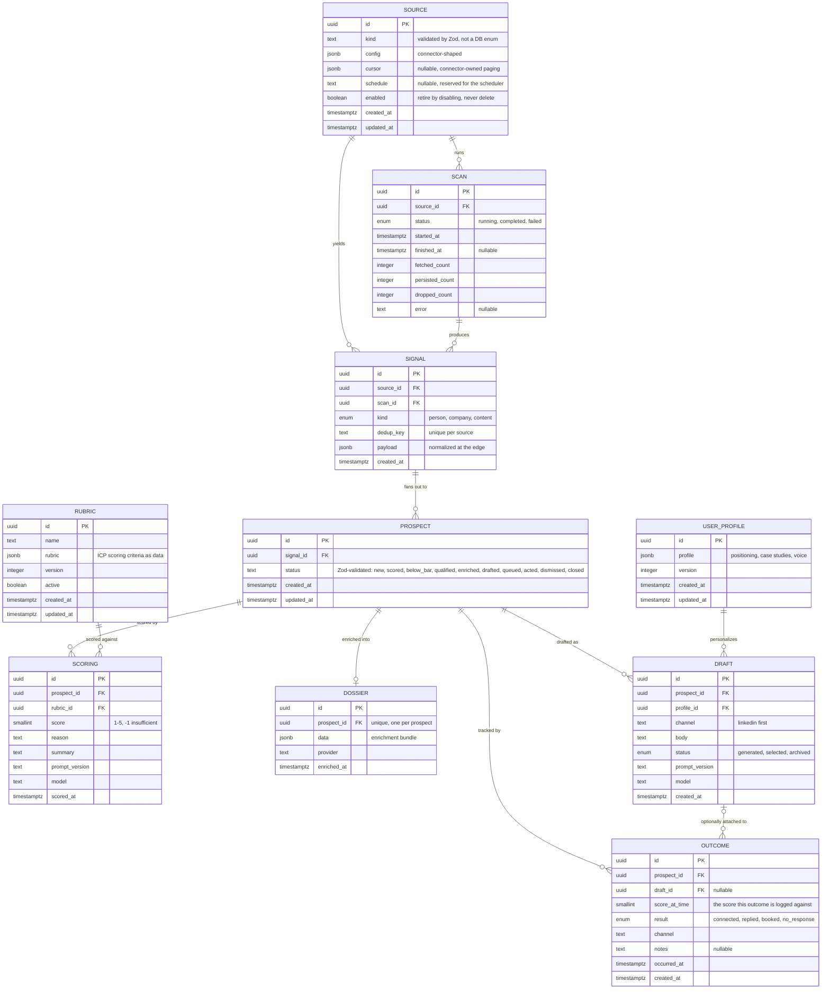
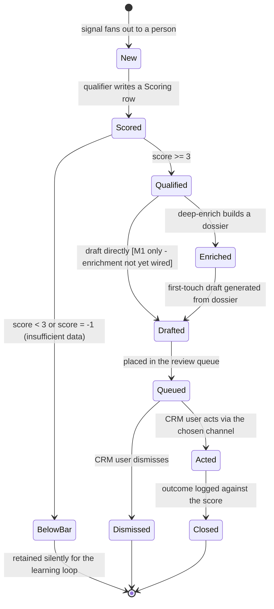

## Glossary

The canonical noun for each domain concept - one term per concept, synonyms killed. This becomes the shared `docs/architecture/glossary.md` at promotion. <!-- v:derives docs/architecture/README.md -->

- **Source**: a configured origin of signals (config-as-data) - its kind, connector config, optional schedule, enabled state. <!-- v:fact openspec/changes/signal-ingestion/design.md -->
- **Connector**: the module that fetches and normalizes one source kind; it implements the `SignalSource` port. Behavior, not data - not a table. <!-- v:derives D4 -->
- **RawItem**: a normalized-but-un-deduped item a connector yields; a transient DTO between connector and dedup, never persisted. <!-- v:derives openspec/changes/signal-ingestion/design.md (D-A) -->
- **Scan**: one isolated run of one source's connector, recorded with status and per-stage counts. <!-- v:fact openspec/changes/signal-ingestion/specs/signal-ingestion/spec.md -->
- **Signal**: a deduped, append-only, immutable fact that traces to its source and scan; the top of the funnel. <!-- v:derives D3 -->
- **Prospect**: a person under evaluation, derived from a signal; the unit that moves through the pipeline. Carries its pipeline status, not its score. <!-- v:derives docs/product-overview.md section 4 -->
- **Scoring**: a 1-5 ICP rating event for a prospect (`-1` = insufficient data) with its reason, summary, the rubric version, and the prompt/model that produced it. Modeled as its own entity (one prospect can be scored more than once - e.g. when the rubric is later tuned), not as columns on Prospect. <!-- v:decision -->
- **Dossier**: the deep-enrichment research bundle for one prospect, built by the `EnrichmentProvider`; grounds the draft. <!-- v:derives D4 -->
- **Draft**: a generated first-touch message for a prospect, written from the dossier + user profile; regenerable. <!-- v:derives D5 -->
- **Outcome**: a logged result of a human touch (connected, replied, booked, no-response), recorded against the score it acted on - the learning loop. <!-- v:derives D7 -->
- **Rubric (ICP config)**: the scoring criteria as editable, versioned data; read by qualification. <!-- v:derives D6 -->
- **User Profile**: the operator's positioning, case studies, and voice as versioned data; read by drafting for personalization. <!-- v:derives docs/product-overview.md section 6 -->

Config-as-data entities (per-tenant when productized, D1): **Source**, **Rubric**, **User Profile**. Runtime entities: **Scan**, **Signal**, **Prospect**, **Scoring**, **Dossier**, **Draft**, **Outcome**. <!-- v:derives D1 -->

## Entity model

Specified by the `signal-ingestion` change (its first migration, not yet applied at this commit): `Source`, `Scan`, `Signal`. Everything else is modeled here and migrated when its feature lands; all tables inherit the `signal-ingestion` schema conventions (uuid PKs via `gen_random_uuid()`, `timestamptz`, JSONB at the connector boundary, FK `NOT NULL` + `RESTRICT`). <!-- v:derives openspec/changes/signal-ingestion/design.md (D-A..D-G) --> Enum policy follows that change's D-F: a pg enum only for a genuinely closed, low-churn set; `text` validated by a Zod enum at the app boundary for any set expected to churn (which is why `Prospect.status` below is `text`, not an enum). <!-- v:derives openspec/changes/signal-ingestion/design.md (D-F) -->

Per non-obvious cardinality:

- **SIGNAL ||--o{ PROSPECT (the load-bearing fan-out).** A signal is not a prospect. A person source yields one prospect per signal; a company or content source expands one signal into many person prospects via normalize-expand. <!-- v:derives docs/product-overview.md section 4 --> Modeling it one-to-many from day one is what keeps the company/content path from being a later migration; proposed as ADR-0005 (drafted in this change). <!-- v:decision -->
- **PROSPECT ||--o{ SCORING and RUBRIC ||--o{ SCORING.** The score is its own entity, not columns on Prospect, so a prospect can be re-scored (when the rubric is tuned, D7) without overwriting the prior score and the rubric version it was taken against - keeping the learning loop able to compare like with like. <!-- v:derives D7 --> Each scoring binds to the rubric version that produced it (`rubric_id` + `prompt_version`/`model`). In MVP a prospect is scored once; the entity makes re-scoring additive rows rather than a future migration. The prospect's pipeline status is gated by its latest Scoring against the active rubric, so a re-score moves the gate deterministically rather than leaving it ambiguous. <!-- v:decision -->
- **PROSPECT ||--o| DOSSIER (zero-or-one).** Enrichment is gated by the score and optional in M1, so a prospect may have no dossier; one dossier per prospect when present. <!-- v:derives docs/roadmap.md -->
- **PROSPECT ||--o{ DRAFT.** Drafts are regenerable (new prompt version, retry), so a prospect can accumulate several; one is `selected` for the human to send. <!-- v:derives D5 -->
- **PROSPECT ||--o{ OUTCOME and DRAFT |o--o{ OUTCOME.** A relationship produces several touches over time; each outcome binds to the score it acted on (`score_at_time`), which makes the bar tunable later without a migration. <!-- v:derives D7 --> `draft_id` is nullable because an outcome can be logged for a touch that did not use a generated draft. <!-- v:decision -->
- **USER_PROFILE ||--o{ DRAFT.** A read dependency made explicit: drafts are written from the profile, which is config-as-data shared across all drafts, not contained by one. <!-- v:derives docs/product-overview.md section 6 -->

Attribute decisions for this change (novel, not derived from a locked decision): `Prospect.status` is `text` validated by a Zod enum, not a pg enum - it mirrors a lifecycle state machine (the most churn-prone vocabulary in the model), so following signal-ingestion D-F it is kept out of an immutable migration. <!-- v:derives openspec/changes/signal-ingestion/design.md (D-F) --> `Scan.status` and `Signal.kind` stay pg enums (genuinely closed, per D-F); `Draft.status` and `Outcome.result` are closed enough to stay pg enums for now, extensible by an additive `ALTER TYPE ADD VALUE`. <!-- v:decision --> Operational note for whoever lands these migrations: apply any enum-altering migration in isolation and never ADD-then-USE a value in the same migration (drizzle-kit batches pending migrations in one transaction). <!-- v:fact https://www.postgresql.org/docs/16/sql-altertype.html -->

A **Rubric** row is treated as immutable once any Scoring references it: tuning the ICP creates a new version row (and flips `active`), so a past score's rubric is never rewritten - the invariant the D7 learning loop depends on. <!-- v:decision -->

Deliberately NOT modeled here: a `tenant` entity - `tenant_id` is the additive productization hook on the config-as-data entities. <!-- v:derives D1 --> Nor cross-source identity resolution joining the same human across two sources, a deferred prospect-layer concern since dedup is per-source by design. <!-- v:derives openspec/changes/signal-ingestion/design.md (D-B) --> Nor the company-to-people **expansion record** (the firmographic pre-check verdict and which decision-maker roles were expanded): that intermediate state is owned by the `normalize-expand` change (roadmap #10, M2) and is intentionally absent now, so this is a scoped deferral, not a gap. <!-- v:derives docs/roadmap.md -->

## Lifecycle

The **Prospect** is the entity that moves through the pipeline. The Signal has no lifecycle - it is born persisted and immutable; pipeline progress lives on the prospect's `status`, driven by durable job stages, not polled flags. <!-- v:derives openspec/changes/signal-ingestion/design.md (D-C) -->

This lines up with this change's primary journey (use-cases.md UC2-UC4). <!-- v:derives use-cases.md --> It is also consistent with the L2 intelligence-pipeline flow: qualify is the cost gate, below-bar prospects are kept but not surfaced, and the human acts outside the system and logs the outcome back in. <!-- v:derives docs/architecture/system-design.md -->

## Domain events

The events that drive the system; doubles as the background-job-stage map. <!-- v:derives docs/architecture/system-design.md -->

| Event (past tense) | Trigger | Produces (state / read-model) | Job stage |
|---|---|---|---|
| SourceConfigured | CRM user saves a source | `Source` row created/updated, `enabled` set | config UI (icp-config) |
| ScanRequested | `enqueueScan(sourceId)` or the deferred cron | one `source-scan` job enqueued | scan (signal-ingestion) |
| ScanCompleted | `runScan` finishes | `Scan` -> completed with fetched/persisted/dropped counts | scan |
| ScanFailed | a connector raises mid-run | `Scan` -> failed with error, other sources unaffected | scan |
| SignalPersisted | dedup miss on `(source_id, dedup_key)` | new immutable `Signal` row | scan |
| ProspectScored | qualify job runs the rubric over a signal-derived person | `Prospect` (status `scored`) + a `Scoring` row (score, reason, rubric version) | qualify (qualification) |
| ProspectQualified | score >= 3 | `Prospect` -> qualified, enqueue enrich-or-draft | qualify (qualification) |
| ProspectEnriched | enrich job, provider available | `Dossier` created, `Prospect` -> enriched | enrich (enrichment) |
| DraftGenerated | draft job, after enrich or directly in M1 | `Draft` row, `Prospect` -> drafted | draft (drafting) |
| ProspectQueued | draft persisted | `Prospect` -> queued, appears in the review-queue read-model | review-queue |
| ProspectActed | CRM user acts via the channel | `Prospect` -> acted | review-queue |
| OutcomeLogged | CRM user logs the result | `Outcome` row against `score_at_time`, `Prospect` -> closed | review-queue |

`ProspectQualified` is the enqueue-on-persist hook that `signal-ingestion` deliberately does not wire - its qualify consumer does not exist yet; `qualification` (roadmap #5) is the natural owner that adds it, keeping the job graph closed until its consumer exists. <!-- v:derives openspec/changes/signal-ingestion/design.md (D-L) --> When it lands, the persist-prospects-and-enqueue-next step is one Drizzle transaction owned by the job handler (pg-boss `send` shares the same Postgres), so the fan-out write and its follow-on jobs commit atomically. <!-- v:derives ADR-0001 -->
