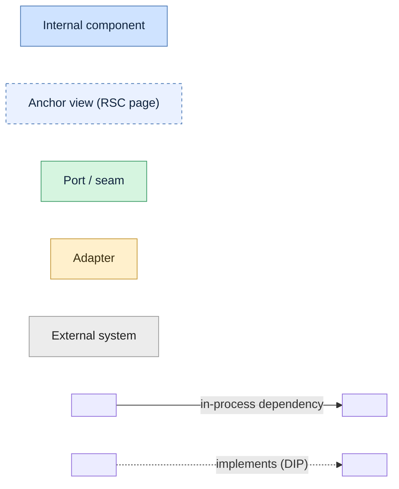
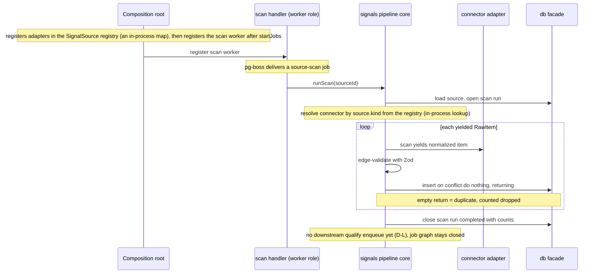

## System context (C4 L1)

Unchanged by this change and not redrawn here - the L1 system box, its actors, and external systems are canon in `docs/architecture/system-context.md`. <!-- v:fact docs/architecture/system-context.md --> This change adds no actor and no external system; it links rather than duplicates, per the architecture README's one-copy rule (rule 3). <!-- v:fact docs/architecture/README.md -->

## Containers (C4 L2)

Also unchanged and not redrawn - the single app container (one Node process running the web and in-process pg-boss worker roles, ADR-0001), managed Postgres, and the external systems are canon in `docs/architecture/system-design.md`. <!-- v:fact docs/architecture/system-design.md --> This artifact's contribution is the level below: the component decomposition inside that one app container. <!-- v:decision -->

## Components (C4 L3)

```mermaid
flowchart TB
    subgraph app["Wisery CRM app - one Node process (ADR-0001)"]
        direction TB

        subgraph web["Web / RSC surface - web role"]
            icp["ICP and source config<br/>anchor view #1"]
            plist["Prospect list<br/>anchor view #3"]
            queue["Review and approve queue<br/>anchor view #2"]
            handlers["Route handlers / Server actions<br/>RSC reads + outcome logging + enqueue scan"]
        end

        root["Composition root<br/>instrumentation.ts -> bootstrapNodeRuntime<br/>starts jobs, registers workers + adapters"]

        subgraph workers["Background pipeline - worker role (pg-boss handlers)"]
            hscan["scan handler"]
            hexpand["normalize-expand handler<br/>M2"]
            hqual["qualify handler"]
            henrich["enrich handler"]
            hdraft["draft handler"]
        end

        subgraph cores["Domain cores - role-agnostic, depend on db only"]
            cscan["signals pipeline<br/>dedup + persist + scan counts"]
            cqual["qualification core<br/>fan-out + score gate"]
            cenrich["enrichment core<br/>builds dossier"]
            cdraft["drafting core<br/>draft from dossier + profile"]
            cexpand["expansion core<br/>company -> people, M2"]
        end

        subgraph portgrp["Ports and registry - D4 / D9 seams"]
            psrc["SignalSource port + registry"]
            penr["EnrichmentProvider port"]
            pllm["LLMProvider port"]
        end

        subgraph adgrp["Adapters - reached only via registry / composition root"]
            afix["fixture connector<br/>test/dev only"]
            alink["linkedin-search"]
            ax["x-posts"]
            aapify["Apify enrichment"]
            abrow["self-host browser driver<br/>Playwright"]
            aanth["Anthropic adapter<br/>Structured Outputs"]
        end

        subgraph prompts["Prompts - src/prompts/&lt;name&gt;_v&lt;n&gt;"]
            pq["qualify prompt"]
            pd["draft prompt"]
        end

        subgraph platform["Platform facades - shared"]
            cfg["config<br/>src/lib/config"]
            db["db / Drizzle + repos<br/>src/lib/db"]
            jobs["jobs facade<br/>src/lib/jobs"]
            logc["log<br/>src/lib/log"]
        end
    end

    PG[("Managed Postgres")]
    SRC["Signal sources"]
    APIFY["Scraping / enrichment provider"]
    LLMX["LLM provider"]
    BROWSER["Headless browser<br/>separate OS process"]

    icp --> handlers
    plist --> handlers
    queue --> handlers
    handlers --> db
    handlers --> jobs

    root --> jobs
    root -->|"registers workers"| workers
    root --> psrc

    hscan --> cscan
    hexpand --> cexpand
    hqual --> cqual
    henrich --> cenrich
    hdraft --> cdraft

    cscan --> db
    cqual --> db
    cenrich --> db
    cdraft --> db
    cexpand --> db
    cexpand --> penr
    cscan --> psrc
    cqual --> pllm
    cqual --> pq
    cdraft --> pllm
    cdraft --> pd
    cenrich --> penr

    afix -.->|implements| psrc
    alink -.->|implements| psrc
    ax -.->|implements| psrc
    aapify -.->|implements| penr
    abrow -.->|implements| penr
    aanth -.->|implements| pllm

    db -->|"SQL, Postgres wire"| PG
    jobs -->|"SQL, Postgres wire"| PG
    alink -->|HTTPS| SRC
    ax -->|HTTPS| SRC
    aapify -->|HTTPS| APIFY
    abrow -->|"CDP over pipe"| BROWSER
    BROWSER -->|HTTPS| SRC
    aanth -->|HTTPS| LLMX

    classDef internal fill:#cfe3ff,stroke:#4a78b5,color:#10243e;
    classDef external fill:#ececec,stroke:#9a9a9a,color:#1f1f1f;
    classDef port fill:#d6f5e0,stroke:#3f9d6a,color:#10243e;
    classDef adapter fill:#fff0cc,stroke:#c79a3a,color:#3a2e10;
    classDef anchorview fill:#eaf1ff,stroke:#4a78b5,color:#10243e,stroke-dasharray:4 4;
    class handlers,root,hscan,hexpand,hqual,henrich,hdraft,cscan,cqual,cenrich,cdraft,cexpand,cfg,db,jobs,logc,pq,pd internal;
    class icp,plist,queue anchorview;
    class psrc,penr,pllm port;
    class afix,alink,ax,aapify,abrow,aanth adapter;
    class PG,SRC,APIFY,LLMX,BROWSER external;
```

This is the C4 level 3 view L2 deferred. Drawing it before the features exist is a deliberate, recorded override of this schema's "do not go to component/L3 - premature pre-code" default; the trade-off and its mitigation are in Decisions and captured as proposed ADR-0006 (drafted in this change, immutable once accepted at apply). <!-- v:decision -->

Everything blue is a component of the single app container; grey is external (from L2). Components are grouped by their stable seam. Edge convention (so every edge carries a protocol): a **solid** arrow is an in-process dependency - a function/method call within the one Node process; a **dashed** arrow is an adapter implementing a port (compile-time, the dependency-inversion direction); an edge crossing to an external system is labeled with its wire protocol. All components read configuration via **config** and emit logs via **log**; those ubiquitous edges are stated once here rather than drawn, to keep the structure legible. A legend follows. <!-- v:decision -->

**Legend.**

Solid = in-process call; dashed = adapter implements port; external edges carry their wire protocol (Postgres wire, HTTPS, or CDP over pipe). Rectangle = component, green = port/seam, amber = adapter, cylinder/grey = external. The named bands (web, workers, cores, ports, adapters, prompts, platform) are grouping lenses by role or seam - they are not containers or sub-systems. The three anchor-view nodes are RSC UI surfaces (pages), not components with a called interface; they reach the system only through `handlers`. Every component also depends on `config` and `log`; those two edges are omitted for legibility (stated once, not drawn). <!-- v:decision -->

### Component catalog

| Component | Responsibility | Seam / port | Role | Owning capability |
|---|---|---|---|---|
| ICP and source config | Edit rubric, profile, and sources as data (anchor #1) | - | web | icp-config (#3) |
| Prospect list | Browse and manage prospects and signals (anchor #3) | - | web | prospect-list (#9) |
| Review and approve queue | Surface queued prospect + dossier + draft, log outcome (anchor #2) | - | web | review-queue (#8) |
| Route handlers / Server actions | RSC reads, the enqueue-scan trigger, outcome logging | reads `db`, calls `jobs` | web | each anchor view |
| Composition root | Start jobs, register workers and adapters - the only `kind -> instance` wiring point | `jobs`, `psrc` registry | boot | platform-runtime |
| scan handler -> signals pipeline | Claim source, run connector, dedup, persist, tally | `SignalSource` via registry | worker | signal-ingestion (#1, specified - not yet built) |
| qualify handler -> qualification core | Fan-out signal to person prospects, score against rubric, gate at >= 3 | `LLMProvider` | worker | qualification (#5) |
| enrich handler -> enrichment core | Deep-enrich a qualified prospect into a dossier | `EnrichmentProvider` | worker | enrichment (#6) |
| draft handler -> drafting core | Generate first-touch draft from dossier + profile | `LLMProvider` | worker | drafting (#7) |
| normalize-expand handler -> expansion core | Company / content -> people before qualify | `EnrichmentProvider` | worker | normalize-expand (#10, M2) |
| SignalSource port + registry | The D4 connector contract + the `kind -> connector` map | port (D4) | both | signal-ingestion |
| EnrichmentProvider port | The D4 deep-enrich contract | port (D4) | worker | enrichment |
| LLMProvider port | Provider-neutral structured-output contract (D9) | port (D9, ADR-0003) | worker | llm-provider (#2) |
| Connectors (fixture [test/dev only], linkedin-search, x-posts) | Fetch + normalize one source kind | implement `SignalSource` | worker | source-adapters (#4); fixture from signal-ingestion |
| Enrichment adapters (Apify, self-host browser) | Deep-enrich / scrape per the cost knob | implement `EnrichmentProvider` | worker | enrichment |
| Anthropic adapter | Default LLM via Structured Outputs + 1h cache | implements `LLMProvider` | worker | llm-provider |
| Prompts | Versioned qualify / draft prompts for `prompt_version` traceability | consumed by cores | worker | qualification, drafting |
| config / db / jobs / log | The reused platform facades - no parallel mechanisms | - | both | platform-runtime, background-jobs (built, M0) |

<!-- v:derives docs/roadmap.md --> <!-- v:fact ADR-0003 --> <!-- v:fact CLAUDE.md -->

For unbuilt capabilities (qualify, enrich, draft, normalize-expand and their cores/adapters) only the seam, port, and owning capability are load-bearing here; their internal shape is owned by each feature's `design.md` and is illustrative until that feature lands (ADR-0006). <!-- v:decision -->

### Web vs worker role mapping (ADR-0001 peel-safety)

The web and worker components run in one process today but are split into the two roles above so the no-rewrite peel into a standalone `worker.ts` stays available. <!-- v:derives ADR-0001 --> The peel-safety invariant that keeps the decomposition honest: web and worker components share state only through Postgres (rows + pg-boss jobs) - no module-level mutable singletons, no in-process cache or event bus, no transaction spanning a request handler and a job. <!-- v:fact ADR-0001 --> The domain cores are deliberately role-agnostic and depend on `db` only, so the same core is callable from a handler or a worker without dragging in queue or HTTP concerns. <!-- v:decision --> Where a stage must both write rows and enqueue the next job - the qualify fan-out persisting N prospects and queuing their next stage - the job handler, not the core, owns one Drizzle transaction passed to both the repo and `jobs.enqueue` (pg-boss `send` shares the same Postgres), so the writes and their follow-on jobs commit atomically while the core stays db-only. <!-- v:decision --> This is within a single job handler, so it does not violate the no-transaction-spanning-a-request-and-a-job invariant. <!-- v:derives ADR-0001 --> The self-host browser is a separate OS process the browser adapter spawns on demand, drawn as the external `Headless browser` box. <!-- v:derives ADR-0002 -->

### Ports and adapters direction (the one mechanical guard)

The dependency-inversion seam (signal-ingestion D-M, enforced by dependency-cruiser): cores and ports MUST NOT import adapters; adapters depend on (implement) ports, and an adapter is bound to a `kind`/provider only in the registry wired from the composition root. <!-- v:fact openspec/changes/signal-ingestion/design.md (D-M) --> This is why a new source or provider is a new adapter file plus one registry line - never a change to a core, a port, or the pipeline. <!-- v:derives D4 --> The rule exists for `SignalSource` today; `enrichment` and `llm-provider` extend it to their ports when they land. <!-- v:decision -->

## Key runtime flows

The L2 container sequences are canon. The flow below is the L3 internal view of the scan slice - it reveals the handler/core/registry/port decomposition the container view hides, and is consistent with the Prospect lifecycle (a SignalPersisted event with no further enqueue yet). <!-- v:derives docs/architecture/system-design.md -->

## Decisions and trade-offs

- **Maintain a pre-code C4 L3 view as living canon.** Chose to draw and keep the component decomposition now over the schema default of stopping at L2 and letting L3 emerge per-feature. <!-- v:decision --> Force: ten capabilities remain (#1-#10; only #0 and the M0 backbone are done) and a shared component skeleton prevents structural drift between them. Trade-off accepted: this view can lag the code. Mitigation: feature-internal detail stays owned by each feature's `design.md` (signal-ingestion D-I already owns the signals internals), this view is the skeleton revised as features land, and the dependency-cruiser port/adapter rule - not this diagram - is the build-enforced contract for the adapter seam (the db-only and web/worker-share-only-via-Postgres invariants are reviewed, not yet build-enforced; a cores-must-not-import-jobs rule is a candidate to add when qualification lands). Proposed as ADR-0006 (drafted here; immutable once accepted at apply). <!-- v:derives openspec/changes/signal-ingestion/design.md (D-I, D-M) -->
- **Domain cores are role-agnostic and depend on `db` only.** Chose thin handlers calling pure cores over cores that reach the jobs facade directly. <!-- v:decision --> Force: keeps the peel reversible (ADR-0001) and the cores deterministically testable by direct call. Trade-off: a small amount of wrapper boilerplate per stage (the handler), already the pattern signal-ingestion D-K set by splitting `runScan` from its worker wrapper. <!-- v:derives openspec/changes/signal-ingestion/design.md (D-K) -->
- **The signal -> N prospect fan-out is a frozen data-model invariant.** Chose one-to-many from day one over a 1:1 signal=prospect shortcut that person sources alone would tolerate. <!-- v:decision --> Force: company/content sources expand one signal into many people; a 1:1 model would be a later migration. Trade-off: person sources carry a one-to-many relation they never exercise beyond N=1. Proposed as ADR-0005 (drafted here). <!-- v:derives docs/product-overview.md section 4 -->

## Cross-cutting concerns

Mostly unchanged from `docs/architecture/cross-cutting.md`; the delta this change introduces is the downstream data-sensitivity surface. <!-- v:fact docs/architecture/cross-cutting.md -->

- Observability: unchanged - structured logging + SQL views over job tables (ADR-0001). <!-- v:derives ADR-0001 -->
- Configuration: ICP rubric, user profile, and sources are config-as-data (D6); the new Rubric and User Profile entities are where that config now lives. <!-- v:derives D6 -->
- Secrets: unchanged - provider and LLM keys and Postgres URLs are server-side only (server-only), never in the client bundle. <!-- v:derives docs/architecture/cross-cutting.md -->
- Failure handling: unchanged - external calls run as durable jobs with retry and dead-letter; each billed stage (qualify, enrich, draft) is its own idempotent job so a retry never re-bills a prior stage. <!-- v:derives ADR-0001 -->
- Trust boundaries: unchanged - every external call is server-side; inbound third-party data is untrusted and normalized at the edge (D4); the CRM user is the only trusted principal while single-user (D1). <!-- v:derives D4 -->
- Data sensitivity (the delta): prospect PII now spans Signal payload, Scoring (reason/summary), Dossier, and Draft - the runtime entities. Concentrating it there gives field minimization one seam to attach at the qualify boundary when productized (D10), rather than scattering it. <!-- v:derives D10 -->
- Scaling / capacity: unchanged - background work runs in-process with the no-rewrite worker peel as the hook (ADR-0001); the binding constraint stays the paid, rate-limited externals, gated by the score. <!-- v:derives ADR-0001 -->
