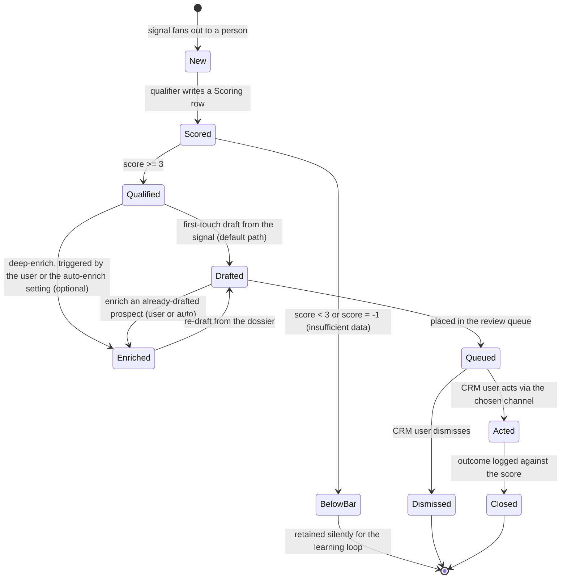

# Domain-model view: the Prospect lifecycle under user-triggered enrichment

This view revises only the **Prospect lifecycle** (and its notes) in `docs/architecture/domain-model.md`. The entity model (ERD), the `Dossier` entity, and the events table are unchanged in shape - only *when* and *why* the `Enriched` transition fires changes. Governed by ADR-0007 (this change), refining D5 and ADR-0005.

## Revised lifecycle

## What changed and why

- **`Qualified -> Drafted` is the default path** (previously annotated "[M1 only - enrichment not yet wired]"). A qualified prospect is drafted from the thin person signal without waiting on enrichment. This is permanent, not an interim shortcut.
- **`Enriched` is an optional side-transition, not a mandatory stage.** Deep-enrich fires only when **the user triggers it** (from a prospect's detail, or a batch multi-select in the prospect grid) **or when the auto-enrich setting is on** (auto-enqueue enrichment on `ProspectQualified`). The default is manual; auto is an explicit, revocable opt-in. This is the cost-control invariant (enrichment is the paid Apify step): spend is never silently incurred.
- **Enrichment triggers a re-draft.** A prospect drafted from the signal that is later enriched produces a new draft from the richer dossier (`Enriched -> Drafted`); `Draft` is already regenerable in the entity model, so this is additive, not a shape change.
- **The auto-enrich preference is config-as-data** (D1/D6) - a flag readable by the qualify/enqueue path; the natural home is the user profile or a settings row (the `enrichment` capability fixes the exact location). Turning it off stops new auto-enrichment immediately and does not touch already-enriched prospects (the reversibility quality attribute).

## Notes to update at promotion

The domain-model lifecycle prose currently says "Enrichment is gated by the score and optional in M1, so a prospect may have no dossier." Promotion rewrites this to: enrichment is optional and user-triggered by default (with opt-in auto), so a prospect may have no dossier; the `PROSPECT ||--o| DOSSIER` zero-or-one cardinality is unchanged and now reflects a deliberate user/auto choice rather than an automatic gate.
