# Domain-model view: Prospect.status is disposition-only

Revises the `Prospect.status` vocabulary, the lifecycle, and the domain-events table in `docs/architecture/domain-model.md`. Entity shapes (`DOSSIER`, `DRAFT`, `OUTCOME`, `SCORING`) are unchanged. Governed by ADR-0008 (this change), refining ADR-0005 and ADR-0007.

## The vocabulary

`status` is the prospect's **disposition in the human-facing pipeline** - one category, mutually-exclusive values:

`new` -> `below_bar` | `qualified` -> `queued` -> `acted` | `dismissed` -> `closed`

- **new** - fanned out from a signal, not yet scored (transient for person sources, which score on create; load-bearing for company/content fan-out, which creates prospects before scoring).
- **below_bar** - scored below 3 or insufficient-data (-1); retained for the learning loop, not surfaced.
- **qualified** - scored >= 3; eligible to be drafted and queued.
- **queued** - a first-touch draft exists and the prospect is in the review/approve queue, awaiting the human.
- **acted** - the human sent the touch via the channel (manual, D2); outcome not yet known.
- **dismissed** - the human declined to reach out; terminal, no touch sent.
- **closed** - an `Outcome` has been logged against the score; terminal, retained for D7 learning.

**Dropped from status:** `scored` (redundant - scoring and gating are one step, so there is no resting scored-but-ungated state); `enriched` and `drafted` (these are *artifacts*, derived from relations - see below).

## "Enriched" and "drafted" are derived, not statuses

Whether a prospect is enriched or drafted is a fact about its related rows, the single source of truth:

- **enriched** == a `Dossier` exists for the prospect (`PROSPECT ||--o| DOSSIER`).
- **drafted** == a selected `Draft` exists (`PROSPECT ||--o{ DRAFT`).

These are orthogonal to disposition and to each other (a prospect can be `qualified` with a dossier but no draft, or `queued` with both), and they can recur (ADR-0007: draft from signal, then enrich, then re-draft) - which a single linear status cannot represent but related rows can.

## Revised lifecycle

```mermaid
stateDiagram-v2
    [*] --> New : signal fans out to a person
    New --> BelowBar : score < 3 or -1 (insufficient data)
    New --> Qualified : score >= 3
    Qualified --> Queued : a first-touch draft exists; enters the review queue
    Queued --> Acted : CRM user acts via the chosen channel
    Queued --> Dismissed : CRM user dismisses
    Acted --> Closed : outcome logged against the score
    BelowBar --> [*] : retained for the learning loop
    Dismissed --> [*]
    Closed --> [*]
```

Drafting and enrichment are **side-activities that produce artifacts**, not status transitions: drafting a qualified prospect produces a `Draft` and moves it to `queued`; enrichment (user- or auto-triggered, ADR-0007) produces a `Dossier` and a re-`Draft` without changing the disposition (a `qualified` or `queued` prospect stays so while its dossier/draft rows are created or updated).

## Events table changes (at promotion)

- `ProspectScored` / `ProspectQualified`: `New -> Qualified` or `New -> BelowBar` directly (no `scored` status).
- `ProspectEnriched`: creates a `Dossier` and enqueues a re-draft; **no status change** (enriched is derived).
- `DraftGenerated`: creates a `Draft`; the prospect moves to `queued` when a draft first exists; **no `drafted` status**.
- `ProspectQueued` / `ProspectActed` / `OutcomeLogged`: set `queued` / `acted` / `closed` as before; `dismissed` on dismissal.
