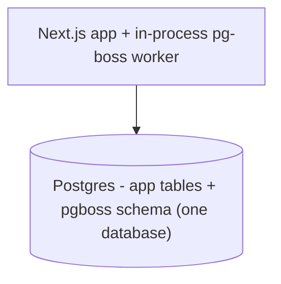
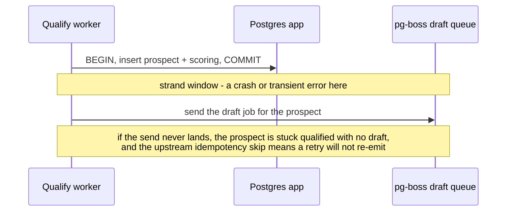
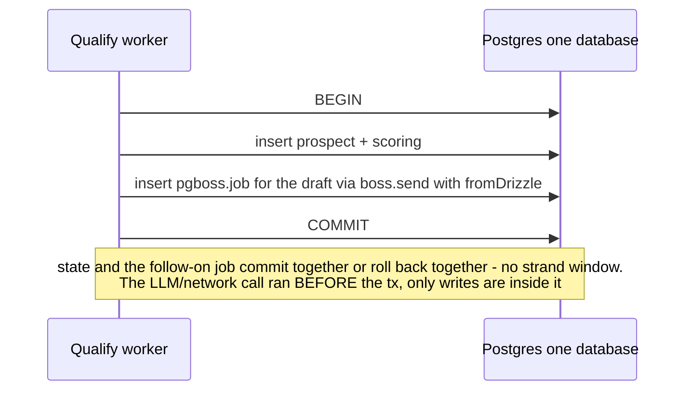

## System context (C4 L1)

Unchanged by this change. No external system is added or removed; the system still talks to the LLM provider, the enrichment provider, and the person-source connectors. See docs/architecture/system-context.md.

## Containers (C4 L2)

Unchanged in shape. The relevant containers are the Next.js app process and the in-process pg-boss worker, both backed by one managed Postgres. The load-bearing fact this change leans on: pg-boss's `pgboss` schema lives in the SAME Postgres database as the app's Drizzle tables (config defaults `PGBOSS_DATABASE_URL` to `APP_DATABASE_URL`), reached through a separate pool. Co-location in one database is what makes a single transaction able to write an app row and a job row together.

## Key runtime flows

The pipeline hands off between stages by enqueueing the next stage's job. Today the enqueue is fire-and-forget AFTER the state transaction commits, opening a strand window:

The atomic handoff moves the enqueue INSIDE the state transaction, on the same connection, via pg-boss's Drizzle adapter:

Decoupling is preserved: the stage's pipeline function receives an injected `enqueueNext(tx, ids)` callback rather than importing the next stage's queue. The composition root (bootstrap) supplies the callback, which calls `boss.send(<next queue>, ..., { db: fromDrizzle(tx, sql) })`. A stage still imports no sibling stage; the wiring still lives in one place.

## Decisions and trade-offs

- **Atomic enqueue-in-transaction**: chose enqueue-the-next-job-inside-the-state-transaction (via `fromDrizzle`) over (a) a reconciliation sweep that periodically re-drives prospects stuck in a non-terminal disposition, and (b) a full transactional-outbox relay. Atomic-enqueue won because pg-boss 12 makes it a first-class, zero-extra-infrastructure capability (the job INSERT rides the existing transaction and connection), it eliminates the strand window entirely rather than recovering from it eventually, and it adds no new background machinery. Trade-off accepted: the atomic path requires pg-boss to share the app's Postgres database (true by default); a deployment that points `PGBOSS_DATABASE_URL` at a separate database forfeits atomicity (a cross-database transaction cannot commit atomically), so that topology is explicitly unsupported for the atomic guarantee. The sweep was rejected as the primary mechanism (eventual, adds a job and a "stuck" heuristic to maintain) but remains a clean future defense-in-depth option if a non-transactional handoff is ever introduced.
- **Injected `enqueueNext(tx)` over a stage importing the next queue**: chose to keep the no-stage-imports-the-next seam by passing a transaction-aware enqueue callback from the composition root, over the simpler option of letting each stage import and call the next queue directly inside its transaction. The seam (each stage decoupled, wiring in one place) is an existing architectural value; preserving it costs a slightly more elaborate worker signature (the pipeline takes an `enqueueNext` option), accepted.

## Cross-cutting concerns

- Observability: unchanged - pg-boss errors logged via the facade; a failed transaction rolls back both writes and the job retries (ADR-0001).
- Configuration: `APP_DATABASE_URL` / `PGBOSS_DATABASE_URL` (the latter defaults to the former); the atomic guarantee depends on them resolving to the same database.
- Secrets: unchanged.
- Failure handling: a transient failure now rolls back the whole transaction (state + job), so the source job retries and re-runs the stage idempotently; there is no half-committed state. Handlers still propagate errors for pg-boss retry/dead-letter (ADR-0001).
- Trust boundaries: unchanged.
- Data sensitivity: unchanged.
- Scaling / capacity: unchanged - the enqueue rides the existing connection, adding no round-trip and no second transaction per handoff.
