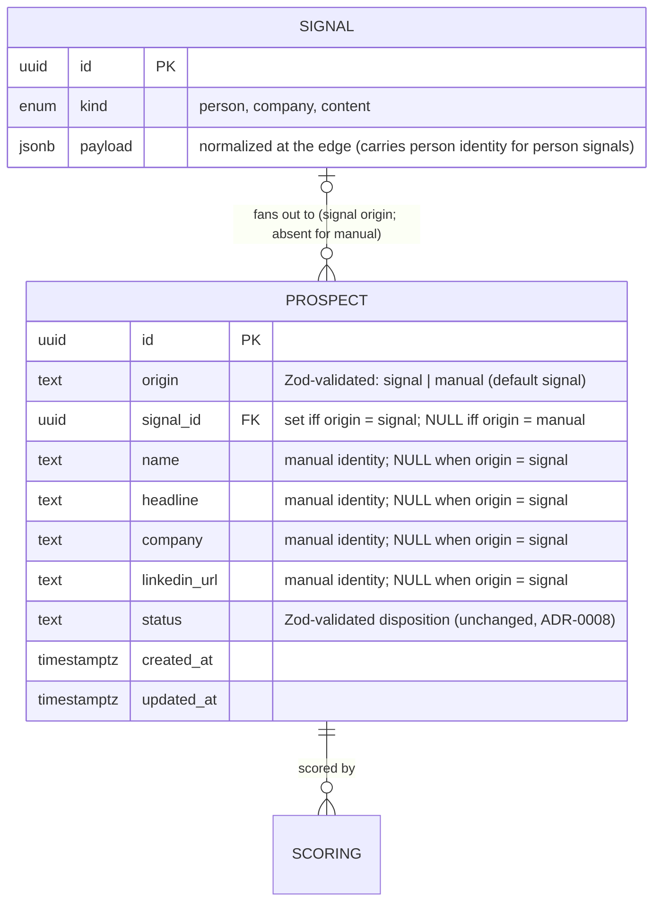

This view revises only the **Prospect** entity and its lifecycle entry in `docs/architecture/domain-model.md`. Every other entity (Source, Scan, Signal, Scoring, Dossier, Draft, Outcome, Rubric, User Profile) and every other relationship is unchanged in shape; the signal-to-prospect fan-out cardinality (one Signal to N Prospects) is preserved. What changes: a Prospect may now originate without a Signal.

## Glossary

- **Prospect**: a person under evaluation, **derived from a signal or entered manually by the CRM user**; the unit that moves through the pipeline. Carries its pipeline status and now its origin, not its score. (Revises the prior "derived from a signal".)
- **Prospect origin**: which path produced a prospect - `signal` (fanned out from a Signal, the existing path) or `manual` (entered by hand, no Signal).
- **Person identity**: the name and descriptive facets (headline/title, company, LinkedIn URL) the qualifier and the UI read for a prospect. For a signal-derived prospect it lives in `signals.payload`; for a manual prospect it lives in columns on the prospect. Read through one coalescing seam so callers never branch on origin.

## Entity model

Per the changed relationship and the new attributes:

- **SIGNAL ||--o{ PROSPECT is now zero-or-one on the signal side of a prospect.** A signal-derived prospect has exactly one signal (and that signal fans out to N prospects, unchanged); a manual prospect has none. `signal_id` becomes nullable to admit the manual origin - this is the supersession of ADR-0005's `signal_id NOT NULL` totality, not of its fan-out cardinality (ADR-0010).
- **`origin` is text validated by a Zod enum, not a pg enum.** It sits beside `status` (also text+Zod) and is plausibly extensible at productization (for example `import`, `api`), so it follows the project's "text+Zod for a set that may churn" policy; it defaults to `signal` so the migration is additive and every existing row reads as signal-derived without a backfill.
- **Manual person identity lives in typed Prospect columns** (`name`, `headline`, `company`, `linkedin_url`), populated only for `origin = manual`. A signal-derived prospect leaves them null and its identity is read from `signals.payload` as today. A **`PersonIdentity` read seam** resolves the two into one shape (`name = prospect.name ?? payload.name`, etc.). This is not a free coalesce: today the pipeline is signal-keyed end to end (the scorer and drafter consume a `SignalRow`, `loadActionableProspect` requires the signal, and the prospect-list / queue read-models `innerJoin(signals)`), so the seam is a real, scoped refactor - see "Consumer impact" below. Its point is that the origin-specific branch is confined to this one seam, not spread across every consumer.
- **The origin invariant is enforced, not just documented.** A DB CHECK makes illegal states unrepresentable, expressed per-origin so a future origin (`import`, `api`) does not trip it: `(origin <> 'signal' OR signal_id IS NOT NULL) AND (origin <> 'manual' OR (signal_id IS NULL AND name IS NOT NULL))`. So `origin = 'signal'` forces `signal_id` present (the thing ADR-0005's NOT NULL guarded stays impossible) and `origin = 'manual'` forces no signal and a name. It deliberately does NOT force the manual identity columns null for signal rows - that would foreclose a future cross-origin merge writing a resolved name onto a signal-derived prospect, and the read seam already prefers the prospect column only for manual origin.

**Consumer impact (the real scope this decision creates).** Because the pipeline is signal-keyed today, admitting a signal-less prospect is not a thin entity tweak; the code change that implements this (separate, `spec-driven`) must: (1) introduce a `PersonIdentity` DTO and read it from a signal or from prospect columns through the one seam, replacing the direct `SignalRow` dependency in the scorer, the drafter, and `loadActionableProspect`; (2) add a prospect-keyed qualify entry (`qualifyProspect(prospectId)` / `enqueueQualify(prospectId)`) and key its idempotency on `prospectId`, since the existing `qualifySignal(signalId)` both loads a signal and creates the prospect itself; (3) change the prospect-list and queue read-models from `innerJoin(signals)` to `leftJoin`, so a manual prospect is not silently dropped; (4) add a re-qualify action on the prospect list so a manual prospect whose fire-and-forget enqueue failed (it sits in `new`) can be re-driven by the user. The architecture decision here is "origin on the prospect"; this list is the honest footprint, not a no-op.

Not modeled here (deferred): dedup of a manual lead against an existing signal-derived prospect (a manual add may duplicate a person the pipeline already found; cross-origin identity resolution stays out of scope, consistent with dedup being per-source today).

## Lifecycle

The Prospect lifecycle is unchanged except for a second entry into `New`: a manual lead is born `New` with no signal, then is scored by the same qualify gate. All downstream transitions (qualified/below_bar, queued, acted, closed, dismissed) are identical regardless of origin.

```mermaid
stateDiagram-v2
    [*] --> New : signal fans out to a person (origin = signal)
    [*] --> New : CRM user adds a lead by hand (origin = manual, no signal)
    New --> BelowBar : score < 3 or score = -1 (insufficient data)
    New --> Qualified : score >= 3
    Qualified --> Queued : a first-touch draft exists; enters the review queue
    Queued --> Acted : CRM user acts via the chosen channel
    Queued --> Dismissed : CRM user dismisses
    Acted --> Closed : outcome logged against the score
    BelowBar --> [*] : retained silently for the learning loop
    Dismissed --> [*]
    Closed --> [*]
```

A thin manual lead (too little identity for a confident score) takes the existing `New --> BelowBar` edge via the qualifier's insufficient-data verdict (-1). No new lifecycle state is introduced; the only new mechanism is the prospect-keyed qualify entry noted in Consumer impact (the existing entry is signal-keyed).

## Domain events

The entry event (`ProspectAddedManually`) is new and `ProspectScored`'s trigger is revised to read identity through the seam regardless of origin; every other event in `docs/architecture/domain-model.md` is unchanged.

| Event (past tense) | Trigger | Produces (state / read-model) | Job stage |
|--------------------|---------|-------------------------------|-----------|
| ProspectAddedManually | CRM user submits the add-lead form on the prospect list | a `Prospect` row with `origin = manual`, `signal_id` null, identity columns set, `status = new`; qualify enqueued by `prospectId` (user-triggered, so fire-and-forget via the facade per ADR-0009's carve-out, not the atomic in-transaction handoff) | prospect-list add action -> qualify (prospect-keyed) |
| ProspectScored | qualify job runs the rubric over the prospect's `PersonIdentity` (read through the seam regardless of origin); idempotency keyed on `prospectId` for the manual entry | a `Scoring` row; `Prospect` -> qualified or below_bar (unchanged, ADR-0008) | qualify |

From ProspectScored onward the manual-origin prospect is indistinguishable from a signal-derived one in every event and read-model. Because the qualify enqueue is fire-and-forget (ADR-0009's user-triggered carve-out), a manual prospect sits visibly in `new` until qualified; a failed enqueue surfaces to the user to re-trigger, rather than being silently stranded - the accepted trade-off for not coupling a user form submit to the pipeline's in-transaction handoff.
