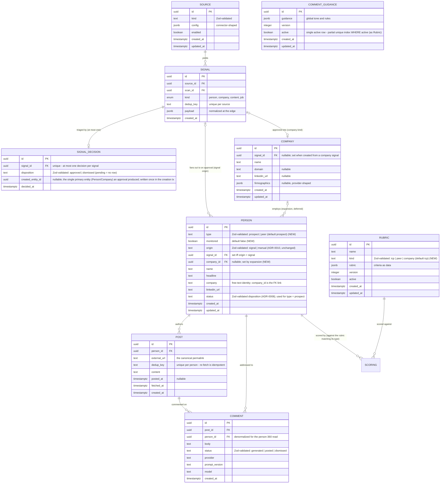
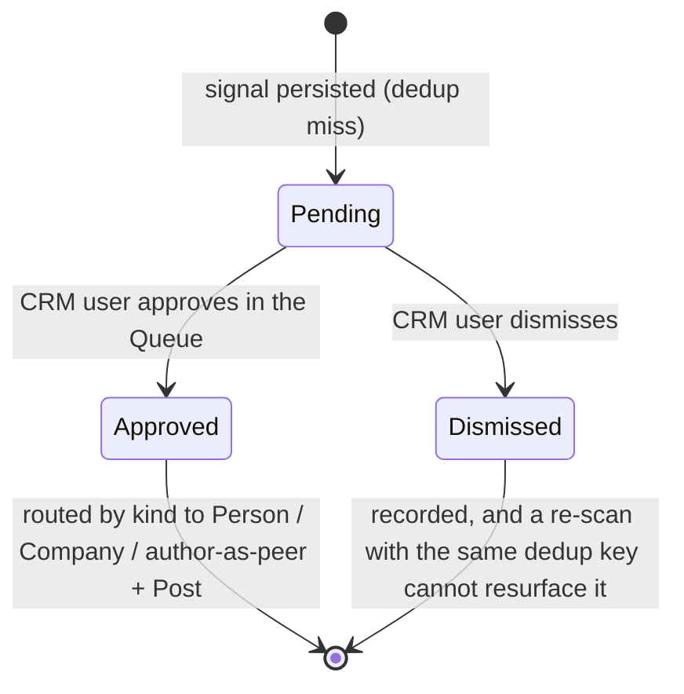
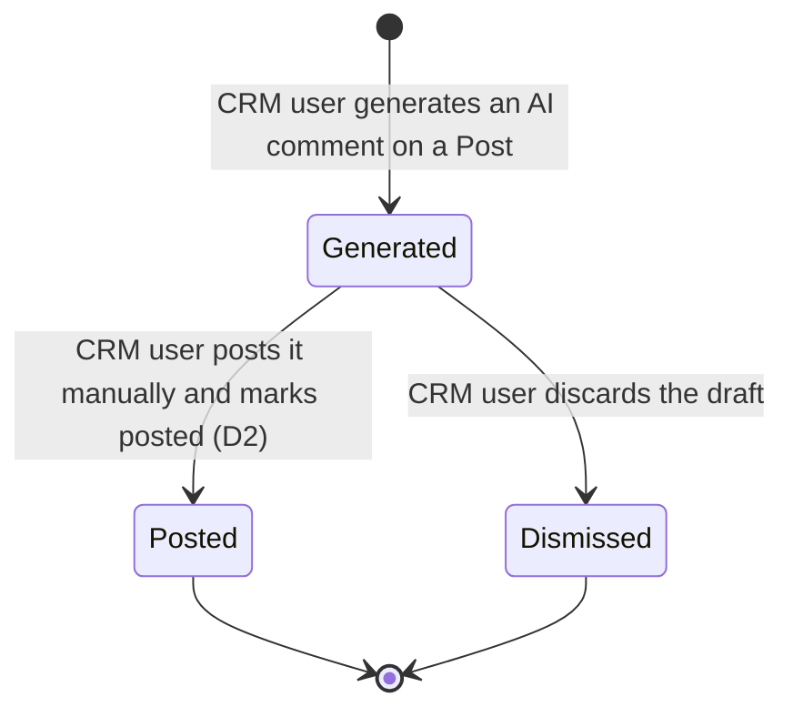

## Glossary

New and changed nouns for the engagement motion and the triage reframe. Unchanged nouns (Source, Connector, RawItem, Scan, Scoring, Dossier, Draft, Outcome, Rubric, User Profile) keep their meaning from the canonical [glossary](../../../docs/architecture/glossary.md).

- **Signal**: unchanged in shape (a deduped, append-only, immutable fact) but no longer auto-fans-out - it now always awaits a human triage decision before any entity is created.
- **SignalDecision**: the human triage verdict on a signal - `pending` (no row yet), `approved`, or `dismissed`. A separate entity from the signal because the verdict is mutable and the signal is immutable, and because the scanner re-encounters the same signal every run and must never reset a decision.
- **Person**: the renamed `Prospect` - a person the CRM user tracks. Carries `type` (prospect | peer) and a `monitored` flag, plus the existing origin/status/identity. Widens the narrower "Prospect = a person under evaluation": a peer is tracked for engagement, not evaluation.
- **Person type**: why the person is tracked - `prospect` (an outreach/ICP target that flows through qualify -> draft -> send) or `peer` (an amplifier engaged via comments, scored against the peer rubric rather than the ICP rubric, and not run through the outreach draft/send funnel). Orthogonal to `origin` and to `monitored`.
- **Monitored**: a flag marking a person whose posting activity the CRM user watches in the Feed. Independent of `type` - a prospect or a peer may be monitored.
- **Company**: a first-class entity created when a company signal is approved. Firmographic identity; people may later link to it (expansion, deferred).
- **Post**: a piece of a person's content (a LinkedIn/X post, or an approved standalone item), attached to a Person. Created on demand ("get latest posts") or by an activity scan, so it is usually independent of any signal; a Post created by approving a content signal traces back to that signal through its author's `Person.signal_id`.
- **Comment**: an AI-drafted reply to a Post, written from the person's full info and the global comment guidance. Regenerable; many per person (one per post). Human-posted (D2) - the CRM user posts it and marks it posted.
- **Comment guidance**: the global tone and rules for comment generation - config-as-data held as a single versioned `comment_guidance` row, a peer of Rubric and User Profile.
- **Rubric kind**: the intent a rubric scores for - `icp` (buyer fit), `peer` (amplifier fit), or `company` (firmographic fit). The qualifier runs the rubric matching a signal's intent; results are advisory at triage.

## Entity model

Deltas only - existing entities (Scan, Scoring, Dossier, Draft, Outcome, User Profile) are unchanged and omitted for clarity; the full pipeline ERD stays in the canonical [domain-model](../../../docs/architecture/domain-model.md).

Per non-obvious cardinality and shape:

- **SIGNAL ||--o| SIGNAL_DECISION (zero-or-one).** The decision is a separate, mutable record keyed `unique` on `signal_id`; `pending` is the absence of a row. Kept off the signal so the immutable-fact invariant (D-C) holds and so the scan writer (insert-only) and the triage writer never share a row - a re-scan that re-encounters the same dedup key is a no-op on the signal and cannot reset a dismissal. `created_entity_id` records what an approval produced without the decision table needing to know the entity table (the reverse FK from `Person.signal_id` / `Company.signal_id` is the authoritative link). It holds only the single primary entity: for a content approval (author `Person(type = peer)` + `Post`) it points at the `Person`, and the `Post` is reached via `Post.person_id`; the signal-to-many-people fan-out (ADR-0005) rides those reverse FKs, never this column. It is written once inside the creation transaction, never updated, and is null only for a dismissal.
- **SIGNAL |o--o{ PERSON (the fan-out, preserved, re-timed).** Cardinality is unchanged from ADR-0005 (one signal can fan out to many people - a company expands to several). What changes is the trigger: fan-out now fires on triage approval, not automatically at persist - with no per-source bypass. A person still references at most one signal (ADR-0010); `origin` is unchanged.
- **PERSON `type` and `monitored` are independent facets, not new tables.** One identity carries both, so a person who is both an ICP target and an engaged amplifier is one row (the dilemma against a separate contacts table - resolved to one table). SCORING attaches to people of either type - the rubric kind differs by type (the ICP rubric for `type = prospect`, the peer rubric for `type = peer`, ADR-0017), so a peer is scored too, just never against the buyer rubric.
- **PERSON ||--o{ POST and POST ||--o{ COMMENT.** A person accrues many posts; a post accrues many comment drafts (regenerable). `Comment.person_id` is denormalized from its post so the person-360 detail reads one person's whole comment history without walking posts. `Post.dedup_key` unique per person makes re-fetch and the activity scan idempotent (the same discipline as `Signal.dedup_key` per source).
- **COMPANY |o--o{ PERSON (expansion, deferred).** The company-to-people link exists in the model so it is not a later migration, but the expansion job that populates `Person.company_id` is out of scope for this slice. `Company.signal_id` is nullable: set when the company is created by approving a company signal, and left null for any future manual company entry (mirroring `Person.origin`), which is why the SIGNAL-to-COMPANY edge is zero-or-one on the company side.
- **RUBRIC `kind`.** Generalizes the single ICP rubric into per-intent rubrics; "at most one active per kind" replaces the prior single-active constraint `rubric_one_active_uq` (now a partial unique index over `(kind)` where active), and the qualifier's active-rubric selection becomes kind-aware (it reads the active rubric for a kind, not the single global active row). The advisory triage filter runs the rubric whose kind matches the signal's intent.

The advisory filter result shown at triage is NOT the durable `Scoring`. A `Scoring` (bound to a rubric version for the learning loop, ADR-0005) is created per-person after approval, by the qualify/peer-scoring job, against the rubric matching the person's type - the ICP rubric for `type = prospect`, the peer rubric for `type = peer`. The triage hint is a lightweight pre-approval read of that same rubric that helps the human decide; it writes no `Scoring` row and does not bind an outcome. Company-fit stays advisory only this slice (a company is not a `Person`, and `Scoring` binds to a person until expansion lands).

## Lifecycle

This slice introduces two new lifecycles. The `Person` (ex-Prospect) lifecycle after approval is unchanged from the canonical [domain-model](../../../docs/architecture/domain-model.md) for `type = prospect`. A `type = peer` person is scored against the peer rubric (smart LLM filtering, ADR-0017) but does not enter the outreach draft/send funnel - its peer score drives engagement filtering and ranking, and it lives in the monitoring/feed flow.

### Signal triage lifecycle

The signal is born immutable; its triage state lives in the SignalDecision relation, not on the signal.

### Comment lifecycle

Regenerate does not transition an existing comment - it creates a new `Comment` row that begins its own lifecycle at Generated. Several Generated rows may coexist for one post; the user posts one (-> Posted) and may dismiss the rest.

## Domain events

The events this slice adds; doubles as the background-job-stage map. Existing pipeline events (ProspectScored, ProspectQualified, DraftGenerated, etc.) are unchanged and fire after approval for `type = prospect`.

| Event (past tense) | Trigger | Produces (state / read-model) | Job stage |
|---|---|---|---|
| SignalPersisted | dedup miss on `(source_id, dedup_key)` | immutable `Signal`; it awaits triage - no entity is created at persist (replaces the old kind-routed auto-handoff; ADR-0013 refines ADR-0005's fan-out trigger) | scan |
| SignalScored | advisory filter runs the rubric matching the signal's intent (kind/type) | a lightweight advisory result attached to the triage read-model (not a durable `Scoring`) | advisory-filter (post-scan) |
| SignalApproved | CRM user approves a pending signal | `SignalDecision` approved + routing: person signal -> `Person`; company signal -> `Company`; content signal -> author `Person(type = peer)` + `Post` | Queue triage action |
| SignalDismissed | CRM user dismisses a pending signal | `SignalDecision` dismissed; the signal cannot resurface | Queue triage action |
| PersonMonitored | CRM user sets the monitored flag | `Person.monitored` set; the person's posts enter the Feed | person detail / Queue action |
| PostsFetched | CRM user clicks "get latest posts" on a person | `Post` rows upserted by `(person_id, dedup_key)` | fetch-posts (user-triggered, ADR-0007 pattern) |
| ActivityScanned | activity-scan cron dispatches one fetch-posts job per monitored person (per-unit isolation, D-K) | new `Post` rows for monitored people; the Feed read-model refreshes | activity-scan dispatcher -> fetch-posts |
| CommentGenerated | CRM user generates a comment on a post | a new `Comment` row (status generated) via the `LLMProvider` port | comment generation (synchronous server action) |
| CommentPosted | CRM user posts manually and marks posted | `Comment` -> posted | Feed action |

The activity scan and comment generation reuse the existing scan and LLM seams; the fetch-posts job reuses the user-triggered, cost-bounded pattern of enrichment (ADR-0007). No new external system is introduced - posts and deep profile come through the existing `EnrichmentProvider` port (posts via a new `fetchPosts` method on it), comments through the existing `LLMProvider` port.
