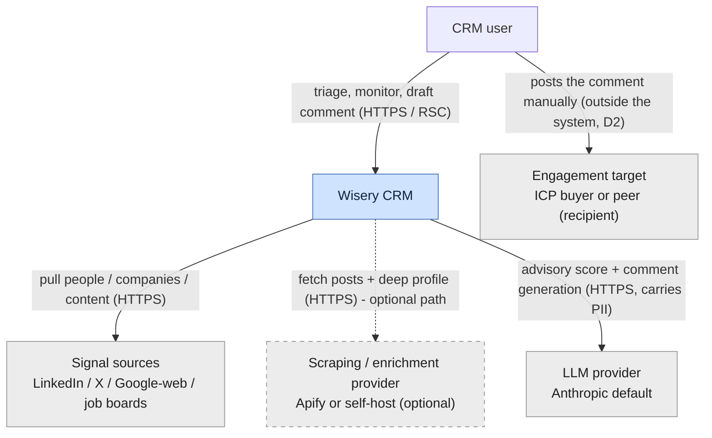
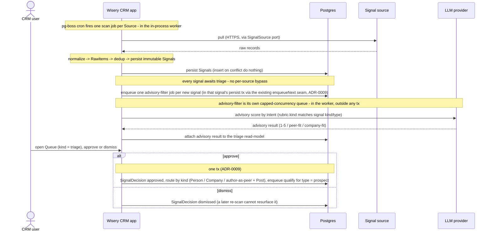
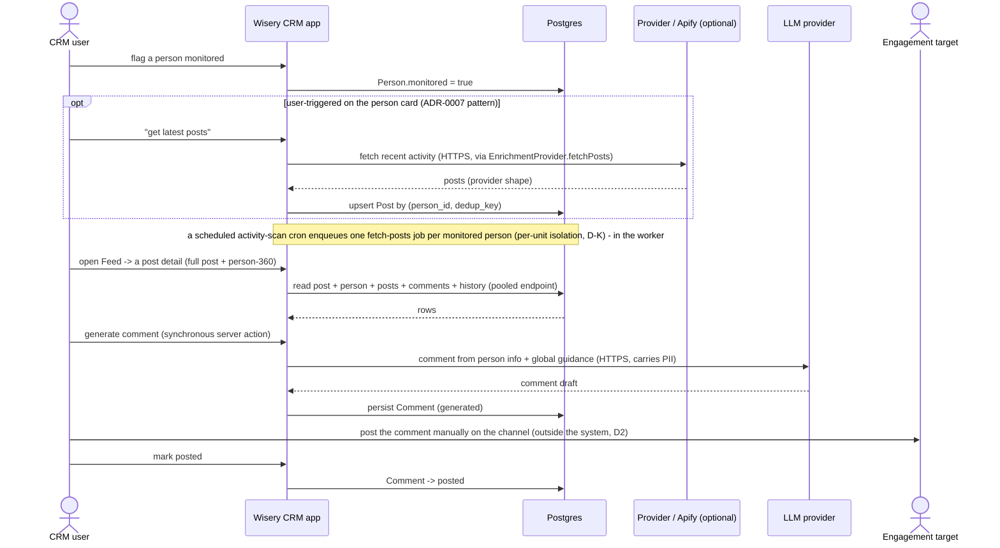

## System context (C4 L1)

This slice introduces no new external system. <!-- v:decision --> Posts and deep profile arrive through the existing `EnrichmentProvider` port (Apify or self-host browser), and comments through the existing `LLMProvider` port. <!-- v:derives D4 / ADR-0002 / ADR-0003 --> The one boundary change is at the human edge: a new engagement target (the post author) is reached only by a manual human action. <!-- v:derives D2 -->

Legend: blue = the internal system boundary; grey = external systems and actors; a solid arrow = an always-present path; a dashed arrow or node = an optional/conditional path (here, the enrichment provider). Every edge carries its protocol. This matches the convention of the canonical L2 diagram.

## Containers (C4 L2)

The container topology is unchanged: one Node process (web + in-process pg-boss worker roles), Managed Postgres (app data + pg-boss tables), and the on-demand provider/browser. <!-- v:derives ADR-0001 / ADR-0004 --> The new work - the advisory filter, the activity scan, and the fetch-posts job - runs as additional pg-boss handlers in the existing worker role; comment generation runs as a synchronous server action (not a queue handler); the Queue and Feed are new RSC surfaces in the web role. <!-- v:decision --> No new container is added, so the peel-safety invariant (web and worker share state only through Postgres) is unaffected. <!-- v:derives ADR-0001 --> The canonical L2 container diagram in [system-design](../../../docs/architecture/system-design.md#containers) stands; this change adds components inside the app container (L3, below), not containers.

## Key runtime flows

Two new highest-judgment flows. Both are consistent with the signal-triage and comment lifecycles in [domain-model.md](domain-model.md) and the [primary journey](use-cases.md). The app appears once; a note marks when it acts in its in-process worker capacity. <!-- v:derives ADR-0001 -->

### Scan to triage decision (the intake reframe)

### Monitor, fetch posts, draft a comment (the engagement loop)

## Decisions and trade-offs

- **Universal triage, no auto-fan-out bypass**: chose a human approve/dismiss gate on every signal at intake over the existing auto-fan-out-then-auto-gate pipeline; the per-source bypass is removed rather than kept as an opt-in. <!-- v:decision --> Force: the new noisy/broad sources (Google-web, content) would flood the prospect list, and the product thesis keeps the human in control of what enters - a per-source bypass would reintroduce exactly the auto-fill the reframe exists to prevent, and split intake into two paths to reason about. <!-- v:derives D2 / product-overview-thesis --> Trade-off accepted: intake now requires human attention on every signal (mitigated by the advisory filter, which pre-reads and ranks each item), and the shipped auto-fan-out behavior is removed, not extended.
- **Advisory filter is its own bounded queue, enqueued not inlined**: the per-signal advisory LLM score runs in a dedicated pg-boss queue with capped concurrency and retry-backoff - enqueued inside each signal's own persist transaction via the existing per-signal `enqueueNext` seam (ADR-0009), so the scan tx never grows with fan-out width, but never executed in it - with a per-tick ceiling and, on the noisy broad sources, an optional cheap non-LLM pre-filter ahead of the LLM call. <!-- v:derives ADR-0007 / ADR-0009 --> Force: universal triage now scores *every* signal (not just person-kind as today) and widens intake to noisy sources, so an inline or uncapped advisory call would be an unbounded LLM cost and rate-limit path (429s would herd onto the same token bucket) - the very cost gate the old flow lacked. Trade-off accepted: one more queue to operate, in exchange for a bounded, isolated advisory cost.
- **Approval reuses the atomic-enqueue handoff**: triage approval is a web server action that, in one Drizzle transaction, writes the `SignalDecision`, creates the routed entity, and (for `type = prospect`) enqueues `qualify` via the ADR-0009 handoff. <!-- v:derives ADR-0009 --> Force: moving entity creation from a worker stage to a human action must not reintroduce the strand window ADR-0009 closed (a committed entity with no next job) - so approval extends that atomic-enqueue seam rather than fire-and-forgetting. Trade-off accepted: the approval action owns a short write-and-enqueue transaction, no I/O inside it (the LLM advisory pass already ran pre-approval).
- **SignalDecision as a separate table, signals stay immutable**: chose a separate `signal_decisions` table over a mutable `status` column on `signals`. <!-- v:decision --> Force: signals dedup on `(source, dedup_key)` and are re-encountered every scan; a decision on the signal row risks a re-scan upsert clobbering a human dismissal, and a status column would supersede the accepted D-C immutable-fact invariant. <!-- v:derives D-C --> Trade-off accepted: a LEFT JOIN for the inbox read and one extra table, in exchange for two non-contending writers and room for decision history. <!-- v:derives explore-2026-06-06 -->
- **Advisory filter, not auto-gate; scored by the rubric matching the person's type**: chose to demote the score to an advisory hint at triage and to score each person against the rubric matching its type (ICP for prospects, peer for peers), keeping the durable per-person `Scoring` created after approval by the qualify/peer-scoring job. <!-- v:decision --> Force: peers must be filtered intelligently too but must not be scored on the *buyer* rubric (they would read below-bar and hide) - so they are scored on the peer rubric instead, and the learning loop (ADR-0005) still needs a per-person score bound to a rubric version. <!-- v:derives ADR-0005 / ADR-0017 --> Trade-off accepted: the same person is scored twice in spirit (an advisory pre-read, then a durable Scoring against the same rubric kind) - the advisory pre-read writes no `Scoring` row, so the two stay distinct and the learning loop is never polluted by a pre-approval hint.
- **One Person table with type + monitored facets**: chose one identity with facets over separate lead/contact (and peer) tables. <!-- v:decision --> Force: a person can be both an outreach target and an engaged amplifier; two tables would duplicate that identity and force the person-360 detail to union tables. <!-- v:derives explore-2026-06-06 --> Trade-off accepted: the `prospects` table name becomes a misnomer, paid by renaming to `person`.
- **Comment is a separate artifact from Draft**: chose a distinct `comments` table over reusing `drafts`. <!-- v:decision --> Force: a comment is per-post and many-per-person, while a draft is per-prospect with a one-selected invariant - the same generative pattern but a different business rule (DRY is one rule per representation, not textual sameness). <!-- v:derives CLAUDE.md-DRY --> Trade-off accepted: a second generative table and prompt, sharing the `LLMProvider` port and the versioned-prompt discipline.

## Cross-cutting concerns

- Observability: the new pg-boss handlers (advisory-filter, activity-scan, fetch-posts) surface in the existing jobs monitor and scan-run history; comment generation is a synchronous action and is observed via request logging, not the jobs monitor. <!-- v:derives ADR-0011 / ADR-0012 -->
- Configuration: the peer/company rubrics and the global comment guidance are config-as-data read via `src/lib/config`; comment guidance is a single versioned `comment_guidance` row (a peer of Rubric and User Profile), and the rubrics reuse the existing rubric table with the new `kind` facet - no new mechanism. <!-- v:derives D1 / D6 -->
- Secrets: unchanged; provider and LLM credentials stay server-side, reached only from worker-role components. <!-- v:derives ADR-0001 -->
- Failure handling: the advisory-filter, activity-scan, and fetch-posts jobs are isolated pg-boss handlers, retried and dead-lettered like the existing stages; fetch-posts is idempotent on `(person_id, dedup_key)` so a retry never duplicates. Comment generation is not a pg-boss job but a synchronous user-triggered server action - a transient LLM 429 surfaces to the user (who retries by clicking again), so there is no background retry path that could double-bill or duplicate a comment. <!-- v:derives ADR-0001 -->
- Trust boundaries: no secret-bearing path crosses to the thin client; the Queue, Feed, and person detail are RSC reads. <!-- v:derives ADR-0001 -->
- Data sensitivity: posts, profiles, and comments are third-party PII; they stay server-side behind the same boundary as dossiers, and no content is published automatically - the human posts every comment (D2). <!-- v:derives D2 / D10 -->
- Scaling / capacity: the activity-scan cron is a fan-out dispatcher that enqueues one fetch-posts job per monitored person (per-unit isolation, D-K), not one monolithic job; post-fetch and comment generation are user-triggered and cost-bounded. The one automatic per-signal LLM cost is the advisory filter - bounded by its own capped-concurrency queue and a per-tick ceiling (and an optional cheap pre-filter on broad sources) - so per-signal spend stays explicit, the cost gate the old Make flow lacked. <!-- v:derives ADR-0007 -->

## Components (C4 L3 deltas)

Per ADR-0006 this repo maintains a pre-code L3 component view as living canon, so the new components are recorded here as deltas to [system-design](../../../docs/architecture/system-design.md#components-c4-l3); they follow the same port/adapter rules (cores depend on `db` only; adapters implement ports; wiring only at the composition root). <!-- v:derives ADR-0006 -->

New web-role components:
- **Queue** (anchor view): one nav surface presenting two independent lanes by `kind` = triage | send - the triage lane reads `signals LEFT JOIN signal_decisions` + advisory results, the send lane reads `prospects WHERE status = queued` (the existing review-queue). The `kind` is presentation grouping: the lanes share a surface, not a query, component state, or action handler (the same DRY-is-one-rule test that keeps Comment separate from Draft). <!-- v:decision -->
- **Feed** (anchor view): monitored people's posts; opens a post detail (post + person-360) where comments are drafted and marked posted. <!-- v:decision -->
- **Person detail** gains the "get latest posts" action and the posts/comments history.

New worker-role components (handlers -> cores, db-only cores):
- **advisory-filter handler -> filter core**: its own capped-concurrency pg-boss queue; runs the rubric matching a signal's intent and writes the advisory result to the triage read-model (via `LLMProvider`), writing no `Scoring` row.
- **activity-scan dispatcher**: a cron handler that enqueues one fetch-posts job per monitored person (per-unit isolation, D-K) - it reuses the fetch-posts handler rather than looping over people in one job.
- **fetch-posts handler -> posts core**: post fetch via `EnrichmentProvider.fetchPosts`, idempotent upsert on `(person_id, dedup_key)`; the same handler serves the user-triggered and the activity-scan paths.

And one web-role core invoked synchronously (not a queue handler):
- **comment-generation core**: invoked by a Feed server action; generates a comment from person info + global guidance (via `LLMProvider`), using a versioned comment prompt `src/prompts/comment_v<n>`, writing a new `Comment` row per call.

These reuse the existing `SignalSource`, `EnrichmentProvider`, and `LLMProvider` ports - no new port *abstraction* is introduced; the `EnrichmentProvider` port gains a `fetchPosts` method distinct from deep-profile enrich. <!-- v:derives D4 / D9 -->
