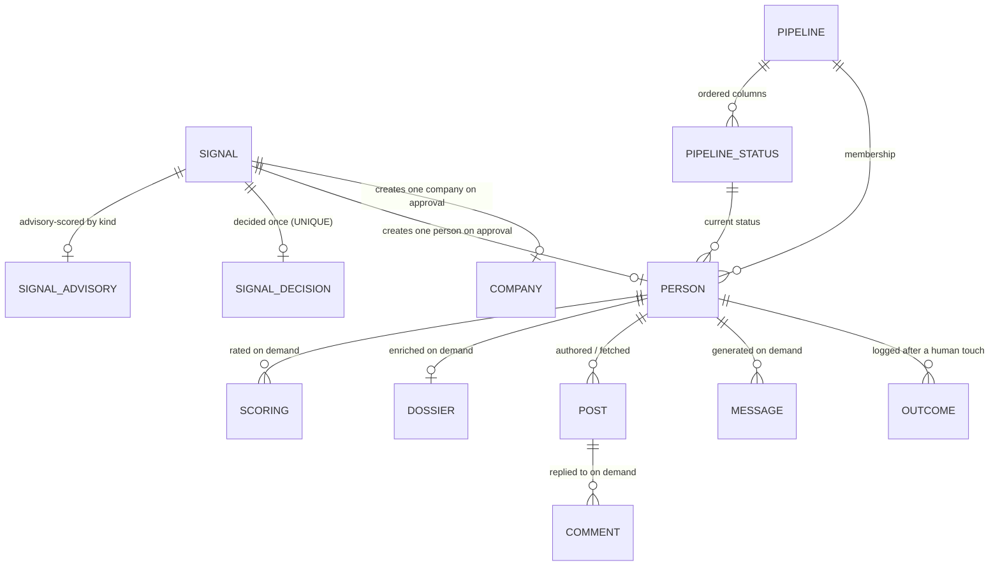
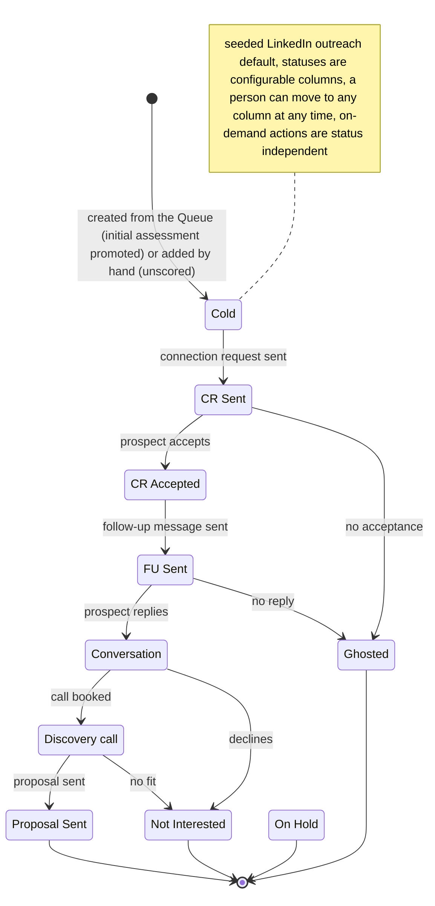

## Glossary

- **Queue**: the single intake surface - fresh, undecided signals of every kind, advisory-scored and filterable by score. Replaces the split Triage + Review & approve surfaces. A decided signal drops out.
- **Pipeline**: a configurable, ordered set of statuses a Person moves through (Breakcold-style kanban columns). Config-as-data; one default pipeline is seeded from code. People-scoped in v1.
- **Pipeline status**: one ordered column in a Pipeline (e.g. Cold, CR Sent). CRUD-able. `Person.status` is a reference to one of these, not a fixed enum value.
- **Qualification**: a derived read over a `prospect`-type Person's latest `icp`/buyer-rubric Scoring (latest by `scored_at`, tie-broken by `id`; the rubric-kind filter is part of the read, so a peer-rubric row never satisfies it) - `qualified` (score >= 3), `below_bar` (score < 3; the `-1` insufficient-data sentinel is `below_bar` by rule, distinct from `unassessed`), or `unassessed` (no `icp`-rubric Scoring row at all - a manual person before its first re-score, or a Queue person approved before any `icp` rubric existed; a Queue prospect with an `icp` rubric is assessed from creation via the promoted initial Scoring). It is `n/a` for a `peer`-type Person, which is never buyer-scored by design (ADR-0017) - its initial Scoring is the peer-rubric assessment and the on-demand re-score is offered only on prospects. Not a stored status, and orthogonal to pipeline position.
- **Message**: a LinkedIn message generated for a Person, on demand. Has a message type. Appears in the person's message history. A separate entity from Comment.
- **Message type**: the kind of LinkedIn message - `connection_request` or `message` (a general DM). A connection-request is a type of Message, not its own entity.
- **Comment**: an AI-drafted reply to a specific Post, human-posted (ADR-0018, unchanged). Kept distinct from Message because it is keyed to a Post and is many-per-person.
- **On-demand action**: a synchronous, user-triggered server action on the Person that writes one row per call (generate message, generate comment, re-score, enrich). No background job, no auto-generation, no retry/double-bill.
- **Scoring**: the 1-5 ICP rating event for a Person (-1 = insufficient data), carrying a `provenance` (`llm | advisory`). Written at signal approval as an `advisory`-provenance initial assessment (the advisory score promoted to a real Scoring, no LLM) when an active rubric of the advisory's kind exists, and refreshed on demand by a re-score (`llm` provenance, buyer rubric). A manually created person gets no Scoring until its first on-demand re-score. `advisory` rows power the qualification read but are excluded from the learning loop.

## Entity model

Notes on non-obvious cardinalities:
- `SIGNAL ||--o| PERSON` / `SIGNAL ||--o| COMPANY`: approval decides a signal exactly once (`signal_decisions.signal_id` UNIQUE) and routes it to exactly one entity by kind, so each signal yields at most one Person or one Company - zero-or-one, not the old auto-fan-out one-to-many. A content signal additionally creates the author's first `Post`.
- `PIPELINE_STATUS ||--o{ PERSON` and `PIPELINE ||--o{ PERSON`: a Person's status is a FK into one pipeline status, and `Person.pipeline_id` records membership explicitly (one seeded pipeline in v1). Both replace the fixed `status` text enum.
- `SIGNAL ||--o| SIGNAL_ADVISORY` and `SIGNAL ||--o| SIGNAL_DECISION` are zero-or-one and the Queue read is a LEFT JOIN, so an un-scored or undecided signal still appears (anti-strand). At approval the advisory score is promoted into the person's initial `Scoring` (no LLM, `advisory` provenance) when an active rubric of its kind exists; otherwise the person reads `unassessed` until re-scored. A manual person has no advisory and stays unscored until re-scored.
- `PERSON ||--o{ MESSAGE`: many messages per person (a connection-request and later DMs all live here), unlike the retired one-selected Draft.
- `POST ||--o{ COMMENT` is unchanged from ADR-0018: a comment is keyed to a post, many per person.
- The `DRAFT` entity is removed: there is no per-prospect, one-selected first-touch artifact anymore. First-touch is a Message generated on demand.

## Lifecycle

The Person's status is no longer a fixed line - it is a pointer into the ordered statuses of a configurable Pipeline. The diagram below shows the seeded default pipeline (frozen in ADR-0020); the statuses are CRUD-able, so a tenant may add, rename, reorder, or remove columns. Qualification is not shown as a status: it is the derived read defined in the glossary, decoupled from pipeline position. On-demand actions (re-score, enrich, generate message/comment) are available in every status and never move it.

## Domain events

| Event (past tense) | Trigger | Produces (state / read-model) | Job stage |
|--------------------|---------|-------------------------------|-----------|
| SignalApproved | CRM user clicks Create Person/Company in the Queue | routed entity created (Person at default status `Cold`, or Company); for a person/peer, an `advisory`-provenance initial Scoring is written when an active rubric of the advisory's kind exists (advisory score promoted, no LLM); a company approval writes no Scoring; signal drops from Queue | none (synchronous server action, one tx) |
| PersonAddedManually | CRM user adds a lead by hand | Person created (origin = manual) at default status `Cold`, no Scoring (not auto-scored) | none (synchronous) |
| SignalDismissed | CRM user dismisses a Queue item | SignalDecision(dismissed); signal drops from Queue | none (synchronous) |
| PersonRescored | CRM user clicks Re-score on the Person | new buyer-rubric Scoring row (LLM call) | none (synchronous on-demand action) |
| PersonEnriched | CRM user clicks Enrich on the Person | Dossier row (Apify call) | enrich (existing worker, user-triggered) |
| MessageGenerated | CRM user clicks Generate message (by type) | new Message row (LLM call) | none (synchronous on-demand action) |
| CommentGenerated | CRM user clicks Generate comment on a Post | new Comment row (LLM call) | none (synchronous, unchanged ADR-0018) |
| PersonStatusChanged | CRM user sets the Person's pipeline status | `Person.status` FK updated | none (synchronous) |
| OutcomeLogged | CRM user logs the result of a manual touch | Outcome row bound to the score | none (synchronous) |

Removed events (the drafting stage is gone): `DraftGenerated`, `PersonQueued`. The automatic `PersonScored`/`PersonQualified` post-approval events are gone; approval instead promotes the advisory score into an `advisory`-provenance initial Scoring (no LLM), and the durable `qualify-prospect` worker is retired - scoring is now the no-LLM approval promotion plus the on-demand `PersonRescored`.
