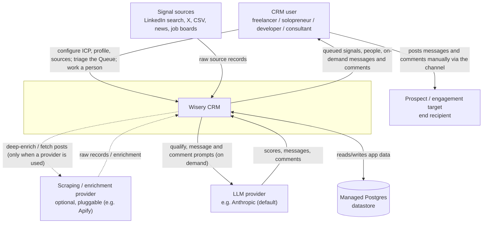
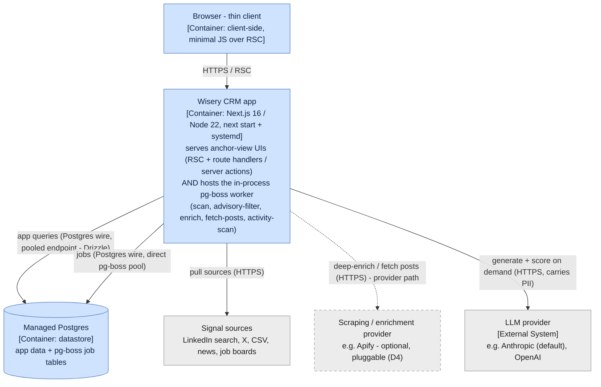
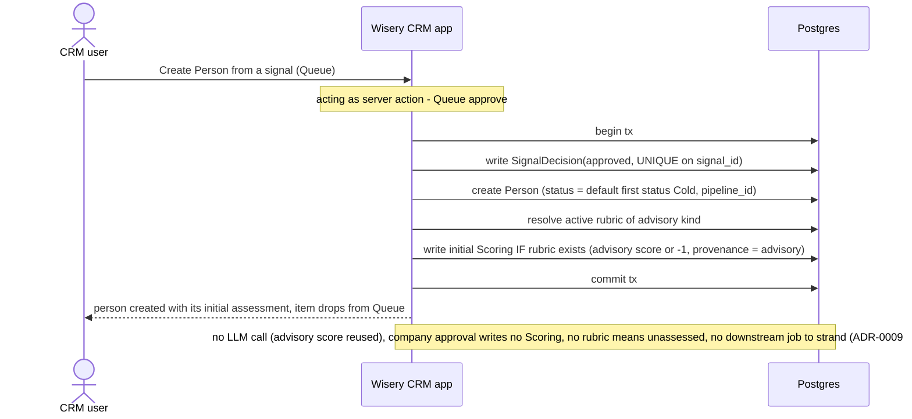
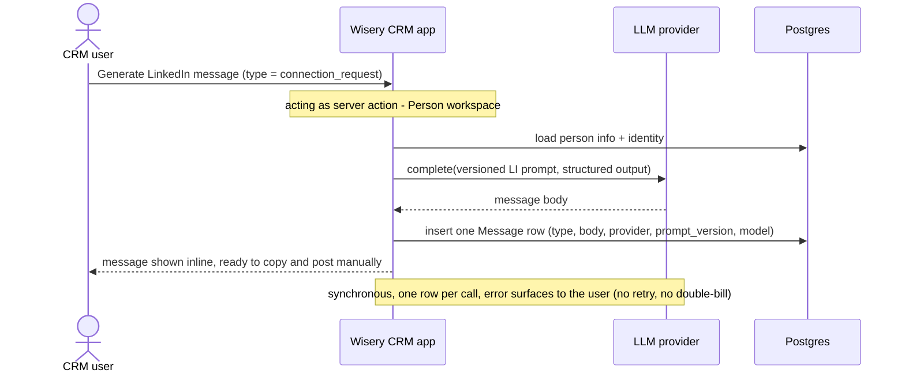

## System context (C4 L1)

The external boundary is unchanged by this rework - no external system is added or removed. What changes is internal: the two intake surfaces (Triage, Review & approve queue) collapse into one Queue, and post-intake work becomes on-demand calls to the LLM and enrichment providers rather than an automatic pipeline. The L1 is reproduced from canon (system-context.md) with the system in its boundary subgraph; only the prose note about the merged surface is new. <!-- v:fact docs/architecture/system-context.md -->

- Signal sources: raw items in, on a schedule (unchanged). <!-- v:fact docs/architecture/system-context.md -->
- Enrichment provider: called only on an explicit user action - deep dossier or latest posts (ADR-0007 core). <!-- v:derives ADR-0007 -->
- LLM provider: called only on an explicit user action - generate a message, a comment, or a re-score (ADR-0003). <!-- v:derives ADR-0003 -->
- The channel (LinkedIn) is crossed only by the human; the system never auto-sends (D2). <!-- v:fact docs/product-overview.md D2 -->

## Containers (C4 L2)

Containers are unchanged by this rework - it adds no container and no port; the only structural change (removing the `draft` worker/queue) is internal to the single app container and is drawn at L3. Per ADR-0001 the web app and the in-process pg-boss worker are two ROLES of one Node process, so they are ONE container, not two boxes. The diagram is reproduced from canon (system-design.md) with the worker's stage list updated to drop `draft`. Internal containers are blue, external systems grey, the optional provider dashed; a legend follows. <!-- v:fact docs/architecture/system-design.md --> <!-- v:derives ADR-0001 -->

**Legend.** Rectangle = process/container, cylinder = datastore. Blue = internal (part of the system we build, including our managed datastore), grey = external system we integrate with but do not own. A solid arrow is an always-present relationship; a dashed arrow is the optional provider path (not an async marker). Arrows point caller -> dependency. <!-- v:fact docs/architecture/system-design.md -->

## Components (C4 L3)

This repo keeps a pre-code L3 component view as living canon (ADR-0006). The rework deletes and adds these components inside the app container: <!-- v:derives ADR-0006 -->

- **Removed**: the `draft handler` / `drafting core` (`src/lib/draft/*`), the draft prompt, the `qualify -> draft` enqueue handoff in the composition root, and the `qualify-prospect` worker (no path enqueues durable scoring anymore). <!-- v:fact src/lib/draft --> <!-- v:derives ADR-0019 -->
- **Added**: a `Message generator` (synchronous server action + versioned LinkedIn prompt, mirroring `src/lib/comments/generate.ts`) <!-- v:derives ADR-0021 -->, and a `pipeline` read/seed module (the default pipeline + statuses, the status setter) <!-- v:derives ADR-0020 -->.
- **Changed**: the Queue read-model (`src/lib/triage/read.ts`) becomes the sole intake read plus a score filter; `approveSignal` (`src/lib/triage/decide.ts`) stops enqueuing qualify and instead writes the person's `advisory`-provenance initial Scoring in the same transaction when a rubric of the advisory kind exists (no LLM); re-score becomes a synchronous server action (the scorer core reused, no worker). A `scorings.provenance` column (`llm | advisory`) is added so the learning loop can exclude advisory rows. <!-- v:derives ADR-0019 -->
- **Term alignment at promotion**: the canon L3 component catalog still names the anchor view "Prospect list" and the concept "prospect"; applying this change updates that vocabulary to "Person list" / "person" (the ADR-0015 rename), so the catalog and the new domain-model agree. <!-- v:fact docs/architecture/system-design.md -->

## Key runtime flows

Both flows draw the app once (web and worker are one container, ADR-0001); a Note marks which internal role is acting. <!-- v:derives ADR-0001 -->

### Approve a signal from the Queue (no auto-pipeline, no LLM)

### Work a person on demand (generate a message)

## Decisions and trade-offs

- **Generation is an on-demand action, not a pipeline stage**: chose making message/comment/re-score/enrich synchronous Person actions over keeping an automatic `qualify -> draft` stage. Force: generation is a feature of the person, not a funnel position, and an auto stage spends LLM budget drafting people the user may never contact. Trade-off accepted: the user must click to generate, and a fresh person carries no durable Scoring until re-scored. Batch generation (many people at once) is deferred to a follow-up, not silently dropped. <!-- v:decision -->
- **Approval promotes the advisory score into an initial assessment Scoring (no LLM); manual entry does not auto-score**: chose keeping a created person's initial assessment as a real Scoring over either dropping it or auto-scoring everything. Force: the owner wants a Queue-created person to carry its score from creation, but a naive advisory-to-Scoring copy fails the `scorings` contract (no `rubric_id`, nullable score, NOT NULL provenance cols) - so a new `scorings.provenance` column (`llm | advisory`) is added, and approval resolves the active rubric of the advisory's kind and, when one exists, writes a Scoring with the advisory score (or -1) and `advisory` provenance, no LLM call (a company approval and a person whose kind has no active rubric write none - the person reads `unassessed`). The advisory PASS still writes no Scoring at triage; ADR-0017's no-pollution purpose is preserved by excluding `advisory` rows (and outcomes bound to them) from the learning loop. A hand-created person is not auto-scored. With no auto-score path left, the `qualify-prospect` worker is retired and re-score is synchronous. Trade-off accepted: a `provenance` column and an `advisory` sentinel, and reads/evals must filter by provenance + rubric kind. <!-- v:decision -->
- **Configurable pipeline over a fixed status enum**: chose a seeded-but-CRUD-able `pipeline_status` FK (with explicit `pipeline_id` membership) over the seven-value `prospectStatusSchema` enum (ADR-0008). Force: the product is a configurable sales pipeline, the fixed enum cannot express a tenant's kanban. Trade-off accepted: `Person.status` becomes a FK requiring a data-preserving three-migration additive-then-swap, and qualification moves out of `status` into a read over Scoring. <!-- v:decision -->
- **One unified Queue over Triage + Review**: chose folding the `/triage` read into a single `/queue` and deleting `/review-queue` over keeping two surfaces. Force: the original T3 explore decision already chose one surface; the implementation drifted to two; the rework corrects the drift in the stronger form (the review surface is removed, not merged, because there is no longer a drafting output to review). Trade-off accepted: there is no dedicated send-approval surface - sending is a manual act from the Person/Feed, consistent with D2. <!-- v:decision -->
- **Per-type Message entity, Comment kept separate**: chose a `Message` table (LinkedIn, connection-request as a `type`) sibling to the post-linked `Comment` over one unified message table. Force: a comment's business rule (keyed to a Post, many per person) differs from a message's (keyed to a person); merging loses that. Trade-off accepted: two generative entities and two prompts; the channel discriminator that would unify future channels is deferred (NC1). <!-- v:decision -->

## Cross-cutting concerns

- Observability: unchanged - on-demand generation is observed via request-level logging at the server action rather than the jobs monitor, exactly as comment generation is today. <!-- v:fact docs/architecture/cross-cutting.md -->
- Configuration: pipelines and their statuses are config-as-data in Postgres (peers of Rubric and User Profile), seeded idempotently at migrate time (D1/D6). <!-- v:derives ADR-0020 -->
- Secrets: unchanged - provider keys via the existing config; on-demand generators read the same `LLMProvider` adapter. <!-- v:fact docs/architecture/cross-cutting.md -->
- Failure handling: on-demand generation is synchronous - an LLM/enrichment error surfaces to the user on that action, with no pg-boss retry and no idempotency key to maintain (ADR-0018, extended to Message and re-score). Removing the `draft` worker leaves an orphaned pg-boss queue, drained once at promotion via a `deleteQueue("draft")` runbook step (deployment.md). <!-- v:derives ADR-0018 -->
- Trust boundaries: unchanged - single-tenant-first; server actions run server-side; `server-only` guards modules that must not reach the client. <!-- v:fact docs/architecture/cross-cutting.md -->
- Data sensitivity: Message bodies are third-party-directed PII held server-side behind the same boundary as Comment and Dossier. <!-- v:derives ADR-0018 -->
- Scaling / capacity: unchanged - in-process pg-boss; removing the draft worker removes a queue, it does not change topology (ADR-0001). <!-- v:derives ADR-0001 -->
