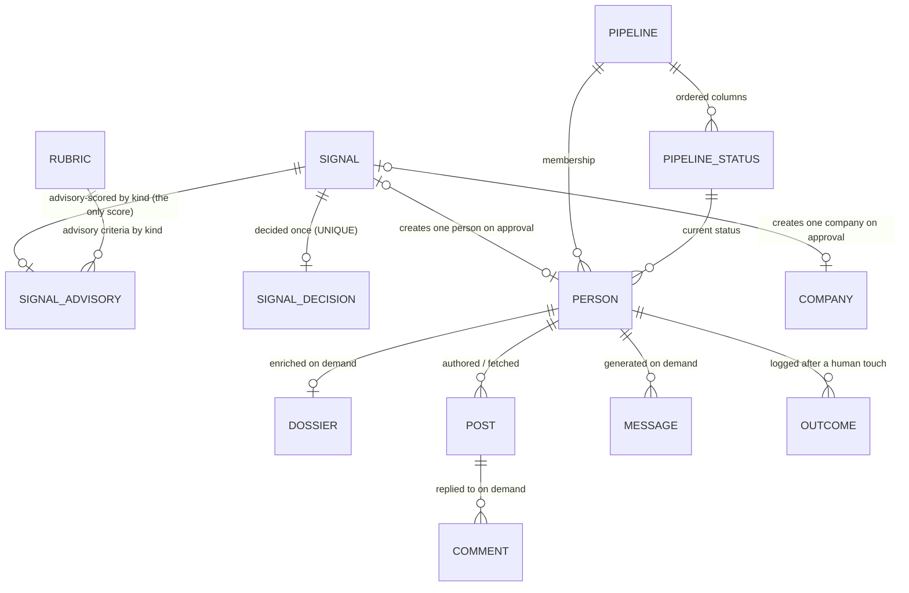
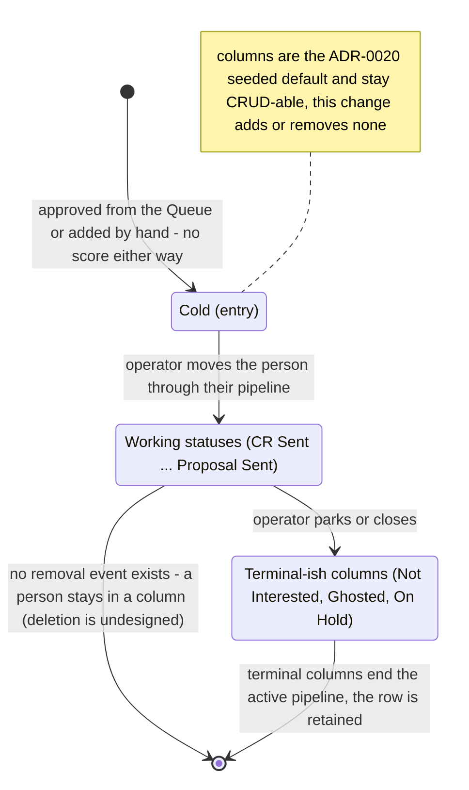

## Glossary

- **Advisory score**: the per-signal fit hint (1-5, -1 insufficient data, or absent when no rubric of the signal's kind is active), written by the advisory filter against the active rubric matching the signal's kind (ADR-0017). After this change it is the only score in the system, and it lives where the judgment happens - on the signal, at triage.
- **Scoring** (removed term): the per-person 1-5 rating entity (ADR-0005, reshaped by ADR-0019) is retired. No person-keyed score exists; the noun leaves the vocabulary along with the entity.
- **Qualification** (removed term): the derived qualified / below_bar / unassessed read over a person's latest buyer-rubric Scoring (ADR-0019/0020) is retired. The human's approve/dismiss verdict at triage is the qualification; after approval a person is described by pipeline position only.
- **Rubric**: unchanged config-as-data (kinds `icp | peer | company`, one active per kind, additive versions). Its sole consumer is now the advisory filter.
- **Outcome**: the logged result of a manual human touch, bound to the Person and the engagement artifact acted on. It no longer snapshots a score (`score_at_time` is removed); the future learning loop (D7, deferred) binds to signal advisory data instead.

## Entity model

Notes on what changed and the non-obvious cardinalities:

- The `SCORING` entity is removed outright - `PERSON ||--o{ SCORING : "rated on demand"` no longer exists, and with it the `advisory | llm` provenance convention and the qualification read. This is the whole change at the entity level.
- `RUBRIC ||--o{ SIGNAL_ADVISORY` is by kind, not by id: the advisory row records the `rubric_kind` it was scored under (ADR-0017's shape, unchanged). Rubrics lose their other consumer (the person scorer) but keep all three kinds.
- `OUTCOME` keeps its person binding and artifact reference but loses the `score_at_time` attribute - there is no person score to snapshot. Note the substrate honestly: `signal_advisory` rows persist but are refreshed in place by the job (version-unpinned, no provenance), so they are reachable context via `person.signal_id`, NOT a learning-grade record - the D7 loop must introduce its own (ADR-0022 names this forfeit); a manual person has no score anywhere, accepted by design.
- `SIGNAL |o--o| PERSON` / `SIGNAL |o--o| COMPANY`: zero-or-one on both ends - approval routes a decided signal to exactly one entity, and a manual-origin Person (or future manual Company) has no signal at all. The LEFT-JOIN anti-strand Queue read is unchanged from ADR-0019's intake model.
- Config-as-data vs runtime: `RUBRIC`, `PIPELINE`, and `PIPELINE_STATUS` are seeded, operator-CRUD-able configuration (ADR-0017/0020); every other entity is written at runtime by jobs or user actions.

## Lifecycle

The Person lifecycle is exactly the configurable pipeline of ADR-0020 - this change does not move it. What changes is the entry annotation: a person enters at the pipeline's entry status carrying no score, whether created from the Queue or by hand. The two origins are now indistinguishable at the entity level except for `origin`/`signal_id`. On-demand actions (enrich, generate message/comment) are available in every status and never move it; re-score no longer exists.

## Domain events

| Event (past tense) | Trigger | Produces (state / read-model) | Job stage |
|--------------------|---------|-------------------------------|-----------|
| SignalAdvisoryScored | advisory filter job scores a pending signal | `signal_advisory` row (the only score) | advisory-filter (existing worker, unchanged) |
| SignalApproved | CRM user clicks Create Person/Company in the Queue | routed entity created (Person at entry status, or Company); no score written, no LLM call; signal drops from Queue | none (synchronous server action, one tx) |
| SignalDismissed | CRM user dismisses a Queue item | SignalDecision(dismissed); signal drops from Queue | none (synchronous) |
| PersonAddedManually | CRM user adds a lead by hand | Person created (origin = manual) at entry status; nothing enqueued | none (synchronous) |
| PersonEnriched | CRM user clicks Enrich on the Person | Dossier row (Apify call) | enrich (existing worker, user-triggered) |
| MessageGenerated | CRM user clicks Generate message (by type) | new Message row (LLM call) | none (synchronous on-demand action) |
| CommentGenerated | CRM user clicks Generate comment on a Post | new Comment row (LLM call) | none (synchronous, unchanged ADR-0018) |
| PersonStatusChanged | CRM user sets the Person's pipeline status | `Person.status` FK updated | none (synchronous) |
| OutcomeLogged | CRM user logs the result of a manual touch | Outcome row bound to the person and artifact (no score snapshot). NO WRITER exists today - the route that wrote outcomes died in the engagement rework; the event is retained in the model and re-implemented with the deferred D7 work | none (synchronous, deferred) |

Removed events: `PersonRescored` (the on-demand re-score action is deleted), and the advisory-promotion side effect of `SignalApproved` (it wrote the `advisory`-provenance initial Scoring under ADR-0019; approval now produces the entity and the decision row only).
