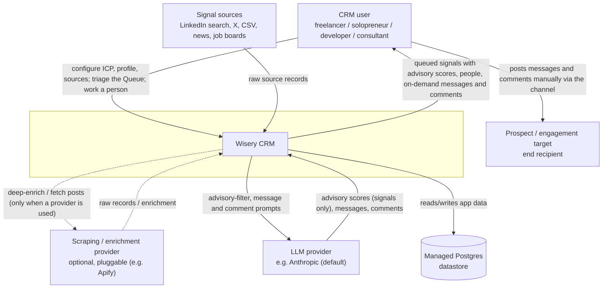
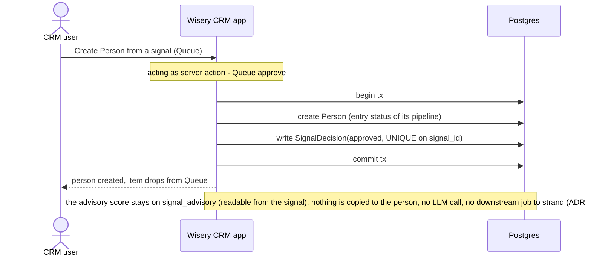

## System context (C4 L1)

The external boundary is unchanged - no actor or external system is added or removed; the node set matches canon. <!-- v:fact docs/architecture/system-context.md --> The edge labels below differ from the canon diagram in more than this change's scope: the canon L1 was never re-labeled for the engagement rework (it still says "review + approve", "qualified prospects, dossier, optional draft", "qualify and draft prompts"), so this diagram carries those deferred ADR-0019..0021 label updates together with this change's narrowing - the LLM provider is no longer asked to score a person; its scoring role narrows to the per-signal advisory filter (plus generation, unchanged). Promotion lands the full re-labeled diagram into docs/architecture/system-context.md. <!-- v:decision -->

- Signal sources: raw items in, on a schedule (unchanged). <!-- v:fact docs/architecture/system-context.md -->
- LLM provider: scores signals (the advisory filter job) and generates messages/comments on demand; after this change no call path scores a person (ADR-0003 port unchanged). <!-- v:derives ADR-0003 -->
- Enrichment provider: called only on an explicit user action (ADR-0007 core, unchanged). <!-- v:derives ADR-0007 -->
- The channel (LinkedIn) is crossed only by the human; the system never auto-sends (D2). <!-- v:fact docs/product-overview.md D2 -->

## Containers (C4 L2)

Containers are unchanged - this change adds no container, no port, and no worker; it deletes code inside the single app container (the qualify slice) and one table plus one column in the datastore. Per ADR-0001 the web app and the in-process pg-boss worker are two roles of one Node process, one container. The canon L2 worker stage list "(scan, normalize, advisory-filter, enrich, fetch-posts, activity-scan)" needs no edit because person scoring had no worker after ADR-0019 - the deletion is entirely in the server-action role (normalize is the deferred M2 expansion stage, untouched here). <!-- v:fact docs/architecture/system-design.md --> <!-- v:derives ADR-0001 --> One canon L2 edge label does change at promotion: the app-to-LLM edge currently reads "advisory-score + generate/re-score on demand" - re-score is deleted, so the label becomes "advisory-score + generate on demand". <!-- v:decision -->

## Components (C4 L3)

This repo keeps a pre-code L3 component view as living canon (ADR-0006). This change only removes components inside the app container: <!-- v:derives ADR-0006 -->

- **Removed**: the qualify slice (`src/lib/qualify/` - pipeline, qualification read, gate) and the re-score server action on the prospect list; the enrichment path's qualification gate (the human's approval is the gate, so any admitted person is enrichable on demand). <!-- v:fact src/lib/qualify -->
- **Relocated**: the LLM scorer core and its `icp_score_v1` prompt survive - the advisory filter is their only consumer - so the scorer moves into the triage slice (`src/lib/triage/scorer.ts`); the prompt file is unchanged for version traceability. The scorer consumes the kernel `PersonSubject` shape (a structural `{kind, payload}` subject from `src/lib/prospect/identity.ts`, a designated L0 kernel module) - it scores signal subjects, not Person rows. <!-- v:fact src/lib/triage/advisory.ts (imports the scorer) -->
- **Changed**: `approveSignal` (`src/lib/triage/decide.ts`) drops its advisory-resolution + Scoring-promotion step - it writes the SignalDecision and the routed entity, nothing else; the prospect read-model (`src/lib/prospect/read.ts`) drops its scoring joins and qualification fields. <!-- v:derives proposal Scope -->
- **Unchanged**: the advisory filter (`src/lib/triage/advisory.ts`), the Queue read, rubric config (`src/lib/icp/`), pipelines, messages, comments, enrichment. <!-- v:fact src/lib/triage/advisory.ts -->
- **Term alignment at promotion**: the canon L3 catalog and key-flows sections currently still name the qualify component, the re-score action, and the qualification read; at promotion they will be deleted or re-worded, not kept as tombstones. <!-- v:decision -->

## Key runtime flows

### Approve a signal from the Queue (entity only - no score, no LLM, no job)

The flow ADR-0019 added on this path (resolve active rubric, write the `advisory`-provenance initial Scoring) is deleted; the transaction shrinks to decision + entity. The on-demand re-score flow ("Work a person on demand: re-score") is deleted entirely - the Person workspace's remaining on-demand actions (generate message/comment, enrich) are unchanged from ADR-0019/0021. <!-- v:derives ADR-0019 -->

## Decisions and trade-offs

- **The signal is the only scored thing**: chose deleting person scoring outright over keeping it as promotion + on-demand re-score (ADR-0019's model). Force: the advisory score informs the approve/dismiss verdict, and that human verdict is the qualification - a person-keyed score after approval restates a decision already made, at the cost of a table, an LLM pipeline, a prompt, a provenance convention, and a derived read. Trade-off knowingly accepted: no per-person fit number exists after approval; "why is this person here" is answered by the originating signal's advisory score (one join away via `person.signal_id`), and a manual-origin person has no score anywhere. <!-- v:decision -->
- **Qualification is deleted, not re-derived from the advisory score**: chose removing the qualified / below_bar / unassessed read over recomputing it from `signal_advisory` through the person's signal link. Force: a manual person has no signal, so an advisory-derived badge would be permanently `unassessed` with no path to change it - a dead state worn on the UI; and pipeline position already expresses what the operator is doing with the person. Trade-off accepted: if practice shows the list needs a fit cue, surfacing the signal's advisory score via the existing origin-signal join is additive at the schema level - but the cue is rubric-kind-polysemic (buyer-fit only for `icp`-kind signals) and absent for manual origin, so any such surface must branch on `signal_advisory.rubric_kind`, never render `score` uniformly. <!-- v:decision -->
- **Drop `outcomes.score_at_time` now rather than repoint it**: chose removing the snapshot column over binding it to the advisory score at touch time. Force: nothing writes outcomes today (the route that did was deleted in the engagement rework), so repointing would design the learning-loop binding speculatively, ahead of the loop itself. Trade-off accepted: the D7 loop, when designed, must define its own binding to `signal_advisory` data; until then outcomes carry result + artifact reference only. <!-- v:fact src (no outcome write path) --> <!-- v:decision -->
- **Destructive drop over freeze**: chose DROP TABLE `scorings` over keeping it read-only for provenance. Force: pre-launch dev data with no consumer; a frozen table invites accidental coupling and contradicts the one-authoritative-representation rule. Trade-off accepted: historical dev scores are gone; rollback is a dev-snapshot restore. <!-- v:decision -->

## Cross-cutting concerns

- Observability: unchanged - the advisory filter stays a monitored job; the deleted re-score was request-level logging on a server action. <!-- v:fact docs/architecture/cross-cutting.md -->
- Configuration: rubrics stay config-as-data with all three kinds (ADR-0017's shape) <!-- v:derives ADR-0017 -->; with person scoring removed, their only scoring consumer is the advisory filter (D6). <!-- v:derives proposal Scope -->
- Secrets: unchanged - one fewer LLM consumer behind the same `LLMProvider` adapter. <!-- v:fact docs/architecture/cross-cutting.md -->
- Failure handling: approval loses its only conditional write (the rubric-dependent promotion), shrinking the transaction; no new failure modes are introduced, one (promotion skipped on missing rubric) disappears. <!-- v:derives ADR-0019 -->
- Trust boundaries: unchanged - single-tenant-first, server actions server-side, `server-only` guards. <!-- v:fact docs/architecture/cross-cutting.md -->
- Data sensitivity: unchanged classes; the dropped `scorings.reason`/`summary` strings (LLM judgments about a person) are deleted with the table, marginally shrinking stored derived-PII. <!-- v:decision -->
- Scaling / capacity: unchanged - no worker or queue is touched (the qualify queues were already retired by ADR-0019); the People list read loses a join. <!-- v:derives ADR-0001 -->
