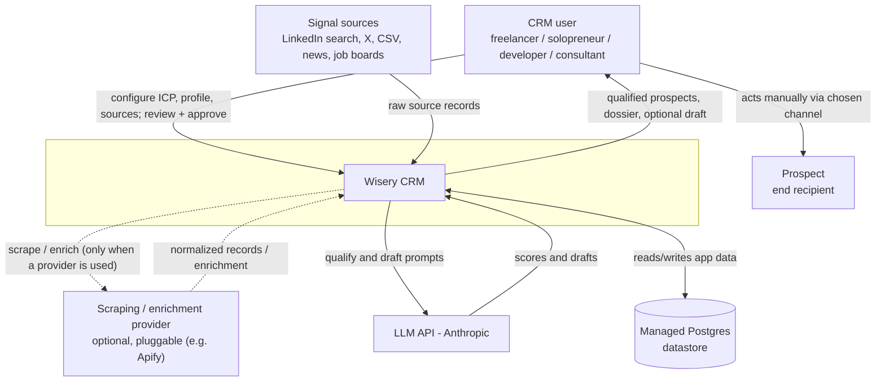
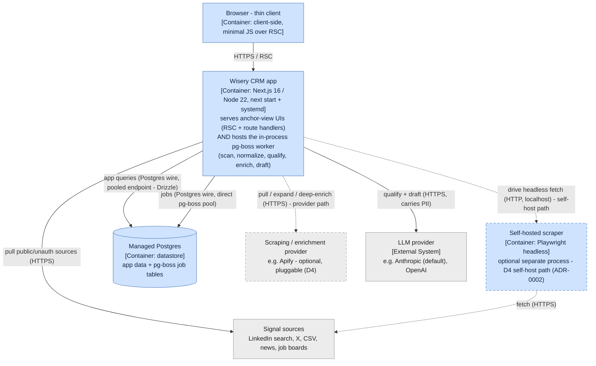
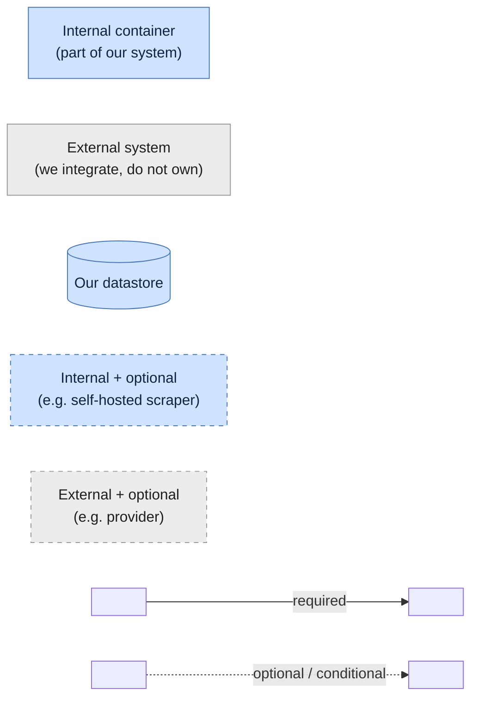
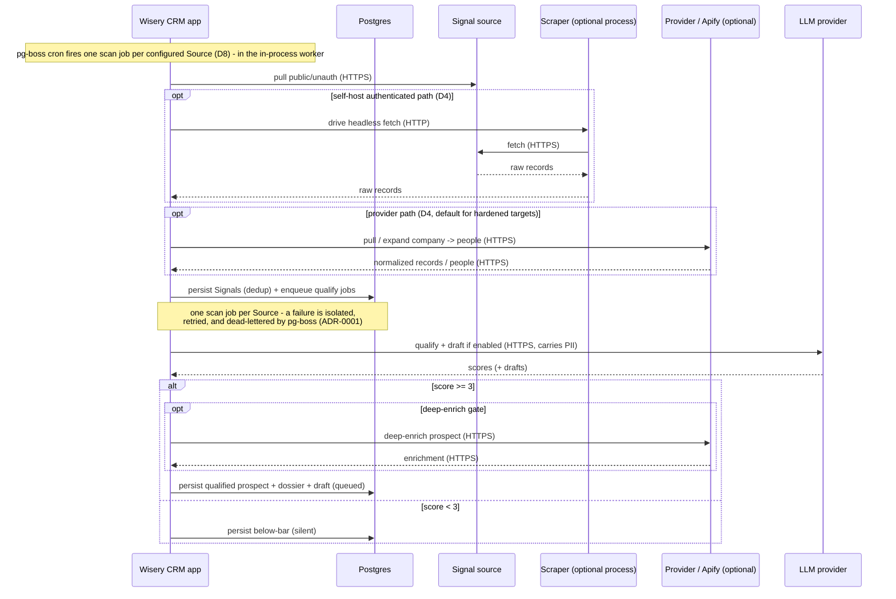

This change adds the C4 L2 container depth that the L1 system context
(docs/architecture/system-context.md) explicitly parked. It honors ADR-0001 (background jobs
in-process via pg-boss)<!-- v:derives ADR-0001 --> and introduces ADR-0002 (self-hosted scraping runs as an optional separate
process - an extension of ADR-0001's in-process default for one heavy dependency).<!-- v:derives ADR-0002 --> The L1 section
below is the already-promoted L1, reproduced unchanged for self-containment;<!-- v:derives docs/architecture/system-context.md --> the new material is the
Containers (C4 L2) section and the container-level runtime flows.

## System context (C4 L1)

Unchanged from the promoted system-context.md - the system as one box, its human actor, and
every external system it depends on.<!-- v:derives docs/architecture/system-context.md --> The action edge runs from the CRM user (not the system)
to the Prospect.<!-- v:derives D2 -->

## Containers (C4 L2)

The separately runnable and deployable units inside (and at the edge of) the Wisery CRM
boundary, and the protocols between them. The test for a container here is "something that has
to be running for the system to work" - a process or a datastore - not a code grouping inside
one of them (that is L3, out of scope for this change).<!-- v:fact C4 model - a container is a separately runnable/deployable unit -->

Per ADR-0001 and the decision below, the web app and the pg-boss worker are two ROLES of a
single Node process, so they are ONE container, annotated with both responsibilities - not two
boxes.<!-- v:derives ADR-0001 --> Their split into web/worker roles and the optional `worker_threads` pool are L3 internals,
deliberately not drawn.<!-- v:decision --> Internal containers (what we build and run) are blue; external systems we depend on but do not
control are grey; optional units and edges (the self-hosted scraper, the external provider) are
dashed. A legend follows the diagram.

**Legend.**

Key: a **solid** arrow is an always-present relationship; a **dashed** arrow is an optional/conditional
path (present only on the D4 self-host or provider path), not an async marker. Arrows are
unidirectional and point from caller to dependency - the response is implied, which is why this view
has no double-headed arrows. **Rectangle** = process/container, **cylinder** = datastore. **Blue** =
internal (part of the system we are building, including our own datastore even when managed-hosted), **grey** = external system we integrate with but do not own. The two
axes are independent: a unit can be internal-and-optional (the self-hosted scraper) or
external-and-optional (the provider).

The three outbound source paths - direct public/unauth pull, self-host scraper, and provider - are
per-source ALTERNATIVES selected by the D4 cost/ban-risk knob, not concurrent.<!-- v:derives D4 --> The app's outbound
edges to sources and the provider are not direct vendor bindings: they cross the D4 `SignalSource`
/ `EnrichmentProvider` ports. Apify and the self-hosted scraper are interchangeable adapters behind
those ports, which is why a new source is a new adapter, not a pipeline change (D4, D8).<!-- v:derives D4, D8 --> LLM-agnosticism is a locked
product decision (D9): the LLM provider sits behind an `LLMProvider` port - a peer of the D4
`SignalSource` / `EnrichmentProvider` ports, all of them seams across the system boundary - where
every data-returning call is a provider-neutral JSON Schema validated with Zod, the wire schema kept
within that provider's supported structured-output subset and richer constraints enforced in a
post-parse Zod refine, so Anthropic is the default adapter rather than a binding (D9, ADR-0003).<!-- v:derives D9, ADR-0003 --> (The
in-process queue, by contrast, is reached via a thin pg-boss facade that is deliberately not a
portability seam - see the Managed Postgres entry.)<!-- v:derives ADR-0004 --> An
authenticated source never uses the direct pull (the ToS/ban-risk path the product avoids, D2);<!-- v:derives D2 --> it
goes via the scraper or the provider, with the provider the default for hardened targets (ADR-0002).<!-- v:derives ADR-0002 -->

Container by container, and why each qualifies as a container (not a component):
- **Wisery CRM app**: one Node process (`next start` + systemd). It is a single container because both roles run in the same process and share one event loop (ADR-0001);<!-- v:derives ADR-0001 --> the web/worker split and the optional `worker_threads` pool are L3 components, out of scope here. **Peel-safety invariant**: the no-rewrite peel into a standalone `worker.ts` holds only while the web and worker roles share state solely through Postgres - no module-level mutable singletons, no in-process caches or event buses, no transaction or connection spanning a request handler and a job (ADR-0001).<!-- v:decision; derives ADR-0001 --> The peel is the moment this becomes two containers (two app containers on the no-scraper path; on the self-host path the scraper is already a separate unit, and peeling the worker onto its own host turns the scraper's localhost HTTP control hop into a private-network endpoint - ADR-0002).<!-- v:derives ADR-0002 -->
- **Browser - thin client**: the client-side container; thin because most rendering is server-side (RSC). Drawn so the client/server cut is explicit - no secret-bearing path crosses to it.<!-- v:derives server-only (CLAUDE.md), RSC default -->
- **Managed Postgres**: the datastore container; one instance holds both app data and the pg-boss job tables (ADR-0001),<!-- v:derives ADR-0001 --> so it is a single failure domain for serving and background work - a Postgres outage halts both, accepted while single-user.<!-- v:decision --> It is drawn inside the system boundary (internal) because it is the system's own datastore - we own its schema - not a third-party system we integrate with; managed hosting (Neon/Supabase/RDS, ADR-0001) is an operational fact, not a boundary change, unlike the genuinely external LLM, provider, and sources.<!-- v:decision; derives ADR-0001 --> The two access modes (pooled endpoint for app queries, a direct connection for pg-boss) are a property of how the app connects: pg-boss claims work by long-polling with `SKIP LOCKED` and runs its own long-lived `pg.Pool`,<!-- v:fact pg-boss src/plans.ts (FOR UPDATE..SKIP LOCKED), src/db.ts (new pg.Pool, application_name=pgboss) --> so it is given a direct connection rather than fronted by a transaction-mode pooler, which would be redundant in front of its pool (its advisory locks are transaction-scoped and pooler-safe, so they are not the reason)<!-- v:fact pg-boss src/plans.ts pg_advisory_xact_lock; PgBouncer issue #102 - xact-scoped locks are pooler-safe --> - ADR-0001. pg-boss's persistent connections are sized via its pool `max` and budgeted against the database's connection cap alongside the pooled app connections.<!-- v:derives ADR-0001 --> The app reaches pg-boss through a thin pg-boss facade (a wrapper for testability and to localize the pg-boss API), deliberately not a portability seam: pg-boss's transactional enqueue - a job created atomically with its originating data write - is a Postgres-backed-queue property the facade does not abstract away, so the queue stays intentionally Postgres-coupled and a real backend change would be a future superseding decision, not a free adapter swap (ADR-0004).<!-- v:derives ADR-0004 -->
- **Self-hosted scraper (optional)**: a separate process because a headless browser is heavy (memory, its own lifecycle, a wide crash blast radius), so isolating it protects the worker event loop and lets it restart independently (ADR-0002).<!-- v:derives ADR-0002 --> The worker drives it over HTTP from within a pg-boss job, so a crash is an isolated, retried, dead-letterable failure that fails only self-host-path sources - serving, the provider path, and public-API pulls are unaffected.<!-- v:derives D4 - paths are alternatives --> The drive-fetch edge carries only a target/source spec, not credentials: the scraper holds its own session material, so that secret surface stays inside it (ADR-0002).<!-- v:derives ADR-0002 --> Present only on the D4 self-host path; the managed provider is the default for hardened targets, and this is absent when only the provider or public APIs are used.

## Key runtime flows

Two highest-judgment flows, both consistent with the L1 boundary flow and the primary journey
from the archived L1 change. These are dynamic views over the containers above; because the web
and worker are one container, the app appears once and a note marks when it is acting in its
in-process worker capacity.<!-- v:derives ADR-0001 -->

### Intelligence pipeline - scheduled scan to queued draft

### Human review and act

## Decisions and trade-offs

- **Web and worker as one container with two roles**: chose a single Node process over two separate containers now, per ADR-0001 (pg-boss in-process). Alternative weighed: stand up the worker as its own container immediately. One process won because it matches the current single-user reality, needs no extra infra or Redis, and `SKIP LOCKED` keeps the later split a no-rewrite peel - but only under the peel-safety invariant (web and worker share state solely through Postgres; no shared in-process singletons, caches, event buses, or request-spanning transactions). Trade-off accepted: web and worker share an event loop, so a CPU-bound step could degrade request latency - the primary lever is the documented peel to a standalone `worker.ts`, with a `worker_threads` pool as a profile-driven optimization for a step proven CPU-bound, not an upfront build.<!-- v:decision; derives ADR-0001 -->
- **Self-hosted scraper as a separate optional process** (ADR-0002): chose a separate optional process over running Playwright/Puppeteer in-process in the worker. A headless browser is heavy (memory, its own lifecycle, a wide crash blast radius), so isolating it protects the worker event loop and lets it restart independently; it is also genuinely optional (D4 self-host path) and absent when only the provider or public APIs are used. The managed provider is the default for hardened/authenticated targets (keeping ban risk off the user's account, D2); Playwright is preferred over Puppeteer if self-hosted. Trade-off accepted: an extra deployable unit and an HTTP hop to drive it, with the worker driving it from a pg-boss job so a crash is isolated, retried, and dead-letterable.<!-- v:decision; derives ADR-0002 -->
- **One Postgres, two connection modes**: the app connects to a single Postgres two ways - the pooled endpoint for app queries (Drizzle) and a direct connection for pg-boss - drawn as two edges to the single datastore (not as two stores). pg-boss claims work by long-polling with `SKIP LOCKED` (it has no LISTEN/NOTIFY) and manages its own long-lived `pg.Pool` for cron/maintenance; its advisory locks are transaction-scoped (`pg_advisory_xact_lock`) and pooler-safe, so the reason to give it a direct connection is not lock breakage but that fronting its own pool with a transaction-mode pooler (PgBouncer/Supavisor) is redundant and adds churn (ADR-0001).<!-- v:fact pg-boss src/plans.ts (SKIP LOCKED, pg_advisory_xact_lock pooler-safe), src/db.ts (own pg.Pool) --> Alternative weighed: route everything through one transaction pooler - rejected as a pool-in-front-of-a-pool with no benefit for pg-boss. Trade-offs accepted: two connection configurations against one datastore; one datastore is a single failure domain (an outage halts serving and jobs); and pg-boss's persistent pool must be sized (its `max`) and budgeted against the database's connection cap.<!-- v:decision; derives ADR-0001 -->
- **LLM-agnostic via an `LLMProvider` port** (D9, ADR-0003): chose a provider-neutral structured-output contract (JSON Schema + Zod validation) over binding the qualify/draft path to one vendor's SDK; LLM-agnosticism is a locked product decision (D9). Each adapter maps the shared contract onto its provider's native structured-output mode - for the default Anthropic adapter that is Anthropic Structured Outputs (`output_config.format`, GA January 2026, public beta November 2025, not `tool_use`; verified against `@anthropic-ai/sdk` 0.97.0); others map to their equivalent, falling back to constrained prompting + Zod validate/repair where a provider has no native mode. Alternative weighed: code directly against the Anthropic SDK - rejected because it makes the highest-value path non-portable. Trade-offs accepted: the wire schema is a supported subset, not arbitrary JSON Schema - Anthropic's native mode rejects common keywords (numeric/length bounds, arbitrary `minItems`, recursion, open `additionalProperties`, advanced regex), but on the default adapter the SDK's `zodOutputFormat` transform produces that subset automatically and still validates the full Zod schema after parse (the two-layer split is the SDK's behavior, not hand-rolled), with the subset managed explicitly only on the raw `messages.create` path or for non-Anthropic adapters; provider-specific features like prompt-cache `cache_control` stay inside the adapter; and output fidelity, latency, and cost vary by provider, so evals and the D7 qualify threshold may need per-model calibration. This aligns with the updated CLAUDE.md rule (use the provider's native structured-output mode behind the port).<!-- v:decision; derives D9, ADR-0003 -->
- **Thin pg-boss facade, not a portability seam; Postgres stays the queue substrate** (ADR-0004): kept pg-boss on Postgres (ADR-0001 unchanged) and wrapped it in a thin facade for testability/mocking and to localize the pg-boss API - explicitly not a swap layer. Driver was lock-in avoidance on principle, with no concrete non-Postgres requirement. Survey (npm registry, 2026-05): the real Postgres-native peers are pg-boss and Graphile Worker (both do transactional enqueue and cron); pg-boss was chosen for its singleton/debounce, dead-letter ergonomics, and larger install base, not because it is the only mature option. Transactional enqueue (a job created atomically with its originating data write) is a Postgres-backed-queue property - pg-boss and Graphile Worker have it, Redis/BullMQ cannot - and is the reason the queue stays Postgres-coupled. Storage-agnostic options were rejected as immature (Agenda v6's Postgres backend is a recent, unproven separate package) or as a different lock-in that also loses transactional enqueue (BullMQ is Redis-only). CQRS, which prompted the Redis idea, is an in-process mediator concern and needs no broker, so it does not drive this. Trade-off accepted: the facade buys testability and a clean call site, not portability - a real backend change (e.g. for real-time pub/sub, or a scale pg-boss cannot meet) would be a future superseding decision and, for transactional-enqueue jobs, a rewrite rather than a free swap.<!-- v:decision; derives ADR-0004 -->

## Cross-cutting concerns

- Observability: pino structured logging; job and dead-letter visibility comes from logs plus SQL views over the `pgboss` schema - no job dashboard UI (ADR-0001).<!-- v:derives ADR-0001 -->
- Configuration: per-user ICP/profile/sources are config-as-data in Postgres (D6); runtime config, provider endpoints, and the two connection strings come from the environment.<!-- v:derives D6 -->
- Secrets: the enrichment-provider and LLM-provider API keys and the Postgres connection strings live only server-side in the app container (its web and worker roles) via `server-only`; on the self-host path, any scraping session cookies live only in the scraper process (ADR-0002). The browser is a thin client and no secret-bearing path crosses to it.<!-- v:derives ADR-0002, server-only (CLAUDE.md) -->
- Failure handling: external calls run as pg-boss jobs with retries and a dead-letter path; one scan job per Source isolates a failing source from the others (ADR-0001); CPU-bound parsing, if profiling shows it, is isolated on the `worker_threads` pool. On shutdown the app owns a SIGTERM/SIGINT handler that calls `boss.stop({ graceful: true })` within the host stop window; because a restart re-runs in-flight jobs on retry, externally-billed steps (provider, LLM) are idempotent (ADR-0001).<!-- v:derives ADR-0001 -->
- Trust boundaries: browser <-> web is the only inbound client edge; every external call (sources, provider, LLM) is server-side from the worker; inbound third-party data is untrusted and normalized at the edge (D4). Auth/sessions are deferred while single-user (D1).<!-- v:derives D4, D1 -->
- Data sensitivity: prospect PII enters via sources and any provider into the worker, persists in Postgres, and is sent to the LLM for scoring/drafting - the main data-processor exposure (product-overview open question). While single-user (D1) this PII is deliberately uncontrolled; field minimization and sub-processor controls attach at the qualify boundary when productized (D10). The only outbound path to the Prospect is the manual human action from the browser.<!-- v:derives D1, D10 -->
- Scaling / capacity: in-process worker now; the primary scaling lever is the no-rewrite peel to a standalone `worker.ts` if request p95 degrades, with `worker_threads` as a profile-driven optimization for a proven CPU-bound step (ADR-0001). Each `next start` instance runs its own pg-boss engine, so horizontal web scaling multiplies pg-boss's connection footprint against the Postgres direct-connection cap - past one instance, prefer the worker peel over N embedded engines. The binding constraints remain the paid, rate-limited externals (the provider when used, the LLM provider), which the design gates and tolerates rather than scales past.<!-- v:derives ADR-0001 -->
