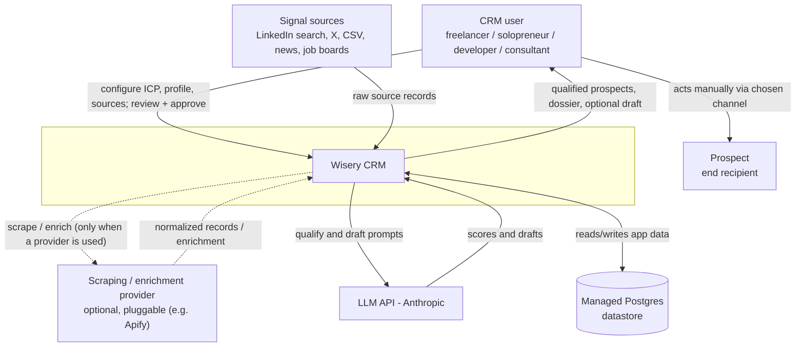
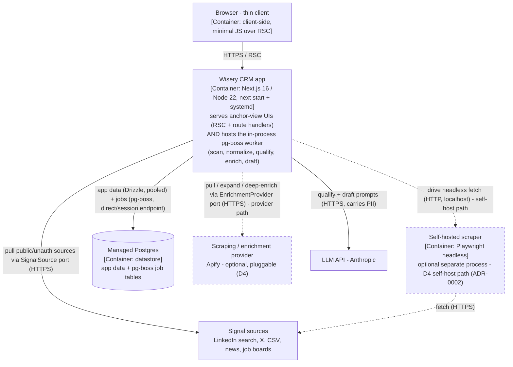
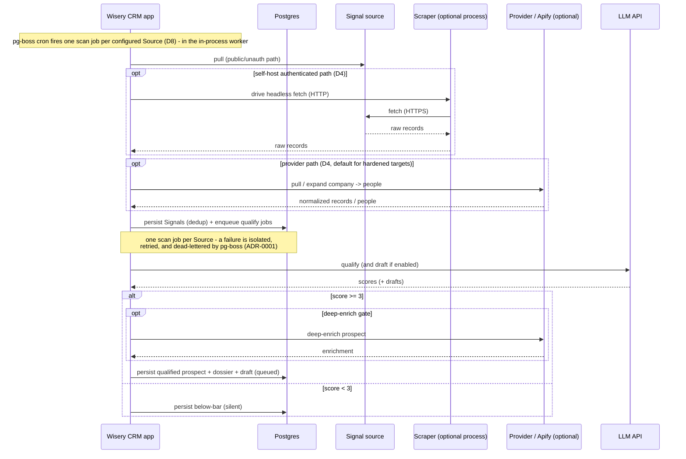
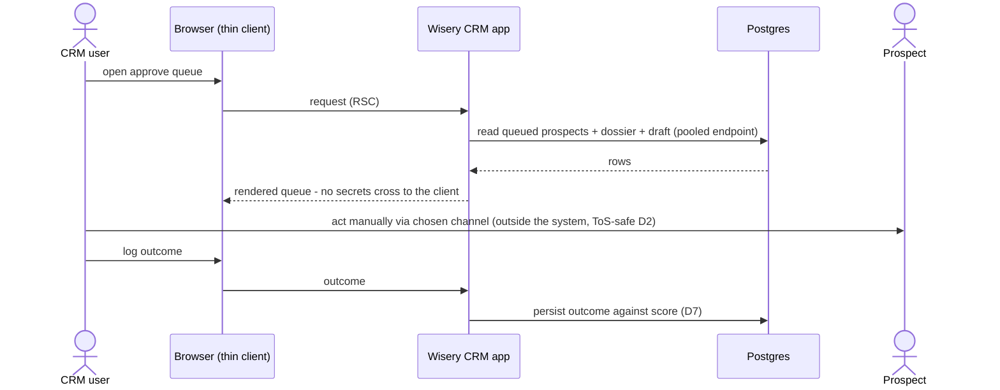

This change adds the C4 L2 container depth that the L1 system context
(docs/architecture/system-context.md) explicitly parked. It honors ADR-0001 (background jobs
in-process via pg-boss) and introduces ADR-0002 (self-hosted scraping runs as an optional separate
process - an extension of ADR-0001's in-process default for one heavy dependency). The L1 section
below is the already-promoted L1, reproduced unchanged for self-containment; the new material is the
Containers (C4 L2) section and the container-level runtime flows.

## System context (C4 L1)

Unchanged from the promoted system-context.md - the system as one box, its human actor, and
every external system it depends on. The action edge runs from the CRM user (not the system)
to the Prospect.

## Containers (C4 L2)

The separately runnable and deployable units inside (and at the edge of) the Wisery CRM
boundary, and the protocols between them. The test for a container here is "something that has
to be running for the system to work" - a process or a datastore - not a code grouping inside
one of them (that is L3, out of scope for this change).

Per ADR-0001 and the decision below, the web app and the pg-boss worker are two ROLES of a
single Node process, so they are ONE container, annotated with both responsibilities - not two
boxes. Their split into web/worker roles and the optional `worker_threads` pool are L3 internals,
deliberately not drawn. Optional containers and edges (the self-hosted scraper, the external
provider) are dashed.

The three outbound source paths - direct public/unauth pull, self-host scraper, and provider - are
per-source ALTERNATIVES selected by the D4 cost/ban-risk knob, not concurrent. The app's outbound
edges to sources and the provider are not direct vendor bindings: they cross the D4 `SignalSource`
/ `EnrichmentProvider` ports. Apify and the self-hosted scraper are interchangeable adapters behind
those ports, which is why a new source is a new adapter, not a pipeline change (D4, D8). An
authenticated source never uses the direct pull (the ToS/ban-risk path the product avoids, D2); it
goes via the scraper or the provider, with the provider the default for hardened targets (ADR-0002).

Container by container, and why each qualifies as a container (not a component):
- **Wisery CRM app**: one Node process (`next start` + systemd). It is a single container because both roles run in the same process and share one event loop (ADR-0001); the web/worker split and the optional `worker_threads` pool are L3 components, out of scope here. **Peel-safety invariant**: the no-rewrite peel into a standalone `worker.ts` holds only while the web and worker roles share state solely through Postgres - no module-level mutable singletons, no in-process caches or event buses, no transaction or connection spanning a request handler and a job (ADR-0001). The peel is the moment this becomes two containers.
- **Browser - thin client**: the client-side container; thin because most rendering is server-side (RSC). Drawn so the client/server cut is explicit - no secret-bearing path crosses to it.
- **Managed Postgres**: the datastore container; one instance holds both app data and the pg-boss job tables (ADR-0001), so it is a single failure domain for serving and background work - a Postgres outage halts both, accepted while single-user. The two access modes (pooled endpoint for app queries, a direct/session endpoint for pg-boss) are a property of how the app connects: pg-boss claims work by long-polling with `SKIP LOCKED` and holds a long-lived pool plus advisory locks, which a transaction-mode pooler would break, so it must use the direct endpoint (ADR-0001). pg-boss's persistent connections count against the instance's direct-connection cap and are budgeted alongside the pooled app connections.
- **Self-hosted scraper (optional)**: a separate process because a headless browser is heavy (memory, its own lifecycle, a wide crash blast radius), so isolating it protects the worker event loop and lets it restart independently (ADR-0002). The worker drives it over HTTP from within a pg-boss job, so a crash is an isolated, retried, dead-letterable failure. Present only on the D4 self-host path; the managed provider is the default for hardened targets, and this is absent when only the provider or public APIs are used.

## Key runtime flows

Two highest-judgment flows, both consistent with the L1 boundary flow and the primary journey
from the archived L1 change. These are dynamic views over the containers above; because the web
and worker are one container, the app appears once and a note marks when it is acting in its
in-process worker capacity.

### Intelligence pipeline - scheduled scan to queued draft

### Human review and act

## Decisions and trade-offs

- **Web and worker as one container with two roles**: chose a single Node process over two separate containers now, per ADR-0001 (pg-boss in-process). Alternative weighed: stand up the worker as its own container immediately. One process won because it matches the current single-user reality, needs no extra infra or Redis, and `SKIP LOCKED` keeps the later split a no-rewrite peel - but only under the peel-safety invariant (web and worker share state solely through Postgres; no shared in-process singletons, caches, event buses, or request-spanning transactions). Trade-off accepted: web and worker share an event loop, so a CPU-bound step could degrade request latency - the primary lever is the documented peel to a standalone `worker.ts`, with a `worker_threads` pool as a profile-driven optimization for a step proven CPU-bound, not an upfront build.
- **Self-hosted scraper as a separate optional process** (ADR-0002): chose a separate optional process over running Playwright/Puppeteer in-process in the worker. A headless browser is heavy (memory, its own lifecycle, a wide crash blast radius), so isolating it protects the worker event loop and lets it restart independently; it is also genuinely optional (D4 self-host path) and absent when only the provider or public APIs are used. The managed provider is the default for hardened/authenticated targets (keeping ban risk off the user's account, D2); Playwright is preferred over Puppeteer if self-hosted. Trade-off accepted: an extra deployable unit and an HTTP hop to drive it, with the worker driving it from a pg-boss job so a crash is isolated, retried, and dead-letterable.
- **One Postgres, two connection modes**: the app connects to a single Postgres two ways - the pooled endpoint for app queries (Drizzle) and a direct/session endpoint for pg-boss - shown as one annotated relationship rather than two stores. pg-boss claims work by long-polling with `SKIP LOCKED` (it has no LISTEN/NOTIFY) and holds a long-lived pool plus advisory locks for cron/maintenance; a transaction-mode pooler (PgBouncer/Supavisor) breaks advisory locks and recycles session state, so the direct endpoint is mandatory (ADR-0001). Alternative weighed: a single pooled connection for everything - rejected because it breaks pg-boss. Trade-offs accepted: two connection configurations against one datastore; one datastore is a single failure domain (an outage halts serving and jobs); and pg-boss's persistent connections must be sized and budgeted against the provider's direct-connection cap.

## Cross-cutting concerns

- Observability: pino structured logging; job and dead-letter visibility comes from logs plus SQL views over the `pgboss` schema - no job dashboard UI (ADR-0001).
- Configuration: per-user ICP/profile/sources are config-as-data in Postgres (D6); runtime config, provider endpoints, and the two connection strings come from the environment.
- Secrets: the provider and LLM API keys and the Postgres connection strings live only server-side in the app container (its web and worker roles) via `server-only`; on the self-host path, any scraping session cookies live only in the scraper process (ADR-0002). The browser is a thin client and no secret-bearing path crosses to it.
- Failure handling: external calls run as pg-boss jobs with retries and a dead-letter path; one scan job per Source isolates a failing source from the others (ADR-0001); CPU-bound parsing, if profiling shows it, is isolated on the `worker_threads` pool. On shutdown the app owns a SIGTERM/SIGINT handler that calls `boss.stop({ graceful: true })` within the host stop window; because a restart re-runs in-flight jobs on retry, externally-billed steps (provider, LLM) are idempotent (ADR-0001).
- Trust boundaries: browser <-> web is the only inbound client edge; every external call (sources, provider, LLM) is server-side from the worker; inbound third-party data is untrusted and normalized at the edge (D4). Auth/sessions are deferred while single-user (D1).
- Data sensitivity: prospect PII enters via sources and any provider into the worker, persists in Postgres, and is sent to the LLM for scoring/drafting - the main data-processor exposure (product-overview open question). While single-user (D1) this PII is deliberately uncontrolled; the qualify boundary is the designated attach point for field minimization and sub-processor controls when productized. The only outbound path to the Prospect is the manual human action from the browser.
- Scaling / capacity: in-process worker now; the primary scaling lever is the no-rewrite peel to a standalone `worker.ts` if request p95 degrades, with `worker_threads` as a profile-driven optimization for a proven CPU-bound step (ADR-0001). Each `next start` instance runs its own pg-boss engine, so horizontal web scaling multiplies pg-boss's connection footprint against the Postgres direct-connection cap - past one instance, prefer the worker peel over N embedded engines. The binding constraints remain the paid, rate-limited externals (the provider when used, the LLM API), which the design gates and tolerates rather than scales past.
