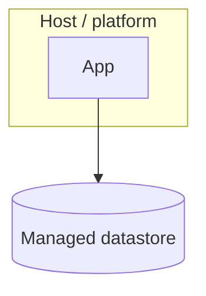

<!-- Create this only if where-things-run is part of this change's scope. If the
     proposal marked deployment Skip, leave this minimal and do not invent infra. -->

## Topology

<!-- The runtime environment: host(s)/platform, managed datastore, external
     worker or proxy box, and the network boundaries between them. -->

## Where each container runs

<!-- Map each container from system-design.md to where it executes. -->
| Container | Runs as | Where |
|-----------|---------|-------|
| {name}    | <in-process / process / SaaS / self-host> | <location> |

## Secrets and config

<!-- Where secrets live and how they reach each container. Point to the config ADR. -->

## Scaling and multi-tenant hook

<!-- The INFRASTRUCTURE realization of the scaling hook noted in system-design.md's
     cross-cutting concerns: the path from current shape to productized shape, if the
     overview names one (e.g. the tenant DB topology). The hook, not the build-out.
     When deployment is skipped, the conceptual hook still lives in system-design. -->
