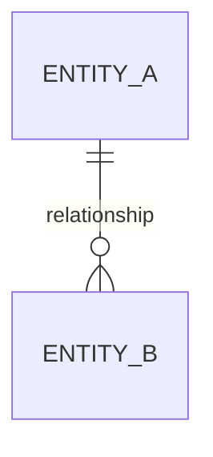
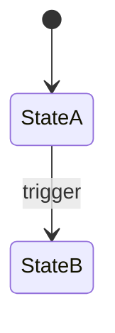

## Glossary

<!-- The canonical noun for each domain concept, one line each. One term per
     concept - kill synonyms. -->
- **{Term}**: <definition>

## Entity model

<!-- Every entity, its key attributes (the shape, not every column), and every
     relationship with cardinality. Call out fan-outs explicitly. -->

<!-- Per non-obvious relationship: one line on why that cardinality. -->

## Lifecycle

<!-- The core pipeline entity's states and transitions. Name the trigger on each
     transition. Must line up with the primary journey and the runtime flow. -->

## Domain events

<!-- The events that drive the system. Doubles as the background-job-stage map. -->

| Event (past tense) | Trigger | Produces (state / read-model) | Job stage |
|--------------------|---------|-------------------------------|-----------|
| {EventName}        | <what>  | <result>                      | <stage>   |
