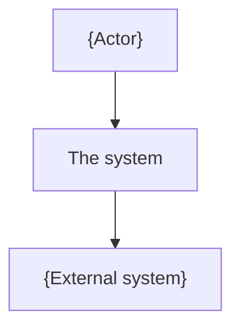
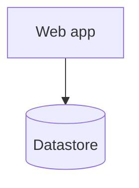
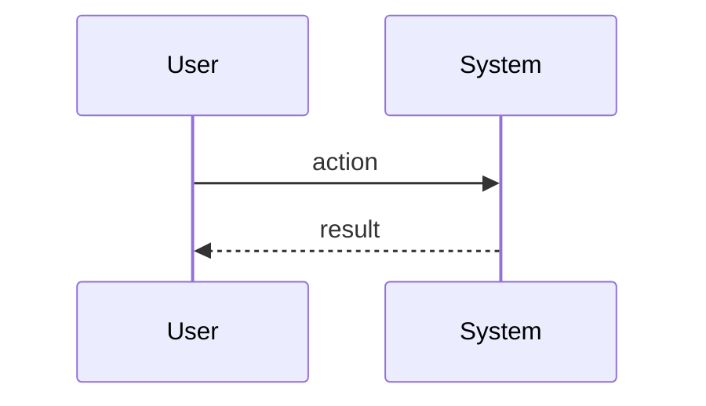

## System context (C4 L1)

<!-- The system as one box, human actors, and every external system it talks to.
     One line per external dependency on what crosses the boundary. -->

## Containers (C4 L2)

<!-- The deployable/runnable units inside the system and the protocols between
     them. Honor the runtime ADR. Do not go to component or code level. -->

## Key runtime flows

<!-- 1-3 sequence diagrams for the highest-risk or highest-judgment flows.
     Must be consistent with the lifecycle and the primary journey. -->

## Decisions and trade-offs

<!-- For the load-bearing structural choices above that carried real alternatives:
     one block each - the choice, the alternative(s) weighed, and why this won, with
     the trade-off knowingly accepted. This is where rationale is reasoned BEFORE the
     adr step freezes the durable ones into an ADR. Keep it to the load-bearing few. -->
- **{Decision}**: chose <X> over <Y> because <force>. Trade-off accepted: <cost>.

## Cross-cutting concerns

<!-- Where each concern lives. Point to ADRs where decided. -->
- Observability:
- Configuration:
- Secrets:
- Failure handling:
- Trust boundaries: <!-- where authn/authz sits; which boundaries are untrusted -->
- Data sensitivity: <!-- PII / sensitive classes handled and where they flow -->
- Scaling / capacity: <!-- the scaling hook; kept here so it survives a skipped deployment -->
